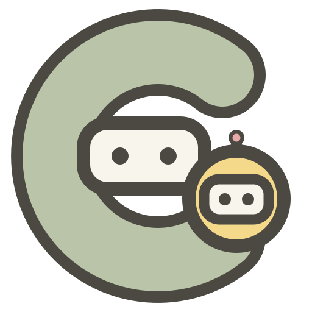
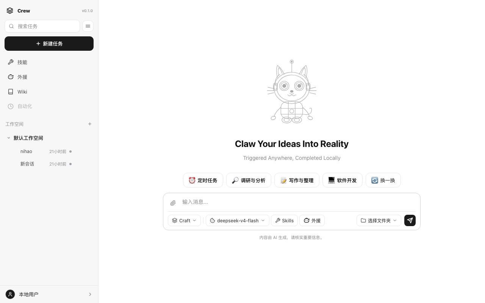
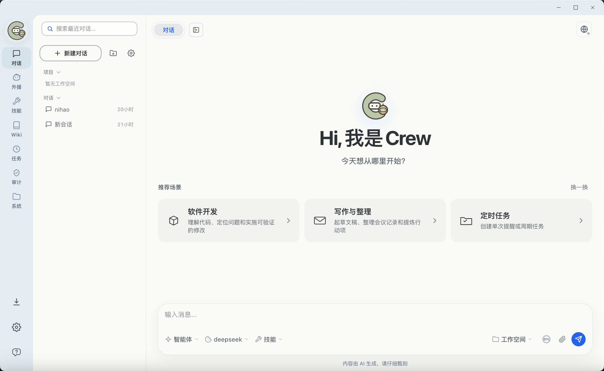

<div align="center">
  <picture>
    <source media="(prefers-color-scheme: dark)" srcset="assets/logo.svg">
    
  </picture>
  <h1>Crew — 本地多智能体工作台</h1>
  <p>
    <a href="https://github.com/shuishenghualalala/Ace/stargazers"></a>
    <a href="LICENSE"></a>
    
    
  </p>
  
</div>

> 每天在 ChatGPT 和 Claude 之间来回切，文件散落各处，Agent 做完就忘，换个会话又要重新交代一遍——于是我们决定做一个能常驻本机、记住一切、还能组队干活的工作台。Crew 的名字就是这么来的：一群 Agent 像船员一样各司其职，你当船长。

### 能做什么

早上打开 Crew，跟 Agent 说"帮我把下载文件夹按日期整理"，它直接动手。Wiki 里存着上周的会议纪要，Agent 能随时检索引用。想写一个需求文档？拉上 Explore Agent 做调研、Plan Agent 拆任务、Wiki Agent 归档，你只需要审核——Team 模式让多个 Agent 像真实团队一样并行协作。

<div align="center">
  
</div>

<div align="center">
  
</div>

> [!NOTE]
> 发布状态：源码预览版。接口和数据格式不承诺稳定，暂不建议直接用于关键生产环境。
> 本版本以 Git 源码检出方式交付；尚未发布 PyPI/wheel 或正式安装器，`pyproject.toml`
> 的构建产物不代表包含桌面端与 Web 端的完整发行包。

## 目录

- [核心能力](#核心能力)
- [为什么选择 Crew？](#为什么选择-crew)
- [环境要求](#环境要求)
- [快速开始](#快速开始)
- [配置模型](#配置模型)
- [可选的账号登录](#可选的账号登录)
- [技能与插件](#技能与插件)
- [其他启动方式](#其他启动方式)
- [构建桌面发行包](#构建桌面发行包可选)
- [验证安装](#验证安装)
- [配置与本地数据](#配置与本地数据)
- [代码结构](#代码结构)
- [参与贡献](#参与贡献)
- [安全提示](#安全提示)
- [开源许可](#开源许可)

## 核心能力

| 模块 | 能力 |
|------|------|
| 自定义模型接入 | 支持 OpenAI 兼容及 Anthropic 协议，自带 API Key 即可使用，密钥本地加密存储 |
| 对话与上下文管理 | 流式对话、thinking、工具调用、附件与工作空间、会话模型切换、上下文压缩和本地记忆 |
| 异构智能体协作 | 接入或创建不同来源不同架构的智能体并持久化；主 Agent 可并发委派临时或预设子智能体；支持本地 Team、动态看板，以及可选的外部 Runtime、Agent 和 Team 接入 |
| 任务与自动化 | 后台任务、状态与心跳、定时任务、并发和超时控制 |
| 知识管理 | 本地 LLM Wiki、文件与多模态入库 |
| 扩展工具 | Skill、插件、MCP Server 和渐进式工具发现 |
| 浏览器与桌面操作 | 可接管的应用内浏览器；通过可选 CUA Driver MCP 操作本机原生应用 |
| 客户端与多渠道 | 支持 Desktop、Web、CLI、本地 WebSocket，以及需要额外依赖和账号配置的飞书/Lark 渠道 |
| Skill 自进化（实验性） | 从会话提取轨迹、分析 Skill 使用情况，并生成优化建议或新 Skill；默认关闭，完整周期可能写入用户 Skill，详见[自进化说明](crew/evolution/README.md) |
| 安全与数据边界 | 默认仅监听本机、可选远程认证、owner 级数据隔离、本地密钥存储、工具访问控制与审批、浏览器网络/文件边界，以及 Desktop IPC 安全门禁 |

## 为什么选择 Crew？

| | Crew | OpenClaw | CodeBuddy Code |
|---|:---:|:---:|:---:|
| **定位** | 本地多 Agent 工作台 | 个人 AI 助理 | AI 编程 CLI |
| **开源** | ✅ Apache 2.0 | ✅ MIT | 部分 |
| **客户端** | Desktop + Web + CLI | CLI + macOS/iOS/Android | CLI |
| **多 Agent 协作** | ✅ Team + 看板 + 子 Agent | 临时子 Agent |  临时子 Agent |
| **本地知识库** | ✅ LLM Wiki（结构化 + 多模态） | ✅ 向量记忆 | ❌ |
| **桌面自动化** | ✅ CUA Driver（操作原生应用） | ❌ | ❌ |
| **浏览器** | ✅ 内置接管式浏览器 | ✅ 标签页 Copilot | ❌ |
| **任务调度** | ✅ 后台任务 + 定时 | ✅ Cron | ❌ |

## 环境要求

| 依赖 | 版本 |
|------|------|
| Python | 3.11 或更高 |
| [uv](https://docs.astral.sh/uv/) | 当前稳定版 |
| Node.js | 22.12 或更高；仅 Desktop / Web 开发需要 |
| npm | 10 或更高；仅 Desktop / Web 开发需要 |

## 快速开始

### 1. 安装后端与创建本地配置

```bash
git clone https://github.com/shuishenghualalala/Ace.git
cd Ace

# 安装 Python 依赖
uv venv .venv --python 3.11
source .venv/bin/activate       # Windows PowerShell: .venv\Scripts\Activate.ps1
uv pip install -e ".[dev,wiki]"

# 创建本地配置和环境变量文件；两者均已被 Git 忽略
cp config/config.yaml.example config/config.yaml  # Windows: Copy-Item config/config.yaml.example config/config.yaml
cp config/.env.example config/.env     # Windows PowerShell: Copy-Item config/.env.example .env
```

`wiki` 额外依赖用于解析 PDF、DOCX、XLSX、PPTX 等上传文件；旧格式 DOC、XLS、PPT 还需要
系统安装 LibreOffice。基础对话场景可安装 `.[dev]`。使用飞书/Lark 渠道时，另行安装
`uv pip install -e ".[feishu]"`，再前往“设置 → 渠道”配置账号。

### 2A. 启动桌面端

需要测试邮箱租户登录时，使用普通模式启动：

```bash
cd desktop
npm install
npm start
```

`npm start` 会构建 Desktop、自动启动托管 Gateway，并读取仓库根目录的
`config/config.yaml`。默认配置为 `auth.mode: email`，首次打开会要求填写邮箱；不发送
验证码，邮箱仅用于区分本机租户。登录后可进入“设置 → 模型 → 添加模型”配置真实模型。

日常开发且不需要测试登录流程时，可使用：

```bash
cd desktop
npm run dev
```

`npm run dev` 会传入 `--dev`，使用隔离的 `dev:dev` Owner 和开发数据目录，因此不会显示
邮箱登录页。两种命令都不需要另外手动启动 Gateway。

### 2B. 启动 Web 端

分别在两个终端中，从仓库根目录运行：

```bash
# 终端 1：启动 Gateway（REST / WebSocket）
source .venv/bin/activate       # Windows PowerShell: .venv\Scripts\Activate.ps1
python -m crew.gateway.server
```

```bash
# 终端 2：启动 Web 开发服务器
cd web
npm install
npm run dev
```

浏览器打开 `http://localhost:5173`。Web 开发服务器会把 `/api` 和 `/ws` 请求代理到默认监听 `127.0.0.1:8000` 的 Gateway。

## 配置模型

### 方式一：在桌面端配置（推荐）

1. 打开“设置 → 模型”。
2. 点击“添加模型”。
3. 填写模型 ID、接口模型名、API 协议、Base URL 和 API Key。
4. 根据模型能力选择文本、工具调用和视觉能力并保存；需要时在模型列表中将其设为默认。

设置页的默认模型供新会话继承；已有会话可在对话输入区通过模型选择器单独切换。
外部 Team 规划、组队描述生成和 Dynamic Kanban 编排等辅助推理使用当前账号的默认模型，不跟随单个会话的模型切换。
Wiki 编译与摘要默认遵循同一规则；如需独立模型，可在配置中显式设置 `wiki.model`。

Crew 支持 OpenAI 兼容接口和 Anthropic Messages 接口。API Key 只会写入当前 owner 的本地 `.env`，不会写入 `config.yaml`、返回给前端或发送给远程认证服务。不同运行模式的具体落盘位置见[配置与本地数据](#配置与本地数据)。

### 方式二：通过配置文件配置

适合 CLI、Web 或无桌面界面的部署。先从 `config/config.yaml.example` 创建本地
`config/config.yaml`，再声明模型；其中 `api_key_env` 是保存密钥的环境变量名：

```yaml
llm:
  active: my-model   # 兼容字段；建议与 default 保持一致
  default: my-model  # 新会话与辅助推理的默认兜底模型
  models:
    my-model:
      name: My Model
      provider: openai          # 或 anthropic
      api_key_env: MY_MODEL_API_KEY
      base_url: https://api.example.com/v1
      model: your-model-name
      context_window: 128000
      capabilities: [text, tools]
```

再把真实密钥写入项目根目录的 `.env`：

```dotenv
MY_MODEL_API_KEY=your-api-key
```

保存配置后重启 Crew Gateway。不要把真实 API Key 写入 `config/config.yaml`、源码、测试或 README；
本地 `config/config.yaml` 和 `.env` 均不应提交。

## 账号与租户登录

Ace 默认使用 `auth.mode: email`：首次启动只需填写邮箱，不发送验证码，邮箱会规范化为小写并生成 `email:<邮箱>` 数据 owner。该模式用于本机多租户数据隔离，不验证邮箱所有权；同一台电脑上的使用者可以输入其他邮箱切换租户。

如需保留单机免登录行为，可改为 `auth.mode: local`，此时使用 `local` 作为数据 owner。
如需接入自己的手机号验证码认证服务，在本地 `config/config.yaml` 中启用远程模式：

```yaml
auth:
  mode: remote
  remote:
    provider_id: my-company
    base_url: https://xxxxx.example
    send_code_path: /auth/send-code
    login_path: /auth/login-by-code
    timeout_seconds: 10
    session_ttl_seconds: 604800
```

请填写实际服务地址，也可以通过环境变量提供：

```bash
export CREW_AUTH_BASE_URL=https://auth.example.com
```

验证码接口接收 `{"phoneNumber":"..."}`；登录接口接收
`{"phoneNumber":"...","code":"..."}`。登录成功响应应包含：

```json
{
  "ok": true,
  "user": {
    "userId": "user-123",
    "phoneNumber": "13800000000",
    "displayName": "可选昵称"
  }
}
```

外层也可以使用 `data.user`。Crew 将用户数据归属标识生成为
`provider_id:userId`，例如 `my-company:user-123`；手机号只用于登录和展示，不参与 owner
拼接。Gateway 代理外部认证请求并签发本机 HttpOnly 会话 Cookie，Desktop 通过系统安全存储
保存该会话。占位地址不会被请求；启用 remote 但未配置有效地址时，登录页会明确提示配置。

## 技能与插件

仓库随附六个与产品功能直接关联的 Skill：

| Skill | 来源 | 用途 |
|-------|------|------|
| `crew-guide` | `crew/skills/agent-guide/` | Crew 使用手册与本地 Skill 安装指引 |
| `crew-wiki-curator` | `crew/skills/crew-wiki-curator/` | Wiki Agent 的入库、溯源、冲突处理与质量治理规范 |
| `cua-driver` | `crew/skills/cua-driver/` | 原生桌面应用自动化的观察、操作与验证规范 |
| `image-understanding` | `crew/skills/image-understanding/` | 通过用户配置的视觉模型理解图片，并支持 LLM Wiki 图片解析 |
| `video-understanding` | `crew/skills/video-understanding/` | 通过用户配置的外部服务理解视频，并支持 LLM Wiki 视频解析 |
| `browser-use` | `plugins/browser/skills/` | 应用内浏览器的导航、读取和交互工作流 |

`crew-wiki-curator` 只向 Wiki 预设 Agent 开放，普通对话不会加载 Wiki 管理流程；
`browser-use` 随 Browser 插件启用。用户 Skill 可放入 `CREW_HOME/skills/`，并在“技能与插件”页面管理。
`cua-driver` 提供模型操作规范；对应第三方可执行程序不随源码或安装包分发，可在
“设置 → MCP”中按需安装并启用。一键安装支持 macOS、Windows 和 Linux；macOS 首次使用时
需要在“系统设置 → 隐私与安全性”中向 CuaDriver 授予辅助功能权限，使用截图、SOM 或视觉模式时
还需要屏幕录制权限。安装来源和完整边界见 [CUA Driver 说明](crew/skills/cua-driver/references/setup.md)。
图片和视频理解服务的环境变量见 `config/.env.example`；没有完整配置时不会发送媒体数据。
视频上传还需要用户逐次确认。项目运行不依赖远程技能市场。

## 其他启动方式

### CLI

```bash
source .venv/bin/activate       # Windows PowerShell: .venv\Scripts\Activate.ps1
python -m crew.cli
```

## 构建桌面发行包（可选）

当前仓库提供本地构建脚本，但不发布预编译安装包，也不包含代码签名、公证和自动更新服务。
构建过程会下载 Electron、Python、Node.js 等运行时，可能占用数 GB 磁盘空间。

### Electron 裸目录

在目标操作系统上运行对应命令：

```bash
cd desktop
npm ci
npm run dist:linux   # Linux x64 → desktop/release/linux-unpacked/
npm run dist:win     # Windows x64 → desktop/release/win-unpacked/
npm run dist:mac     # macOS x64 + arm64 → desktop/release/
```

这些产物适合本地验证或作为下游发行流程的输入，不是已签名的正式安装器。更多配置说明见
[Desktop 文档](desktop/README.md#本地预打包)。

### Linux UOS / Kylin `.deb`

需要 Docker 和 PowerShell 7。从仓库根目录运行：

```powershell
pwsh ./deb-package/pack_deb.ps1 -Version 0.1.0 -Platform UOS
pwsh ./deb-package/pack_deb.ps1 -Version 0.1.0 -Platform Kylin
```

不传 `-Platform` 时会依次构建 UOS 和 Kylin 两个 amd64 安装包。产物位于仓库根目录，
文件名形如 `crew-desktop_0.1.0_uos_amd64.deb`。

### Windows 安装器

需要 Windows、PowerShell、uv、Node.js/npm 和
[Inno Setup 6](https://jrsoftware.org/isinfo.php)。从仓库根目录运行：

```powershell
pwsh ./deb-package/pack_exe.ps1 -Version 0.1.0
```

产物位于 `dist/installer/`。安装包会携带 Gateway、Desktop，以及供技能脚本使用的
Python 和 Node.js 运行时。

## 验证安装

```bash
# Web 构建与测试
cd web
npm install
npm run build
npm test
cd ..

# Python 测试（默认跳过需要真实模型和网络的 e2e 用例）
pytest

# Desktop 完整检查
cd desktop
npm install
npm run check
```

如需运行真实模型端到端测试，请从仓库根目录执行以下命令。测试会调用本地配置的外部模型或
服务，可能发送测试数据、消耗额度或产生费用；运行前请确认 API Key、端点和测试数据：

```bash
pytest -m e2e
```

## 配置与本地数据

| 路径 | 用途 | 是否应提交 |
|------|------|------------|
| `config/config.yaml.example` | 可发布的默认结构化配置模板 | 是 |
| `config/config.yaml` | 本地模型、Gateway、MCP 和工具配置 | 否 |
| `config/.env.example` | 环境变量模板，不含真实值 | 是 |
| 项目根目录 `.env` / `config/.env` | 手工配置或 CLI 使用的 API Key、Token 等本地敏感配置 | 否 |
| `${CREW_HOME}/accounts/acct_<hash(local)>/.env` | `auth.mode: local` 时由设置页保存的模型 API Key；默认 `${CREW_HOME}` 为 `~/.Crew` | 否 |
| `${DESKTOP_USER_DATA}/gateway-dev/accounts/acct_<hash(dev:dev)>/.env` | `npm run dev` 的隔离开发环境中由设置页保存的模型 API Key | 否 |
| `${CREW_HOME}/accounts/acct_<hash(providerId:userId)>/.env` | `auth.mode: remote` 时由设置页保存的模型 API Key，每个登录用户相互隔离 | 否 |
| `~/.Crew/` / `.Crew/` / `.crew/` | 用户配置、会话和运行时数据 | 否 |
| `crew_data/` | 本地数据库 | 否 |

`${CREW_HOME}` 可通过同名环境变量覆盖；未覆盖时，示例配置中的 `.Crew` 会解析为用户主目录下的 `~/.Crew`。`${DESKTOP_USER_DATA}` 是 Electron 为当前 Desktop 应用分配的用户数据目录。`acct_<hash(...)>` 是由 owner ID 稳定计算出的隐私保护目录名，磁盘上不会直接出现 `local`、用户 ID 或手机号；远程模式下的 `providerId:userId` 仅用于本机派生该目录名。

## 代码结构

| 模块 | 职责 |
|------|------|
| `crew/core` | 类型、消息信封与核心接口 |
| `crew/providers` | OpenAI 兼容与 Anthropic 模型适配 |
| `crew/agent` | Agent 对话循环、Plan、压缩与子智能体 |
| `crew/agent/external` | 外部 Runtime、Agent 和 Team 适配 |
| `crew/team` | 多智能体 Team 与协作编排 |
| `crew/dynamickanban` | 动态看板和任务图编排 |
| `crew/evolution` | 实验性轨迹提取、Skill 优化与生成 |
| `crew/browser` | 应用内浏览器的生命周期、控制和安全边界 |
| `crew/memory` | 本地持久记忆 |
| `crew/tools` | 工具注册、权限与内置工具 |
| `crew/state` | 配置、会话、工作空间与日志 |
| `crew/gateway` | FastAPI REST / WebSocket Gateway |
| `crew/tasks` / `crew/cron` | 后台任务与定时任务 |
| `crew/wiki` | 本地知识库 |
| `crew/skills` / `plugins` | 技能与插件扩展 |
| `desktop` | Electron 桌面端 |
| `web` | Web 客户端 |

## 参与贡献

欢迎提交 Issue 和 Pull Request。开始前请阅读 [贡献指南](CONTRIBUTING.md)；安全漏洞请按照 [安全政策](SECURITY.md) 私下报告。

## 安全提示

- Crew 提供 owner 级数据隔离、工具访问控制、浏览器敏感动作的一次性审批、私网和文件边界、
  密钥脱敏以及 Desktop IPC 校验；这些机制不能替代对第三方工具和外部服务的信任审查。
- 仅安装可信来源的技能、插件、MCP Server 和外部智能体运行时。
- 不要在公开 Issue、日志或截图中暴露 API Key、Token、Cookie 和本地文件内容。
- 将 Gateway 暴露到非本机网络前，请自行增加身份认证、TLS、网络边界和最小权限控制；默认配置面向本机使用。

## 开源许可

本项目采用 [Apache License 2.0](LICENSE) 开源许可。项目致谢见 [NOTICE](NOTICE)。

---

<p align="center">
  <a href="https://star-history.com/#shuishenghualalala/Ace&Date">
    
  </a>
</p>

