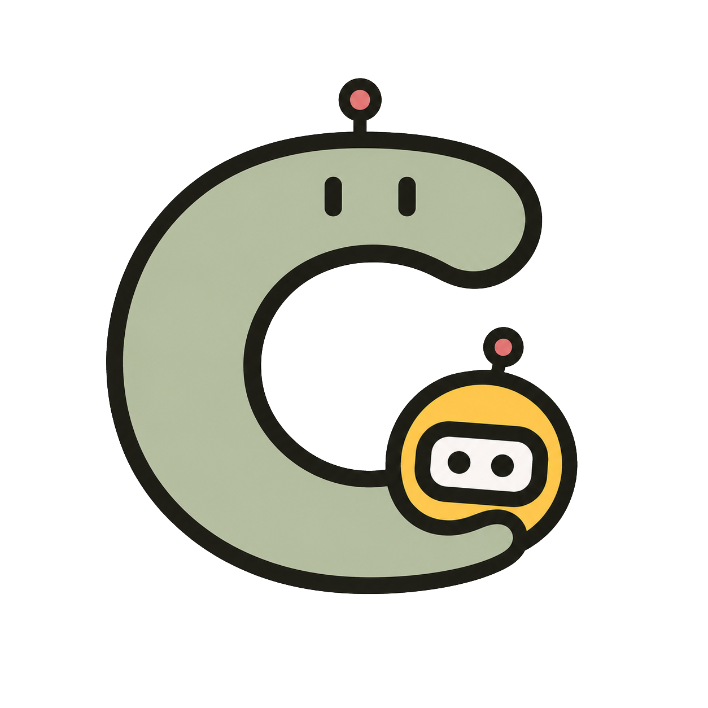

English | [简体中文](README.zh-CN.md)

<div align="center">
  
  <h1>Crew — An open-source AI workbench that runs on your computer</h1>
  <p><i>Local-first multi-agent collaboration with skills, automation, a knowledge base, browser and desktop control, and your choice of models.</i></p>
  <p>
    <a href="https://github.com/shuishenghualalala/Ace/stargazers"></a>
    <a href="LICENSE"></a>
    
    
  </p>
</div>

> If your day involves bouncing between ChatGPT and Claude, hunting for scattered files, and re-explaining the same context in every new conversation, Crew is designed to bring that work into one place.
>
> Crew runs on your computer, keeps useful context close at hand, and lets multiple agents work together. The name comes from the idea of a ship's crew: each agent has a role, while you remain in command. 🏴‍☠️
>
> Think of Crew as an open-source alternative to WorkBuddy. It can install skills, connect to services, work with local files, operate a browser, run scheduled tasks, and coordinate agents in parallel. Crew is licensed under Apache 2.0, stores its application data locally, and connects to model providers with your own API keys through OpenAI-compatible or Anthropic APIs.

### 🎬 What it can do

Tell Crew to "sort my Downloads folder by date," and it can get to work without making you switch between apps.

Keep meeting notes, personal notes, and reference material in the Wiki so agents can retrieve the context they need when they need it.

Need a product spec? Ask the Explore agent to research, the Plan agent to break the work down, and the Wiki agent to archive the result. Team mode lets them collaborate in parallel while you review the decisions that matter.

You can also connect local installations of Codex, Claude Code, and Kimi, then route each task to the agent best suited to it.

Bring your own model provider through an OpenAI-compatible or Anthropic API, and switch providers whenever your needs change. You remain in control of the credentials.

Installers are available for macOS (Intel and Apple Silicon), Linux (Kylin and UOS), and Windows.

<div align="center">
  
</div>


## 📖 Table of contents

- [✨ Core capabilities](#-core-capabilities)
- [🤔 Why Crew?](#-why-crew)
- [🧰 Requirements](#-requirements)
- [🚀 Quick start](#-quick-start)
- [🗺️ Roadmap](#️-roadmap)
- [🧠 Configuring models](#-configuring-models)
- [🔐 Accounts & tenant login](#-accounts--tenant-login)
- [🧩 Skills & plugins](#-skills--plugins)
- [🧱 Code layout](#-code-layout)
- [🤝 Contributing](#-contributing)
- [🔒 Security notes](#-security-notes)
- [📜 License](#-license)

## ✨ Core capabilities

Crew combines conversation, memory, automation, collaboration, and extensibility:

| Module | Capability |
|------|------|
| Bring your own models | Connect through OpenAI-compatible or Anthropic APIs, use your own API keys, and keep credentials in encrypted local storage |
| Conversation and context | Streaming responses, reasoning traces, tool calls, attachments, workspaces, per-session model selection, context compaction, and local memory |
| Multi-agent collaboration | Create or connect agents built on different runtimes, save them for later, and delegate work to temporary or preset sub-agents; includes local Teams, Dynamic Kanban, and optional external Runtime, Agent, and Team integrations |
| Tasks and automation | Background and scheduled tasks, status and heartbeat monitoring, concurrency controls, and timeouts |
| Knowledge management | A local LLM-powered Wiki with file and multimodal ingestion |
| Extensible tools | Skills, plugins, MCP servers, and progressive tool discovery |
| Browser and desktop automation | An in-app browser that agents can operate, plus optional native desktop control through the CUA Driver MCP |
| Clients and channels | Desktop, Web, CLI, local WebSocket, and an optional Feishu/Lark channel that requires additional dependencies and account setup |
| Skill evolution (experimental) | Extract session trajectories, analyze skill usage, and suggest skill improvements or new skills; disabled by default, and a full cycle may write to user skills — see the [evolution documentation](crew/evolution/README.md) |
| Security and data boundaries | Localhost-only networking by default, optional remote authentication, owner-level data isolation, local credential storage, tool permissions and approvals, browser network and file boundaries, and desktop IPC validation |

## 🤔 Why Crew?

Crew is built for people who want local control over their data, credentials, and tools. Here is a high-level comparison:

| | Crew | OpenClaw | CodeBuddy Code |
|---|:---:|:---:|:---:|
| **Positioning** | Local multi-agent workbench | Personal AI assistant | AI coding CLI |
| **Open source** | ✅ Apache 2.0 | ✅ MIT | Partial |
| **Clients** | Desktop + Web + CLI | CLI + macOS/iOS/Android | CLI |
| **Multi-agent** | ✅ Team + Kanban + sub-agents | Ad-hoc sub-agents | Ad-hoc sub-agents |
| **Local knowledge base** | ✅ LLM Wiki (structured + multimodal) | ✅ Vector memory | ❌ |
| **Desktop automation** | ✅ CUA Driver (drives native apps) | ❌ | ❌ |
| **Browser** | ✅ Built-in takeover browser | ✅ Tab copilot | ❌ |
| **Task scheduling** | ✅ Background + scheduled | ✅ Cron | ❌ |

## 🧰 Requirements

To build Crew from source, you will need:

| Dependency | Version |
|------|------|
| Python | 3.11 or higher |
| [uv](https://docs.astral.sh/uv/) | Current stable |
| Node.js | 22.12 or higher; desktop development only |
| npm | 10 or higher; desktop development only |

## 🚀 Quick start

### 1. Download an installer (recommended)

Download the installer for your system from [GitHub Releases](https://github.com/shuishenghualalala/Ace/releases):

| Your system | Installer |
|------|------|
| macOS (Apple Silicon, M-series) | `crew-desktop_<version>_arm64.dmg` |
| macOS (Intel) | `crew-desktop_<version>_x64.dmg` |
| Linux UOS (amd64) | `crew-desktop_<version>_uos_amd64.deb` |
| Linux Kylin (amd64) | `crew-desktop_<version>_kylin_amd64.deb` |
| Windows 10/11 (x64) | `Crew_Setup_v<version>.exe` |

After installation, **Settings → About → Update** in the desktop app automatically selects the latest package for your operating system and architecture.

### 2. Install from source

Before building, confirm your environment meets the [requirements](#-requirements): Python 3.11+, [uv](https://docs.astral.sh/uv/), Node.js 22.12+, npm 10+.

#### Install with one command (recommended)

```bash
# macOS / Linux: clone the repository, then install the backend, config, and desktop app
git clone https://github.com/shuishenghualalala/Ace.git
cd Ace
bash scripts/install.sh --all
```

```powershell
# Windows PowerShell
git clone https://github.com/shuishenghualalala/Ace.git
cd Ace
pwsh ./scripts/install.ps1 -All
```

With no arguments, the script installs only the backend and local configuration templates. Use `--dev` to add development dependencies, or `--with-web` / `--with-desktop` to install the corresponding frontend. After reviewing the script, you can also run it through a pipe: `curl -fsSL <raw script URL> | bash`. In that mode, the script clones the repository before continuing.

#### Manual steps (macOS / Linux)

```bash
git clone https://github.com/shuishenghualalala/Ace.git
cd Ace

# Install Python dependencies
uv venv .venv --python 3.11
source .venv/bin/activate
uv pip install -e ".[dev,wiki]"

# Create local config and env files (both git-ignored)
cp config/config.yaml.example config/config.yaml
cp config/.env.example config/.env

# Start the desktop app
cd desktop
npm install
npm run dev
```

#### Windows (PowerShell)

```powershell
git clone https://github.com/shuishenghualalala/Ace.git
cd Ace

# Install Python dependencies
uv venv .venv --python 3.11
.\.venv\Scripts\Activate.ps1
uv pip install -e ".[dev,wiki]"

# Create local config and env files (both git-ignored)
Copy-Item config\config.yaml.example config\config.yaml
Copy-Item config\.env.example .env

# Start the desktop app
cd desktop
npm install
npm run dev
```

Installing the `wiki` extra enables parsing for uploaded PDF, DOCX, XLSX, and PPTX files. Basic chat only requires `.[dev]`.

`npm run dev` passes `--dev`, uses an isolated development owner and data directory, and starts a managed Gateway automatically, so you do not need to launch the backend separately.

## 🗺️ Roadmap

- [x] v1.1.1 released with support for macOS (Intel and Apple Silicon), Linux (Kylin and UOS), and Windows
- [ ] Expanded security controls
- [ ] Expanded browser automation
- [ ] More agent integrations

## 🧠 Configuring models

Crew is not tied to a single model vendor. You can connect any supported provider for which you have an API key.

### Option 1: Configure in the desktop app (recommended)

1. Open **Settings → Models**.
2. Click **Add model**.
3. Enter the model ID, API model name, API protocol, base URL, and API key.
4. Select the model's text, tool-calling, and vision capabilities, then save it. If needed, mark it as the default model in the list.

New sessions inherit the default model selected in Settings. Existing sessions can switch models from the composer. Auxiliary tasks—including external Team planning, team-description generation, and Dynamic Kanban orchestration—use the current account's default model rather than the model selected for an individual session. Wiki compilation and summarization instead inherit the current session's effective model by default; set `wiki.model` in the configuration only when you want a dedicated Wiki model. Wiki operations without a session context fall back to the current account's default model.

Crew supports OpenAI-compatible APIs and the Anthropic Messages API. Your API key is stored only in the current owner's local `.env` file: it is never written to `config.yaml`, returned to the frontend, or sent to a remote authentication service.

### Option 2: Configure via config file

For CLI, Web, or headless deployments, first create `config/config.yaml` from `config/config.yaml.example`. Then define your models. The `api_key_env` field names the environment variable that contains the API key:

```yaml
llm:
  active: my-model   # Compatibility field; keep in sync with default
  default: my-model  # Fallback for new sessions and auxiliary reasoning
  models:
    my-model:
      name: My Model
      provider: openai          # or anthropic
      api_key_env: MY_MODEL_API_KEY
      base_url: https://api.example.com/v1
      model: your-model-name
      context_window: 128000
      capabilities: [text, tools]
```

Then put the real key in the project root `.env`:

```dotenv
MY_MODEL_API_KEY=your-api-key
```

Save the file and restart the Crew Gateway. Never place real API keys in `config/config.yaml`, source code, tests, or documentation, and never commit your local `config/config.yaml` or `.env` files.

## 🔐 Accounts & tenant login

Crew supports tenant-level data isolation and defaults to `auth.mode: email`. On first launch, enter an email address; no verification code is sent. Crew normalizes the address to lowercase and uses `email:<address>` as the data-owner identifier. This mode separates local tenant data without verifying ownership of the email address. Anyone using the same machine can enter a different address to switch tenants.

For single-machine use without login, set `auth.mode: local`. This uses `local` as the data-owner identifier.

To connect your own phone-number verification service, enable remote mode in your local `config/config.yaml`:

```yaml
auth:
  mode: remote
  remote:
    provider_id: my-company
    base_url: https://xxxxx.example
    send_code_path: /auth/send-code
    login_path: /auth/login-by-code
    timeout_seconds: 10
    session_ttl_seconds: 604800
```

Replace the placeholder with your service URL, or provide it through an environment variable:

```bash
export CREW_AUTH_BASE_URL=https://auth.example.com
```

The code endpoint accepts `{"phoneNumber":"..."}`; the login endpoint accepts
`{"phoneNumber":"...","code":"..."}`. A successful login response should include:

```json
{
  "ok": true,
  "user": {
    "userId": "user-123",
    "phoneNumber": "13800000000",
    "displayName": "optional nickname"
  }
}
```

The response may also wrap `user` inside a top-level `data` object. Crew builds the data-owner identifier as `provider_id:userId`, for example `my-company:user-123`. The phone number is used only for login and display; it is not part of that identifier.

The Gateway proxies external authentication requests and sets an HttpOnly session cookie scoped to localhost. The desktop app stores the session in the operating system's secure credential store. Crew never sends requests to placeholder addresses; if remote mode is enabled without a valid service URL, the login page prompts you to finish the configuration.

## 🧩 Skills & plugins

Skills are reusable playbooks that extend what Crew's agents can do. The repository includes six skills tied directly to product features:

| Skill | Source | Purpose |
|-------|------|------|
| `crew-guide` | `crew/skills/agent-guide/` | User guide for Crew and local skill installation |
| `crew-wiki-curator` | `crew/skills/crew-wiki-curator/` | Rules for Wiki ingestion, provenance, conflict handling, and quality control |
| `cua-driver` | `crew/skills/cua-driver/` | Observation, interaction, and verification guidance for native desktop automation |
| `image-understanding` | `crew/skills/image-understanding/` | Image analysis through your configured vision model, including LLM Wiki ingestion |
| `video-understanding` | `crew/skills/video-understanding/` | Video analysis through your configured external service, including LLM Wiki ingestion |
| `browser-use` | `plugins/browser/skills/` | Navigation, reading, and interaction workflows for the in-app browser |

`crew-wiki-curator` is available only to the Wiki preset agent; ordinary conversations do not load the Wiki-management workflow. The Browser plugin enables `browser-use`. User-installed skills live in `CREW_HOME/skills/` and can be managed from **Skills & plugins**.

`cua-driver` tells models how to use the CUA Driver. The third-party driver executable is not included in the source tree or installers, but you can install and enable it from **Settings → MCP** on macOS, Windows, or Linux. On first use on macOS, grant CuaDriver access under **System Settings → Privacy & Security → Accessibility**. Screenshot, SOM, and vision modes also require Screen Recording permission. See the [CUA Driver documentation](crew/skills/cua-driver/references/setup.md) for installation sources, scope, and security boundaries.

Configuration variables for the image- and video-understanding services are documented in `config/.env.example`. Crew sends media only after the required service configuration is complete, and every video upload requires separate user confirmation. The project does not depend on a remote skill marketplace.

## 🧱 Code layout

Key directories:

| Directory | Responsibility |
|------|------|
| `crew/core` | Types, message envelopes, and core interfaces |
| `crew/providers` | OpenAI-compatible and Anthropic model adapters |
| `crew/agent` | Agent conversation loop, planning, compaction, and sub-agents |
| `crew/agent/external` | External Runtime, Agent, and Team adapters |
| `crew/team` | Multi-agent teams and collaboration orchestration |
| `crew/dynamickanban` | Dynamic Kanban and task-graph orchestration |
| `crew/evolution` | Experimental trajectory extraction, skill optimization, and generation |
| `crew/browser` | In-app browser lifecycle, control, and security boundaries |
| `crew/memory` | Local persistent memory |
| `crew/tools` | Tool registry, permissions, and built-in tools |
| `crew/state` | Config, sessions, workspaces, and logs |
| `crew/gateway` | FastAPI REST / WebSocket Gateway |
| `crew/tasks` / `crew/cron` | Background and scheduled tasks |
| `crew/wiki` | Local knowledge base |
| `crew/skills` / `plugins` | Skills and plugin extensions |
| `desktop` | Electron desktop app |
| `web` | Web client |

## 🤝 Contributing

Bug reports, feature ideas, and pull requests are welcome. Please read the [contributing guide](CONTRIBUTING.md) before you begin. Report vulnerabilities privately according to the [security policy](SECURITY.md) so the maintainers have time to investigate and fix them.

## 🔒 Security notes

Crew includes several safeguards, but local control still requires careful configuration:

- Crew provides owner-level data isolation, tool access controls, one-time approval for sensitive browser actions, private-network access controls, file-system boundaries, credential redaction, and desktop IPC validation. These safeguards do not replace a security review of third-party tools and external services.
- Only install skills, plugins, MCP servers, and external agent runtimes from sources you trust.
- Never expose API keys, tokens, cookies, or local file contents in public issues, logs, or screenshots.
- Before exposing the Gateway beyond localhost, configure authentication, TLS, network boundaries, and least-privilege access controls. The default configuration is intended for local use.

## 📜 License

This project is open source under the [Apache License 2.0](LICENSE). See [NOTICE](NOTICE) for acknowledgements.

---
