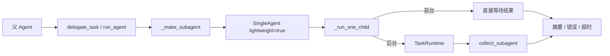
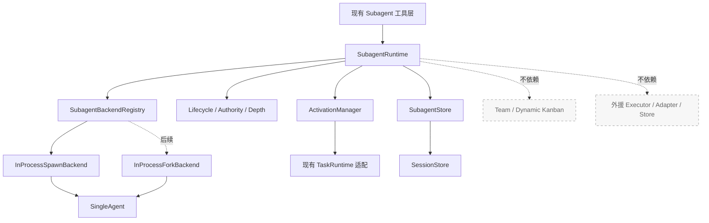
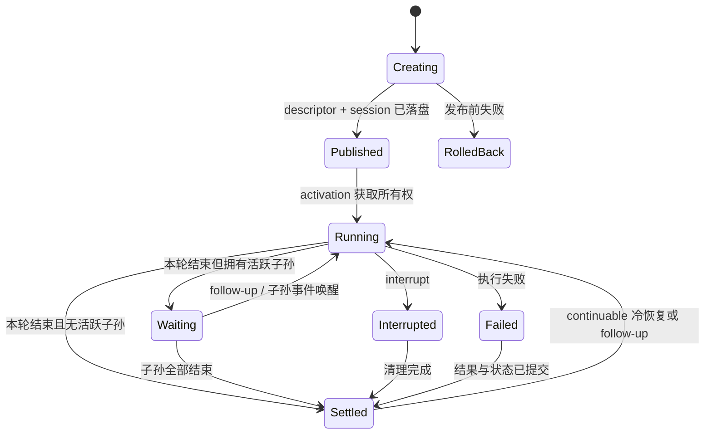

# Ace Subagent 向 DSH 靠齐的演进方案

> 状态：方案稿，尚未实施  
> 更新时间：2026-08-31  
> 范围：仅覆盖 Ace 的 Subagent / 多智能体委派能力  
> 明确排除：Team 功能、外援功能、外部 Agent 后端接入

## 1. 结论

Ace 当前已经具备可用的单次 Subagent 执行链路：父 Agent 可以创建轻量子 Agent，前台或后台执行任务，并获得摘要、超时、错误与部分输出。它适合“把一段工作交给临时子 Agent”的场景，但还不是一个完整的委派运行时。

本方案建议把现有实现逐步收敛为一个独立的 `SubagentRuntime`：先统一运行契约、生命周期、深度与权限，再增加可持续会话，最后补充 fork 与结构化输出。第一批改造只做内部架构收口和安全边界，不新增产品入口、不开放递归、不改变现有工具行为。

本方案不会修改或复用 Team 的编排机制，也不会接入或改造外援体系。Subagent、Team、外援继续保持三条独立链路。

## 2. 源码核对说明

此前的初步判断基于 Ace 源码和现有 DSH 拆解文档，没有直接核对 DSH 仓库源码。本版方案已经补查以下实际源码：

- DSH 仓库：`/Users/ahuamao/Documents/Codes/deepseek-harness`
- 核对提交：`668ff41a2e`
- DSH 拆解文档：`/Users/ahuamao/Documents/Codes/agents-under-the-hood/how-deepseek-harness-works/09-编排能力.md`
- Ace 仓库：`/Users/ahuamao/Documents/Codes/Ace`

重点核对的 DSH 模块包括：

- `packages/subagent/subagent/src/types.ts`
- `packages/subagent/subagent/src/index.ts`
- `packages/subagent/subagent/src/continuation.ts`
- `packages/subagent/subagent/src/child-agent.ts`
- `packages/subagent/subagent/src/descriptor.ts`
- `packages/subagent/subagent/src/lifecycle.ts`
- `packages/subagent/subagent-spawn-in-process/src/index.ts`
- `packages/subagent/subagent-fork-in-process/src/index.ts`
- `packages/subagent/subagent-in-process-driver/src/index.ts`
- `packages/subagent/tool-subagent/src/index.ts`
- `packages/subagent/tool-subagent-control/src/index.ts`
- `packages/subagent/tool-subagent-report/src/index.ts`

因此，本文区分两类内容：

- **已确认的 DSH 机制**：来自上述源码。
- **Ace 的落地设计**：结合 Ace 当前存储、工具和运行时做出的工程选择，不照搬 DSH 的事件日志架构。

## 3. 范围边界

### 3.1 本次范围内

- `delegate_task`、`run_agent`、`collect_subagent` 背后的 Subagent 执行链路。
- Subagent 的统一契约、运行状态、停止原因和生命周期事件。
- 父子关系、持久化描述符、委派深度和权限边界。
- 单次执行与可持续会话两种生命周期。
- 进程内 spawn；后续再增加进程内 fork。
- Subagent 专属测试与文档。

### 3.2 明确不动 Team

本方案不修改：

- `crew/team/**`
- `crew/dynamickanban/**`
- `TeamManager`
- Team Bus、Team 消息协议和 Team 成员状态机
- Team 模式的工具注册、路由和产品入口
- Dynamic Kanban 与 Team 的任务分派语义

虽然 Subagent 和 Team 可能共同使用 `TaskRuntime` 等底层能力，但本方案只作为现有接口的调用方，不改变这些共享接口的语义。若后续发现必须修改共享运行时，需要单独评估并取得确认，不能夹带在 Subagent 改造中。

### 3.3 明确不动外援

本方案不修改：

- `crew/agent/external/**`
- `crew/agent/executor/external.py`
- 外援的 Adapter、Executor、Store、注册表和数据库结构
- 外援的产品入口、权限配置和结果回传协议
- 任何 ACP、Codex、Claude Code、DSH SDK 等进程外后端接入

首轮只支持 Ace 内部的进程内子 Agent。未来如果要增加进程外 Subagent 后端，应另写方案、单独审批，并保持与现有外援链路隔离。

### 3.4 兼容性约束

- 保留现有工具名和参数：`delegate_task`、`run_agent`、`collect_subagent`。
- 第一阶段不向模型暴露 `provider` / `backend` 选择。
- 第一阶段不开放 Subagent 递归创建能力。
- 现有前台、后台、批量执行和摘要行为保持兼容。
- 不改变普通 Agent、Team Agent 和外援 Agent 的会话行为。
- 实现必须兼容 macOS、Linux 和 Windows，不使用 `fork(2)` 等平台专属进程能力。

## 4. Ace 当前实现

### 4.1 当前执行链路



主要代码位置：

- `crew/agent/subagent/tools.py`
  - 管理活动子 Agent。
  - 统一执行单个子任务。
  - 提供前台、后台、批量、收集与中断能力。
- `crew/app.py`
  - 创建轻量 `SingleAgent`。
  - 为子 Agent 筛选工具并注入 preset。
  - 完成 Subagent 工具的应用级装配。
- `crew/agent/runtime.py`
  - `lightweight=True` 时不持久化子会话和记忆。
- `crew/tasks/runtime.py`
  - 承载后台任务状态与结果。
- `crew/state/session_store.py`
  - 已有内部子会话命名与隐藏查询能力，但当前 Subagent 没有真正利用它完成可恢复会话。

### 4.2 已经做得好的部分

- 单个子任务共用一条执行路径，前台与后台行为相对一致。
- 批量任务有并发上限，不会无界创建子 Agent。
- 同时具备 idle timeout 和 absolute timeout。
- 超时和异常时能够返回部分输出。
- 子 Agent 的工具权限不高于父 Agent。
- 支持 Markdown preset，并允许内置与用户配置覆盖。
- 父 Agent 退出时会尝试中断仍在运行的子任务。
- 后台任务已经接入持久化 `TaskRuntime`。

### 4.3 当前核心限制

1. **只有单次执行，没有可持续身份**  
   每次委派都创建临时实例，完成后无法继续对话，也不能冷恢复。

2. **`lightweight` 混合了两个概念**  
   它同时表达“轻量提示词/能力”和“不持久化会话”。后续要支持轻量但可恢复的子 Agent，必须拆开。

3. **缺少独立运行时契约**  
   工具层同时承担输入转换、Agent 创建、并发、状态、结果规范化和清理，后续扩展会越来越难。

4. **缺少稳定的父子描述符**  
   没有版本化记录 provider、父会话、深度、persona、工具过滤、模型与策略快照。

5. **递归依靠工具屏蔽**  
   当前安全性来自“不把委派工具给子 Agent”，而不是运行时可验证的深度限制。

6. **停止原因不够统一**  
   完成、超时、取消、模型拒绝、Token 限制和运行错误还没有一个稳定的内部协议。

7. **没有续聊控制面**  
   缺少面向持久子 Agent 的发送消息、列举、定向中断和子到父汇报协议。

## 5. DSH 源码中确认的关键机制

### 5.1 Provider 与能力声明

DSH 的 `SubagentProvider` 是命名后端，其 `capabilities` 显式声明四项能力：

- `outputSchema`
- `depthLimit`
- `toolFilter`
- `persona`

同时，provider 通过独立字段 `inheritsParentContext` 声明是否继承父上下文。

`prepareContinuable` 方法是否存在，直接表示该 provider 是否支持可持续会话。工具层不让模型任意选择 provider，而是由宿主配置决定。

### 5.2 两种生命周期

- **One-shot**：一次启动，一次结果，适合短任务和批量工作。
- **Continuable**：拥有稳定 Session，多次 Activation，可以 follow-up、interrupt、report，并支持冷恢复。

DSH 的 continuable 没有额外套一层后台 Task；Session 是持久身份，Activation 是一次进程内执行占用。一个 Session 同一时刻最多有一个 Activation。

### 5.3 持久描述符

DSH 在子会话中保存版本化 descriptor，记录：

- one-shot / continuable
- provider
- label
- agent provider / model
- persona
- tool filter

冷恢复以首次 descriptor 为权威，避免配置变化后恢复出另一个身份。

### 5.4 深度与策略快照

- 子 Agent 深度为父深度加一。
- 持久化的父级深度只能作为单调下界，不能被恢复过程降低。
- sandbox、approval、tool filter 等策略在异步启动前完成快照。
- 子 Agent 的权限被固定在创建时，不会因为宿主后续配置变化而静默升级。

### 5.5 发布边界与失败语义

DSH 把“子 Agent 已发布”作为明确边界：

- 发布前失败：回滚，不返回一个不可用的子 ID。
- 发布后失败：结果 Promise 仍解析为结构化结果，失败作为数据返回。
- `dispose` 幂等，清理顺序由运行时统一负责。

### 5.6 权限关系

- 父可以向自己的可持续子 Agent 发送消息。
- 活跃子 Agent 可以向直接父 Agent 汇报。
- 中断遵循明确的祖先关系和活动实例检查。
- list 只展示调用者有权看到的后代。

### 5.7 fork 只继承完成轮次

进程内 fork 截取到最近一次 `turn/end`，不继承父 Agent 当前未完成的半轮输出。DSH 当前组合也对 continuable fork 保持谨慎，避免重复拼接父级前缀导致上下文污染。

### 5.8 结构化输出是子 Agent 专属工具

DSH 不是只在任务结束后解析一段 JSON，而是给子 Agent 注入 `structured_output` 工具：

- 按 schema 校验。
- 只允许成功调用一次。
- 成功后结束当前轮次。
- 先校验再提交，避免半成功状态。

## 6. 差距与取舍

| 维度 | Ace 当前 | DSH 已确认机制 | Ace 的取舍 |
|---|---|---|---|
| 运行抽象 | 工具层直接驱动 `SingleAgent` | Runtime + Provider | 抽出独立 `SubagentRuntime` |
| 生命周期 | one-shot | one-shot + continuable | 分阶段增加 continuable |
| 子身份 | 临时 UUID | 稳定 Session | 使用隐藏子会话 + 显式描述符 |
| 恢复 | 不支持 | 支持 cold resume | 基于 Ace `SessionStore` 实现，不引入完整事件溯源 |
| Provider | 固定进程内 | 命名注册表 + capabilities | 首期只注册 `inprocess_spawn` |
| 深度 | 工具屏蔽 | 持久化深度限制 | 先落深度，再考虑开放递归 |
| 权限 | 父工具上限 | 父子/祖先关系校验 | 在 Runtime 内集中校验 |
| 停止原因 | 字符串与异常组合 | 稳定 stop reason | 建立内部枚举并保留 Ace 超时扩展 |
| fork | 无 | 完成轮次前缀 | 后期仅做 one-shot fork |
| 结构化输出 | 无专属协议 | 子作用域工具 | 后期加入，两阶段提交 |
| 后台任务 | `TaskRuntime` | one-shot jobs；continuable Session | 不修改共享 `TaskRuntime`，仅保留兼容适配 |
| Team / 外援 | 独立系统 | 不属于 Subagent 核心 | 保持完全隔离 |

## 7. 目标架构



### 7.1 分层职责

#### 工具层

只负责：

- 校验模型工具参数。
- 调用 Runtime。
- 把内部结果转换为现有工具输出格式。

不再直接负责 Agent 创建、状态机、权限和持久化。

#### `SubagentRuntime`

负责：

- 创建 one-shot / continuable 子 Agent。
- provider 能力校验。
- 深度与父子权限校验。
- 描述符和策略快照。
- 发布边界、状态变迁、停止原因和幂等清理。
- foreground、background 和 activation 的统一观察。

#### Backend Registry

负责后端注册与能力声明。首期只允许宿主配置选择，模型工具参数中不出现 backend 名称。

#### `SubagentStore`

只保存 Subagent 专属数据：

- 稳定子 ID。
- 父会话 ID。
- owner / direct parent。
- descriptor 版本和内容。
- delegation depth。
- 生命周期类型与状态。
- seed length / fork boundary。
- 创建、更新和结束时间。

不要把这些字段塞进 Team 或外援的数据表。

#### `ActivationManager`

只管理进程内活跃实例。持久 Session 与活跃 Activation 分离：重启后 Activation 消失，但 Session 仍可恢复。

## 8. 核心契约

建议建立以下内部类型，具体命名可在实施时微调：

```python
@dataclass(frozen=True)
class SubagentCapabilities:
    output_schema: bool
    depth_limit: bool
    tool_filter: bool
    persona: bool
    inherits_parent_context: bool
    continuable: bool


@dataclass(frozen=True)
class SubagentDescriptor:
    version: int
    lifecycle: Literal["one_shot", "continuable"]
    backend: str
    parent_session_id: str
    label: str | None
    model: str | None
    persona: str | None
    tool_filter: tuple[str, ...]
    delegation_depth: int


@dataclass(frozen=True)
class SubagentOutcome:
    stop_reason: Literal[
        "completed",
        "aborted",
        "error",
        "max_tokens",
        "refusal",
        "timed_out",
    ]
    output: str
    error: str | None = None
    timeout_kind: Literal["idle", "absolute"] | None = None
```

说明：DSH 的稳定停止原因是 `completed`、`aborted`、`error`、`max-tokens`、`refusal`。Ace 现有 idle / absolute timeout 有独立业务价值，因此保留 `timed_out` 扩展，并通过 `timeout_kind` 区分，不把超时伪装成成功或普通错误。

Backend 协议建议保持最小化：

```python
class SubagentBackend(Protocol):
    name: str
    capabilities: SubagentCapabilities

    async def start(self, request: SubagentStartRequest) -> SubagentRun: ...

    async def prepare_continuable(
        self,
        request: SubagentStartRequest,
    ) -> PreparedSubagent | None: ...
```

`SubagentRun.result` 必须总是产生 `SubagentOutcome`；发布后的子任务失败以数据表达。只有调用方参数错误、未知 backend、能力不支持等启动前错误才直接抛出异常。

## 9. 会话、状态与恢复

### 9.1 拆分 lightweight 与 persistence

将当前 `SingleAgent(lightweight=True)` 的含义拆为两条独立配置：

- `lightweight_mode=True`：使用轻量提示词、记忆和工具配置。
- `session_persistence=none | hidden`：是否持久化会话。

默认普通 Agent 行为不变；只有 Subagent 构造路径显式传入新参数，避免影响 Team 和外援创建 Agent 的路径。

### 9.2 子会话标识

建议：

- 使用稳定的随机 `subagent_id` 作为业务 ID。
- 使用 `{parent_session_id}::subagent::{subagent_id}` 作为内部 Session ID，延续现有内部会话隐藏规则。
- 同时在 `SubagentStore` 保存显式 `parent_session_id`，不能只依赖字符串前缀推导父子关系。

### 9.3 状态机



One-shot 在首次 `Settled` 后终止；continuable 的 `Settled` 仅表示当前没有活跃执行，Session 仍存在。

### 9.4 冷恢复

冷恢复流程：

1. 从 `SubagentStore` 读取 descriptor。
2. 校验调用者是 direct parent 或允许的祖先。
3. 从隐藏子会话读取该子 Agent 自己的消息后缀。
4. 依据 descriptor 恢复模型、persona、工具过滤与深度。
5. 创建新的 Activation，并原子抢占该 Session 的进程内所有权。

Ace 当前不是事件溯源系统，因此不需要把 DSH 的所有日志事件原样移植。版本化 descriptor 与隐藏子会话足以形成稳定恢复边界。

## 10. 深度与权限

### 10.1 深度规则

- 根 Agent 深度为 `0`。
- 子 Agent 深度为 `parent_depth + 1`。
- `max_depth=0` 表示禁止委派。
- 默认上限建议为 `3`，但第一、二阶段继续从工具层屏蔽递归。
- 恢复时取 descriptor 深度与会话元数据深度的较大值，禁止深度回退。

只有在运行时深度校验、父子权限、清理和测试全部完成后，才单独评估是否向 Subagent 开放委派工具。

### 10.2 权限矩阵

| 操作 | 允许主体 | 校验要求 |
|---|---|---|
| start | 当前 Agent | 未超过深度；backend 能力满足 |
| follow-up | direct parent | 子 Session 属于当前父会话 |
| list | 父或祖先 | 只返回可见后代 |
| interrupt | direct parent / 合法祖先 | 目标必须是其后代；无活跃实例时幂等 |
| report | 当前活跃子 Agent | 只能发给 direct parent |
| dispose | Runtime | 幂等；子孙优先清理 |

权限检查必须位于 Runtime，不依赖模型遵守提示词。

## 11. 工具层演进

### 11.1 保持现有工具兼容

第一、二阶段：

- `delegate_task`：继续提供单次委派与批量执行。
- `run_agent`：继续提供单次委派入口。
- `collect_subagent`：继续收集 `TaskRuntime` 中的后台结果。
- 输出格式保持兼容，在内部逐步切换到 `SubagentOutcome`。

### 11.2 Continuable 控制工具

第三阶段再增加：

- `send_message`：父向 direct child 发送 follow-up。
- `list_agents`：列出调用者可见的 continuable 后代。
- `interrupt_agent`：按权限中断活跃后代。
- `report`：只注入 continuable 子 Agent，用于向 direct parent 汇报选定内容；调用后不强制结束当前轮次。

One-shot 继续通过现有后台任务和 `collect_subagent` 等待结果，不额外创造一套重复的 wait 协议。

### 11.3 Backend 选择

工具参数中不暴露 backend。由应用配置决定：

```yaml
subagent:
  backend: inprocess_spawn
  max_depth: 3
```

这样可以防止模型在运行中绕过宿主策略，也便于以后按部署环境切换实现。

## 12. 分阶段实施

### 阶段 A：语义内核与兼容适配

目标：只重构内部边界，不改变用户可见行为。

改动：

- 新增契约、停止原因和 backend 能力类型。
- 新增 `SubagentRuntime` 与单一 `inprocess_spawn` backend。
- 把 `_run_one_child` 的运行与清理职责移入 Runtime。
- 现有工具通过兼容适配器调用 Runtime。
- 继续保持子会话不持久化、递归关闭。

验收：

- 现有 Subagent 测试全部通过。
- 工具 schema 与输出快照不变。
- Team 和外援相关文件零改动。

### 阶段 B：描述符、深度与隐藏会话

目标：建立可恢复所需的数据基础，但仍只开放 one-shot。

改动：

- 新增独立 `SubagentStore`。
- 拆分 lightweight 与 session persistence。
- 保存版本化 descriptor、父子关系、深度与策略快照。
- 建立发布前回滚、发布后结构化结果和幂等清理。
- 子会话默认隐藏，不进入普通会话列表。

验收：

- 发布前失败不留下 descriptor、Session 或任务垃圾。
- 发布后取消、超时、拒绝和错误都保留明确停止原因。
- 重启后能够读取 descriptor 和历史，但暂不提供 follow-up。
- 深度无法通过恢复或伪造参数降低。

### 阶段 C：Continuable Spawn

目标：支持稳定子身份和多轮续聊。

改动：

- 引入 Session / Activation 分离。
- 实现 start、follow-up、list、interrupt、report。
- 实现冷恢复和单 Activation 所有权。
- 实现子孙优先清理与父结算通知。

验收：

- 同一个 continuable 子 ID 可以跨多轮使用。
- 应用重启后可由 direct parent 冷恢复。
- 两个并发 follow-up 不能同时占用同一 Session。
- 非父级/非祖先调用被拒绝。
- 子 Agent 只能向 direct parent 汇报。

### 阶段 D：Fork 与结构化输出

目标：补齐高级委派能力。

改动：

- 新增 `inprocess_fork` backend，首期只支持 one-shot。
- fork 只继承父 Agent 已完成轮次。
- 新增子作用域 `structured_output` 工具。
- schema 校验采用先校验、后提交的两阶段语义。

验收：

- fork 不包含父 Agent 当前未完成轮次。
- 不重复拼接父上下文。
- 非法结构化输出不会结束子任务或污染最终结果。
- 成功提交后不能二次覆盖。

### 暂不实施：进程外 Backend

ACP、Codex、Claude Code、DSH SDK 等进程外 provider 不在本方案实施范围内，也不接入 Ace 现有外援链路。未来需要时必须单独确定：

- 与外援的产品语义是否重复。
- 权限、凭据与 sandbox 如何隔离。
- Session 恢复由谁负责。
- 取消、超时和结构化输出如何映射。

## 13. 建议文件结构

在不拆出过多小文件的前提下，复用现有 `definition.py` 和 `registry.py`，只新增运行时、后端和持久化边界：

```text
crew/agent/subagent/
├── tools.py          # 现有：保留工具定义与兼容输出
├── definition.py     # 现有：继续维护 Markdown preset 定义
├── registry.py       # 现有：继续维护 preset 注册表
├── runtime.py        # 新增：契约、Runtime、Activation、生命周期与权限
└── backend.py        # 新增：Backend Protocol、注册表、spawn；后续加入 fork

crew/state/
└── subagent_store.py # descriptor、父子关系与状态持久化
```

需要小范围修改：

- `crew/app.py`：只做 Runtime 和 backend 装配。
- `crew/agent/runtime.py`：拆分 lightweight 与 persistence 参数。
- `crew/state/session_store.py`：复用或收紧隐藏子会话查询。
- `crew/state/config.py`：增加宿主侧 backend、max depth 配置。

禁止修改：

- `crew/team/**`
- `crew/dynamickanban/**`
- `crew/agent/external/**`
- `crew/agent/executor/external.py`

## 14. 测试方案

### 14.1 当前基线

方案编写前已执行：

```text
.venv/bin/python -m pytest \
  tests/test_subagent.py \
  tests/test_subagent_contract.py \
  tests/test_model_capability_review.py -q

60 passed
```

### 14.2 每阶段必须覆盖

- 契约：capability 校验、未知 backend、停止原因映射。
- 生命周期：发布前失败、发布后失败、取消、超时、幂等 dispose。
- 并发：批量上限、同 Session 单 Activation、取消竞态。
- 持久化：descriptor 首次写入权威、父子关系、冷恢复、隐藏查询。
- 权限：越权 follow-up、越权 interrupt、越权 report、list 可见范围。
- 深度：边界值、恢复不降级、递归关闭时工具仍不可见。
- fork：只继承完成轮次。
- 结构化输出：schema 失败、重复提交、成功终止。
- 兼容：现有工具 schema、前后台输出和 preset 行为不变。
- 跨平台：路径、取消、SQLite 与异步任务不依赖 Unix 专属行为。

### 14.3 隔离回归

每阶段需要额外证明没有影响 Team 与外援：

- `git diff` 中不出现 Team、Dynamic Kanban、外援目录。
- Team 工具注册和配置快照不变。
- 外援 backend 注册表、Store schema 和产品入口不变。
- 在 Team 禁用和外援未配置时，Subagent 全量测试仍可运行。
- 执行相关 Team 与外援现有回归测试，确认共享 `app.py`、`SingleAgent` 或 `TaskRuntime` 的改动没有产生行为漂移。

交付前至少运行：

```text
.venv/bin/python -m pytest tests/test_subagent.py tests/test_subagent_contract.py -q
.venv/bin/python -m pytest <Team 现有测试> <外援现有测试> -q
.venv/bin/python -m pytest -q
```

具体 Team 与外援测试文件应在实施阶段根据仓库当时结构通过 `rg --files tests` 确认，不能在方案中写死不存在的文件名。

## 15. 风险与控制

### 15.1 `SingleAgent` 参数拆分影响其他创建路径

控制：新增参数必须有保持当前行为的默认值；只有 Subagent 工厂显式开启隐藏持久化。对普通 Agent、Team 和外援增加构造回归测试。

### 15.2 持久子会话污染普通会话列表

控制：内部 Session ID 使用既有 `::` 隐藏约定，同时查询层显式排除内部会话；父子关系另存字段，不靠命名推导权限。

### 15.3 `TaskRuntime` 与 Activation 状态重复

控制：one-shot background 继续由现有 `TaskRuntime` 承载；continuable 只使用 ActivationManager，不改变共享 TaskRuntime 状态机。

### 15.4 递归过早开放

控制：阶段 A、B、C 默认继续屏蔽委派工具。深度、权限、清理和压力测试完成后，再单独决定是否开放。

### 15.5 持久化迁移难以回滚

控制：使用独立 Subagent 表与版本字段，不改 Team/外援表；旧工具可以在关闭 continuable 配置后继续退回 one-shot 非持久模式。

## 16. 推荐首批工作

建议首批只实施阶段 A，不直接做 continuable：

1. 建立 `runtime.py` 和 `backend.py`，复用现有 `definition.py`、`registry.py`。
2. 把现有 `_run_one_child` 收口到 `SubagentRuntime`。
3. 建立统一 `SubagentOutcome` 和停止原因映射。
4. 用 `inprocess_spawn` backend 包住当前 `_make_subagent`。
5. 保持 `delegate_task`、`run_agent`、`collect_subagent` 的工具 schema 和输出兼容。
6. 保持递归关闭、子会话不持久化、Team 与外援零改动。

这一批完成后，Ace 会先得到一个可扩展、可测试的 Subagent 语义内核。阶段 B、C 才引入数据库和可持续会话，风险更容易控制，也便于逐阶段回滚。

## 17. 实施前检查清单

- [ ] 确认阶段 A 的内部类型和停止原因命名。
- [ ] 固化现有三个工具的 schema 与输出快照。
- [ ] 确认所有 `SingleAgent` 构造位置，避免默认行为漂移。
- [ ] 确认 Team 与外援所依赖的共享模块及回归测试。
- [ ] 禁止首批修改 Team、Dynamic Kanban 和外援目录。
- [ ] 禁止首批增加数据库迁移、continuable 工具和递归能力。
- [ ] 阶段 A 完成后先评审，再决定是否进入阶段 B。
