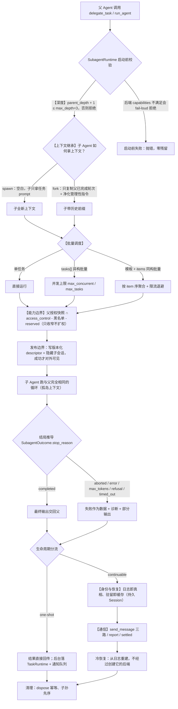
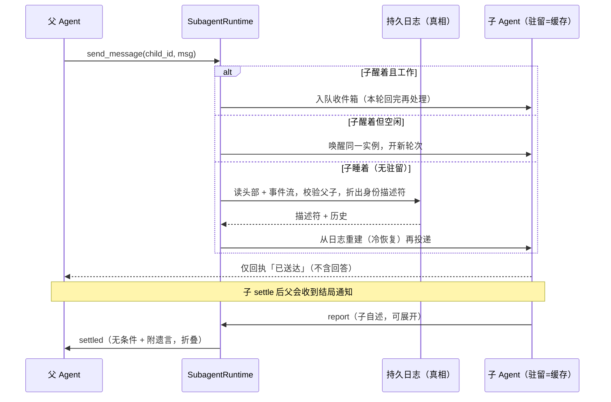

# Ace Subagent 强化方案

> 综合考查 Kimi Code、Codex CLI、DeepSeek Harness 三者的子智能体实现，对照 Ace 现状，给出分阶段强化路线。
> 范围：仅 Ace 的 Subagent 委派能力。**明确排除** Team（crew/team/**、crew/dynamickanban/**）与外援（crew/agent/external/**、crew/agent/executor/external.py）。
> 基线：仓库内 docs/backend/modules/subagent-dsh-alignment-plan.md（2026-08-31 未实施的 DSH 对齐稿）已给出阶段 A/B/C/D 骨架，本文沿用并扩充其未覆盖的三个维度：提示词工程、fork 净化、同构批量与 preset 白名单。

---

## 1. 摘要

Ace 已具备可用的 one-shot 子智能体（前台/后台/批量、frontmatter 预设、父级工具封顶、idle/absolute 双超时 + 部分输出），但当前只是“把一段工作交给临时子 Agent”，还算不上完整的委派运行时。

三个参考实现的共同结论：

1. **委派语义稳定、传输与实现可插拔**——“交任务 → 等结果 / 持续对话”这套语义与子 Agent 跑在哪无关，应把语义层与传输层分离。
2. **失败是数据，不是异常**——子 Agent 的失败是委派语义内的正常结局，应统一为稳定词汇，而不是靠字符串和异常堆叠。
3. **子身份要持久化**——能恢复的对话伙伴，身份必须比进程驻留更长寿；“日志是真相、驻留是缓存”。
4. **权限在服务边界收敛、工具不携带权威**——能力只能收窄不能扩权，归因与授权分离。
5. **深度单调记账**——递归没有天然终点，深度作为单调下界持久化，不许恢复回退。

三者的定位与增量价值：

- **DSH**：抽象最干净，用“one-shot / continuable 分治 + 日志即真相、驻留即缓存 + 操作-凭证表”给出委派运行时的骨架，最值得 Ace 借鉴为总体结构。
- **Kimi**：“profile 即配置（硬工具边界）+ Agent 与 AgentSwarm 分工 + 前台/后台/恢复统一生命周期 + task_id/agent_id 分离”是最贴近产品落地的一层（Ace 的 frontmatter 预设天然对齐）。
- **Codex**：“fork 白名单净化 + 委派纪律提示词 + 邮箱通信 + RAII 并发限流”补上了“上下文继承安全”与“把委派教给模型”两个环节。

## 流程图总览：六个维度一图看

深度、上下文继承、能力边界、批量调度、身份与恢复、通信，这六个维度在一条主链路上的落点如下（带【】标记）：

### 生命周期主链路



### Continuable 的通信与身份（时序）



### 六个维度：现状 → 目标

| 维度 | Ace 现状 | 强化后 | 主要取舍来源 |
|---|---|---|---|
| 深度 | 工具层屏蔽（全禁嵌套） | 单调记账 max_depth=3，恢复不回退；阶段 A/B/C 仍屏蔽递归 | dsh + codex |
| 上下文继承 | 只传 goal+context，无历史 | spawn（空白）与 fork（完成轮次 + 净化）两态 | codex + dsh |
| 能力边界 | 父授权快照 ∩ access_control - 黑名单 | 保持 + 后端能力声明 + 角色只收窄叠加 | kimi + codex + dsh |
| 批量调度 | asyncio.Semaphore + gather | 同构模板批量 + 限流退避 + 有序聚合 | kimi |
| 身份与恢复 | 临时 uuid，不持久 | 版本化 descriptor + 隐藏子会话；continuable 冷恢复 | dsh + codex |
| 通信 | 后台通知队列 + collect_subagent | one-shot 直接回传 + continuable send_message/report/settled | codex + dsh |

---

## 2. 三个参考实现的子智能体机制

### 2.1 Kimi Code

**抽象**：子 Agent 不是不同的类，而是同一套 Agent 运行时挂不同 profile；内置 coder / explore / plan 三个 profile，用工具白名单（tools）+ 黑名单（disallowedTools）决定能力边界，白名单是硬边界（loopTools 根本不包含被禁工具）。

**委派入口**：
- `Agent`：一对一，传 prompt + description，spawn 或 resume 一个子 Agent。
- `AgentSwarm`：模板 + items 的同构批量，`prompt_template` 必须含 `{{item}}`，交给 `SubagentBatch` 做排队/限流恢复/有序聚合；结果按 item 顺序拼成 XML。

**生命周期**：前台/后台共享 `BackgroundManager`；`task_id`（任务壳，管 TaskList/TaskOutput/TaskStop）与 `agent_id`（可恢复上下文的子 Agent 实例，管 `Agent(resume=...)`）两套 id 不混用。

**权限**：四层纵深——profile 工具白名单 → 父权限规则继承 → 工具级审批 → Swarm 独占调用。v2 默认关闭子 Agent 再委派能力，防止无限嵌套。

**可扩展**：`.kimi/agents/*.md` agent file，frontmatter 声明 name/tools/disallowedTools/subagents，支持 `extends` 继承内置角色；父 profile 的 `subagents` 白名单决定可委派子类型。

### 2.2 Codex CLI

**抽象**：Agent ≈ Thread，子 Agent 就是带 `SessionSource::SubAgent` 的普通 Session，复用完整 Session/Turn/工具循环与持久化/沙箱；根 Agent 到所有子 Agent 共享一个容器/文件系统/cwd（编辑立即可见）。

**控制面**：`AgentControl`（每 root 树一份）+ `AgentRegistry`（双索引：path ↔ thread，含昵称池、`SpawnReservation` 两阶段预留、Drop 自动回滚）。

**寻址**：`AgentPath` 类文件系统路径（/root/task_1/task_2），硬校验——必须 /root 开头、禁尾斜杠、每段小写字母数字下划线、`..`/`.`/root 保留，相对引用只能向下、不可横跳/逃逸，把引用关系钉死成树。

**角色**：`apply_role_to_config` 是“受限叠加层”——只能收窄（developer_instructions/model/personality/features/skills），不能替父会话扩权；`reject_full_fork_agent_type_override` 禁止全量 fork 时覆盖角色。

**fork**：`fork_turns = none/all/N`，走白名单筛选（保留 system/developer/user、assistant FinalAnswer、孤儿输出；丢弃 reasoning/内部消息/安全分）+ 开发指令净化/替换（剔除“多 Agent 角色/模式/时间/usage hint”管理性段落，子端重建自己的 hint）。

**通信**：统一邮箱 `InterAgentCommunication`（MESSAGE=不触发 turn / NEW_TASK=触发 / FINAL_ANSWER=结果回包）；`wait_agent` 是事件驱动唤醒原语，只报告“等到/被打断/超时”，不搬运内容；`interrupt_agent` 只断当前 turn、Agent 留守（生命周期交给 residency）。

**资源控制**：注册表总数上限（V1 默认 6）+ `AgentExecutionLimiter`（RAII，V2 并发 4−根 1）+ 深度闸门（默认 1）+ `RolloutBudget` 树内共享 + `Residency` LRU（完成者可换出、可召回）。内置 101 科学家名昵称池。

**提示词工程**：工具描述内嵌委派纪律，root/subagent 双视角 usage hint，`multi_agent_mode`（ExplicitRequestOnly 默认 / Proactive / Custom，reasoning effort=Ultra 自动升级为 Proactive）。

### 2.3 DeepSeek Harness（DSH）

**根本判断**：
- 判断一：委派语义稳定、传输多样 → 语义层 `ctx.subagents`（具名多后端 registry）+ 传输层可插拔后端，模型见到的工具 schema 无 backend 参数。
- 判断二：one-shot（一次性产出，结果归调用者）与 continuable（持续关系，子身份比进程驻留更长寿）两种模式“不可通约”，共用词汇、分开生命周期。

**三条契约逻辑**：
1. 启动前能力协商 fail-loud（后端四能力: outputSchema/depthLimit/toolFilter/persona + inheritsParentContext + prepareContinuable 方法存在性），绝不静默降级。
2. 发布边界唯一——创建中是未发布的半成品，成功一刻是唯一发布点与所有权转移点；发布前失败回滚、发布后失败走结算。
3. 失败是数据——五结局词汇（completed/cancelled/error/limit/refused，可扩展）跨传输统一，结局从子级自己的日志推导而非“怎么停的”推导。

**continuable 核心**：“持久层=真相（durable Session，子代理就是它的日志），进程内=缓存（至多一个 Activation）”；冷恢复不经过创建它的后端，从日志重建；三态（工作中/等待中/可以睡去）现场派生；树形所有权“父等子、取消向下、释放向上”。

**结局通知二分**：子级自述 report（可展开）与运行时结局通知 settled（无条件送达、附遗言、折叠呈现）严格分开，归因与覆盖各司其职。

**权威**：操作-凭证表——send_message 仅精确的、活着的、直接的父；report 仅子自己且收件人不可指定（从持久父子关系唯一推导）；interrupt 更宽（任意活祖先或人类持父地址）；list 只读。归因与权威分离，工具不携带权威。

**深度**：持久化单调下界（父+1），默认 3，恢复取 max(持久值, 运行时值) 禁止洗白；工具过滤是可见性非权威。

---

## 3. 横向对比

| 维度 | Kimi Code | Codex CLI | DeepSeek Harness | Ace 现状 |
|---|---|---|---|---|
| 子 Agent 是什么 | 同一运行时 + profile | Agent ≈ Thread，复用 Session | 普通 agent 跑同一循环 | 临时 SingleAgent(lightweight=True) |
| 委派粒度 | Agent / AgentSwarm | spawn 单个，V2 树协作 | one-shot / continuable | delegate_task（单/批）+ run_agent（预设） |
| 上下文继承 | 只传任务 prompt | fork_turns none/all/N（白名单净化） | spawn 无 / fork 完成轮次前缀 | 只传 goal+context，无 fork |
| 能力边界 | profile 工具白名单（硬） | 角色白名单叠加（只收窄） | tool_filter + persona | _subagent_tool_filter 封顶+黑名单 |
| 批量调度 | SubagentBatch 限流恢复 | ExecutionLimiter RAII | jobs 统一后台词汇 | asyncio.Semaphore + gather |
| 身份与恢复 | task_id + agent_id，可 resume | ThreadId + spawn edge 树 | 日志即真相、冷恢复 | 临时 uuid 不可恢复 |
| 通信 | 后台通知回主 Agent | 邮箱三类消息 + wait_agent | send_message/report/settled | 后台队列 + collect_subagent |
| 深度 | v2 默认禁再委托 | 深度闸门 + 能力位 | 单调记账默认 3 | 工具层屏蔽（全禁嵌套） |
| 失败语义 | 状态字符串 | AgentStatus 枚举 | 五结局词汇 | completed/timeout/error/cancelled |

---

## 4. 优劣势分析

### 4.1 Kimi Code

**优势**
- profile 即配置：coder/explore/plan 共享同一运行时、靠工具白名单做硬边界，扩展成本低，与 Ace 的 frontmatter 预设天然同构。
- Agent 与 AgentSwarm 分层清晰：一对一灵活委派 vs 同构模板批量，各管各的粒度。
- 前台/后台/恢复统一走 BackgroundManager，超时/停止/输出保存逻辑复用，避免双份实现。
- task_id 与 agent_id 显式分离，避免“任务壳 vs 可恢复身份”混淆。
- 事件驱动 UI（spawned/started/suspended/completed/failed），core 管语义、TUI 只做可视化，分层干净。

**劣势**
- read-only 并非纯工具裁剪：explore 的 Bash“只读”约束靠提示 + 审批双层兜底（工具白名单拦不住 rm），纵深还不够硬。
- 批量调度是对象方法组合、v2 才重组织进 DI/Scope；整体演进分两个引擎，历史包袱可见。
- 深度控制偏“开关”（可否再委派的布尔位），缺少单调深度记账的严谨性。

### 4.2 Codex CLI

**优势**
- Agent ≈ Thread 复用全部基础设施（Session/Turn/持久化/沙箱），子 Agent 高度一致、总成本低。
- 寻址强约束：AgentPath 硬校验把引用钉成树，杜绝 `..` 逃逸导致的归属混乱。
- SpawnReservation 两阶段预留 + Drop 回滚 + 昵称池，注册状态零残留。
- fork 白名单 + 开发指令净化/替换，是三者里最认真地处理“上下文继承不会把管理性指令带偏子 Agent”。
- 通信协议完整：邮箱三类消息 + wait_agent 只报告不搬运，事件驱动模型下稳定。
- 资源控制三层（总数/执行并发/深度）+ shared rollout budget + residency LRU，工程化成熟。
- 提示词工程完整：委派纪律 + 双视角 usage hint + 委派模式档位，把“何时不该委派”显式教给模型。

**劣势**
- V1/V2 两套协议并存，命名空间、生命周期、结果回流语义全面分化，演进和心智负担重（Ace 无需照搬）。
- “reasoning effort 自动升级为 Proactive”这类启发式隐式、难解释。
- 原生 Rust、Bazel 重实现，工程量与复杂度与其收益匹配，但对 Python 栈是过度设计。

### 4.3 DeepSeek Harness

**优势**
- 抽象最有纪律性：语义/传输分离、one-shot/continuable 不可通约分治、发布边界唯一、失败是数据，是可直接翻译为契约的“正确模型”。
- “日志是真相、驻留是缓存”给出可恢复身份的简洁答案；树形所有权 + 结局通知二分把“谁有资格结束谁、谁有资格说谁停了”讲得最透。
- 操作-凭证表 + 归因/权威分离 + 工具不携带权威，安全边界收敛在服务层。
- 深度单调记账不许洗白，比“开关”严谨；结构化输出做成工具（两阶段提交、零二次模型）高效干净。

**劣势**
- 概念密度高、阅读门槛高；机制高度依赖其自有的 Cordis 事件溯源/scope/preset 原语，直接移植到非事件溯源系统会水土不服（需翻译成版本化 descriptor + 隐藏子会话）。
- 跨进程后端一律“诚实声明四能力全否”，导致很多语义在跨进程下不可用（虽诚实，但能力面窄）。
- fork + continuable 组合存在真实分歧（持续对话注入 report 工具破坏前缀逐字节一致，KV 复用失效），目前绑定 one-shot，尚未给出统一解法。
- 单进程内子 Agent 无独立沙箱，隔离全靠“同一循环 + 权限栈”，对高风险命令仍需上层兜底。

---

## 5. Ace 现状盘点

**已具备（保留）**：
- one-shot 前台/后台/批量（delegate_task tasks[] + asyncio 并发上限）。
- frontmatter 预设（builtin/user 两级覆盖 + Feature-owned 预注册，run_agent）。
- 父级工具封顶（_subagent_tool_filter 取父授权快照 ∩ access_control）+ SUBAGENT_BLOCKED_TOOLSETS 黑名单 + reserved toolset 隔离。
- idle/absolute 双超时 + 部分输出 + 诊断（last_tool / tool_calls）。
- ActiveSubagents 运行跟踪 + 父中断级联。
- 后台任务落 TaskRuntime（LegacyTaskManagerAdapter），完成通知队列注入下一轮。
- 模型 / skills 继承（子不能越权拿父都拿不到的工具与技能）。

**主要缺口**：

| # | 缺口 | 后果 |
|---|---|---|
| 1 | 只有 one-shot，无可持续身份/resume | 无法续聊、无法冷恢复 |
| 2 | lightweight 混用“轻量能力”与“不持久化” | 无法表达“轻量但可恢复”的子 Agent |
| 3 | 工具层直接驱动创建/并发/状态/清理 | 扩展开销大、无可测契约 |
| 4 | 无稳定父子描述符与深度记账 | 权限靠字符串前缀、递归只靠屏蔽 |
| 5 | 失败仅字符串 + 异常 | 无统一 stop_reason，跨场景语义漂移 |
| 6 | 无子-父控制面 | 无 send_message/list/interrupt/report |
| 7 | 无 fork、结构化输出、同构批量、委派纪律提示词 | 相对三者缺进阶能力 |

---

## 6. 强化目标与原则

目标：把 Ace 子智能体从“一次性委派”升级为“可扩展、可审计、可恢复的委派运行时”，且不触碰 Team 与外援。

原则：
1. 语义与传输分离，后端可插拔、模型不见 backend。
2. one-shot / continuable 分治，共用契约、分开生命周期。
3. 失败是数据；异常只留给启动前参数错误。
4. 发布边界唯一；发布前可回滚、发布后走结算。
5. 权限在服务边界收敛，工具不携带权威，能力只收窄不扩权。
6. 深度单调记账，恢复不许回退。
7. 兼容旧工具名/参数/输出，逐步演进、可回滚。
8. 跨平台（macOS/Linux/Windows），禁 fork(2) 等 Unix 专属，仅用 sqlite/asyncio/pathlib。
9. 模块化、可插拔，注释不写“仿照/参考”表述。

---

## 7. 目标架构

把工具层薄化，抽取运行时与后端，Team/外援保持隔离：

```text
crew/agent/subagent/
├── tools.py        # 保留：工具定义 + 兼容输出（只做参数校验、调 Runtime、格式化）
├── definition.py   # 保留：frontmatter 预设定义（新增 extends / delegatable 白名单）
├── registry.py     # 保留：预设注册表
├── runtime.py      # 新增：契约、Outcome、生命周期、权威、深度、Activation
└── backend.py      # 新增：Backend Protocol、注册表、inprocess_spawn（后续 fork）

crew/state/
└── subagent_store.py  # 新增：descriptor、父子关系、深度、生命周期状态
```

分层职责：
- 工具层：校验模型参数 → 调 Runtime → 把内部结果转回现有工具输出格式。
- SubagentRuntime：创建 one-shot/continuable 子 Agent、能力校验、深度/权限校验、描述符与策略快照、发布边界、状态变迁、幂等清理。
- Backend Registry：后端注册 + 能力声明，首期只允许宿主配置选择，工具参数不出现 backend。
- ActivationManager：只管理进程内活跃实例；持久 Session 与活跃 Activation 分离。
- SubagentStore：只存 Subagent 专属字段，不混入 Team/外援数据表。

---

## 8. 核心设计决策（吸收三方的最优取舍）

1. **统一失败词汇（dsh + codex 收敛）**：SubagentOutcome.stop_reason ∈ completed / aborted / error / max_tokens / refusal / timed_out；timed_out 是 Ace 特有扩展，用 timeout_kind ∈ idle / absolute 区分。
2. **深度单调记账（dsh + codex）**：根=0、子=父+1，持久化，恢复取 max(descriptor, 会话元数据) 禁止回退；默认 max_depth=3，阶段 A/B/C 仍从工具层屏蔽递归。
3. **权威与归因分离（dsh 收敛、codex 角色只收窄对齐）**：Runtime 内集中校验 start/follow-up/report/interrupt/list；interrupt 无活跃实例幂等；list 只读可见后代。
4. **发布边界 + 预留 rollback（dsh + codex SpawnReservation）**：发布前失败零残留，发布后失败走结算，dispose 幂等、子孙先序。
5. **agent_id 与 task_id 分离（kimi + codex）**：阶段 C 引入稳定 subagent_id；后台 task_id 仍是“一次性任务壳”。
6. **fork 净化（codex 特有）**：fork 只继承完成轮次前缀 + 剔除/重建“root/subagent 指令、委派指南、usage hint”等管理性段落；compaction 基线缺失时放弃复用基线。
7. **结构化输出（dsh）**：子作用域 structured_output 工具，schema 校验 → 成功一次 → 结束轮次 → 禁止再动作（两阶段提交、零二次模型）。
8. **委派纪律提示词（codex + kimi，新增）**：默认 ExplicitRequestOnly（仅用户/AGENTS 明确要求才委派），可选 Proactive；子 Agent 注入“你是子 Agent、结果回父、不能问用户、不能嵌套、总结是自报且非已验证事实”；主 Agent 工具描述内嵌何时委派/何时不委派/如何拆写集不相交。
9. **同构批量 + 限流退避（kimi AgentSwarm，后置）**：delegate_task 保留异构 tasks[]，新增可选 prompt_template+items 同构模式，按 item 序聚合 + 限流退避；后台批量仍拒绝。
10. **preset 演进（kimi agentfile，后置）**：frontmatter 增 extends（基于内置角色微调）+ 父侧 subagents 可委派白名单收窄 run_agent 可见面；内置只读 explore/plan，硬移除 Write/Edit/Bash-写类工具作纵深。

---

## 9. 分阶段实施路线

### 阶段 0：方案落文档（本轮）
- 产出本文作为 docs/backend/modules/subagent-strengthening-plan.md，并在既有 subagent-dsh-alignment-plan.md 顶部加状态行互链。
- 无代码改动。

### 阶段 A：语义内核与兼容适配（纯内部重构，不改变可见行为）
- 新增 runtime.py / backend.py：SubagentCapabilities、SubagentOutcome、SubagentBackend Protocol、inprocess_spawn。
- 把 tools.py::_run_one_child 运行/清理职责迁入 Runtime；delegate_task / run_agent / collect_subagent 走兼容适配器。
- 建立 stop_reason 映射（含 idle/absolute 超时扩展）；保持递归关闭、子会话不持久化、Team/外援零改动。
- 同步落地第 8 条委派纪律提示词（低成本、非破坏）。
- 公共 API/数据流：工具 schema 与输出快照不变；仅新增内部类型与后端注册（宿主配置绑定，模型不暴露 backend）。

### 阶段 B：描述符、深度与隐藏子会话（补数据基础，仍只 one-shot）
- 新增 crew/state/subagent_store.py：稳定 subagent_id、父会话、owner/直接父、版本化 descriptor、深度、生命周期类型、seed 长度/时间戳。
- 拆分 SingleAgent(lightweight=) 为 lightweight_mode + session_persistence=none|hidden（默认行为不变，仅 Subagent 工厂显式开启隐藏持久化）；内部 Session ID 用 {parent}::subagent::{id} 复用既有 :: 隐藏约定，父子关系另存字段不靠前缀推导。
- 配置新增 subagent.backend / subagent.max_depth。
- 校验：发布前失败零残留；重启可读 descriptor/history（暂不 follow-up）；深度无法回退。

### 阶段 C：Continuable Spawn（稳定子身份 + 多轮续聊）
- Session/Activation 分离 + 单 Activation 所有权；实现 start / follow-up(触发 turn) / list_agents / interrupt_agent / report（仅 direct parent）。
- 冷恢复：读 descriptor → 校验 direct parent → 读隐藏子会话自身后缀 → 重建 agent + 原子抢占所有权。
- 树形所有权：父等子（有活跃子孙不进 Settled）、取消向下、释放向上；父结算通知 report/settled 二分，settled 无条件送达附遗言。
- 新增工具 send_message / list_agents / interrupt_agent（子作用域 report），gateway 前端新增子 Agent 事件卡（复用现有进度回调/后台事件词汇）。
- 补强第 5 条：agent_id（可恢复身份）与 task_id（后台任务壳）显式分离。

### 阶段 D：Fork、结构化输出、同构批量、preset 白名单（进阶收尾）
- inprocess_fork（首期 one-shot）：只继承完成轮次 + 第 6 条净化；fork+continuable 暂不开放（避开 KV 复用分歧）。
- 第 7 条结构化输出；非法 schema 不污染结果、成功提交不可二次覆盖。
- 第 9 条同构批量 + 限流退避；第 10 条 extends / subagents 白名单 + 内置 explore/plan。

**暂不实施**：进程外后端（ACP/Codex/Claude Code/DSH SDK）——不在本范围，且与外援链路重复，需单独方案。

---

## 10. 公共 API / 数据流变化

- 工具面：阶段 A/B 完全兼容；阶段 C 新增 send_message / list_agents / interrupt_agent / report；阶段 D 新增 structured_output 与 delegate_task 的 prompt_template+items。
- 配置面：新增 subagent.backend（inprocess_spawn）、subagent.max_depth。
- 数据面：新增 Subagent 表（descriptor/父子/深度/生命周期），不动 Team/外援表。
- 事件面：复用现有后台通知/进度通道，补充子 Agent 生命周期事件供 UI 渲染。

---

## 11. 边界、失败模式与风险

- 竞态：并发 follow-up 只能一个占用同 Session；取消与完成竞态用“已接受集合”避免静默假象；batch 内单任务异常不连累他人；dispose 幂等。
- 失败：启动前失败（参数/后端/能力/深度）抛 ToolError 标 is_error；发布后失败走 Outcome 数据；未知 stop_reason 按 error；子 Agent 自报视为“非已验证事实”，关键操作由父校验。
- 回滚：阶段 A/B 可关闭 continuable 配置退回纯 one-shot 非持久；旧工具名/参数/输出兼容。
- 风险：SingleAgent 参数拆分影响 Team/外援构造路径（新增参数默认值不变 + 构造回归测试）；隐藏子会话污染列表（:: 约定 + 查询排除 + 父子关系另存字段）；TaskRuntime 与 Activation 状态重复（one-shot 后台仍走 TaskRuntime，continuable 只走 ActivationManager）；递归过早开放（阶段 A/B/C 默认屏蔽，深度/权限/清理测试完成后再定）。

---

## 12. 测试与验收

每阶段落地覆盖：契约（能力校验/未知后端/结局映射）、生命周期（发布前/后失败、取消、超时、幂等 dispose）、并发（批量上限、单 Activation、取消竞态）、持久化（descriptor 首次权威、父子关系、冷恢复、隐藏查询）、权限（越权 follow-up/interrupt/report、list 可见范围）、深度（边界值、恢复不降级）、fork（只继承完成轮次）、结构化输出（schema 失败/重复提交/成功终止）、兼容（工具 schema/前后台输出/preset 行为不变）、跨平台（无 Unix 专属依赖）。

隔离回归：git diff 不出现 Team/外援目录；Team/外援回归通过；交付前 uv run --frozen pytest -q 全绿。

验收口诀（落为测试断言）：语义与传输分离、失败是数据、发布边界唯一、日志是真相/驻留是缓存、结局必回父、权威在服务边界、深度单调、委派纪律显式化、fork 净化、身份与任务壳分账。

---

## 13. 附：关键实现入口对照

| 参考实现 | 关键文件 | 对应 Ace 计划 |
|---|---|---|
| Kimi | packages/agent-core/src/tools/builtin/collaboration/agent.ts、agent-swarm.ts、session/subagent-host.ts、session/subagent-batch.ts、profile/agentfile/catalog.ts | tools.py（Agent/AgentSwarm 语义）、definition.py/registry.py（preset）、backend.py（批量调度） |
| Codex | codex-rs/core/src/agent/{control.rs,registry.rs,role.rs}、control/{spawn.rs,execution.rs,residency.rs}、protocol/src/agent_path.rs、tools/handlers/multi_agents_v2/** | runtime.py（control/registry/role）、subagent_store.py（最终 spawn edge）、backend.py（execution/residency） |
| DSH | packages/subagent/subagent/src/{types.ts,index.ts,continuation.ts,lifecycle.ts}、packages/subagent/{spawn,fork}-in-process、tool-subagent、tool-subagent-control、tool-subagent-report | runtime.py（types/continuation/lifecycle）、backend.py（spawn/fork）、tools.py（工具/控制/report） |