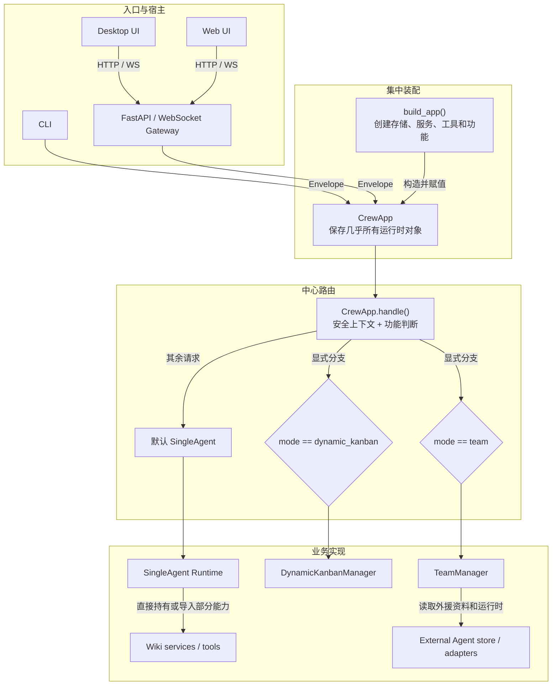
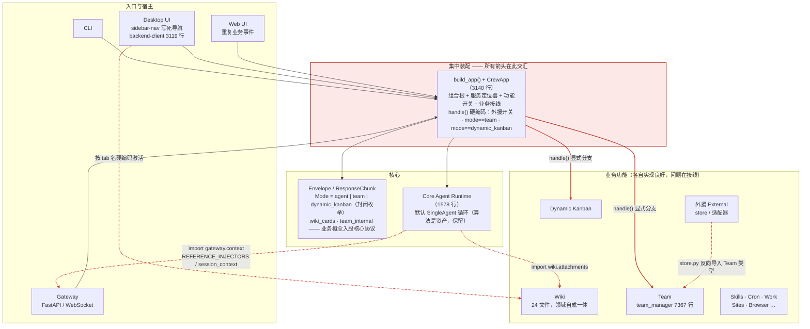
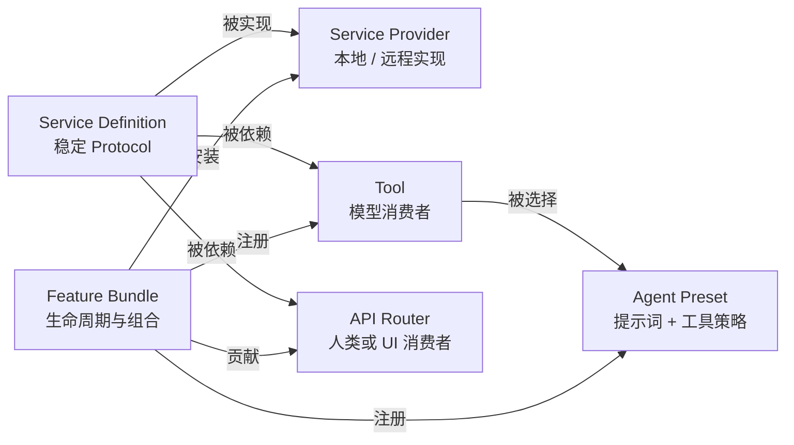
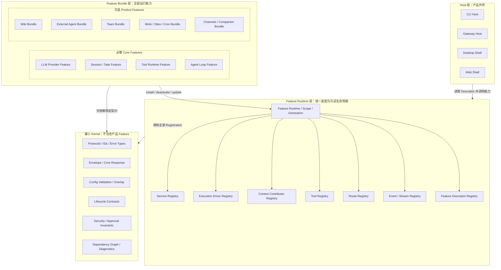
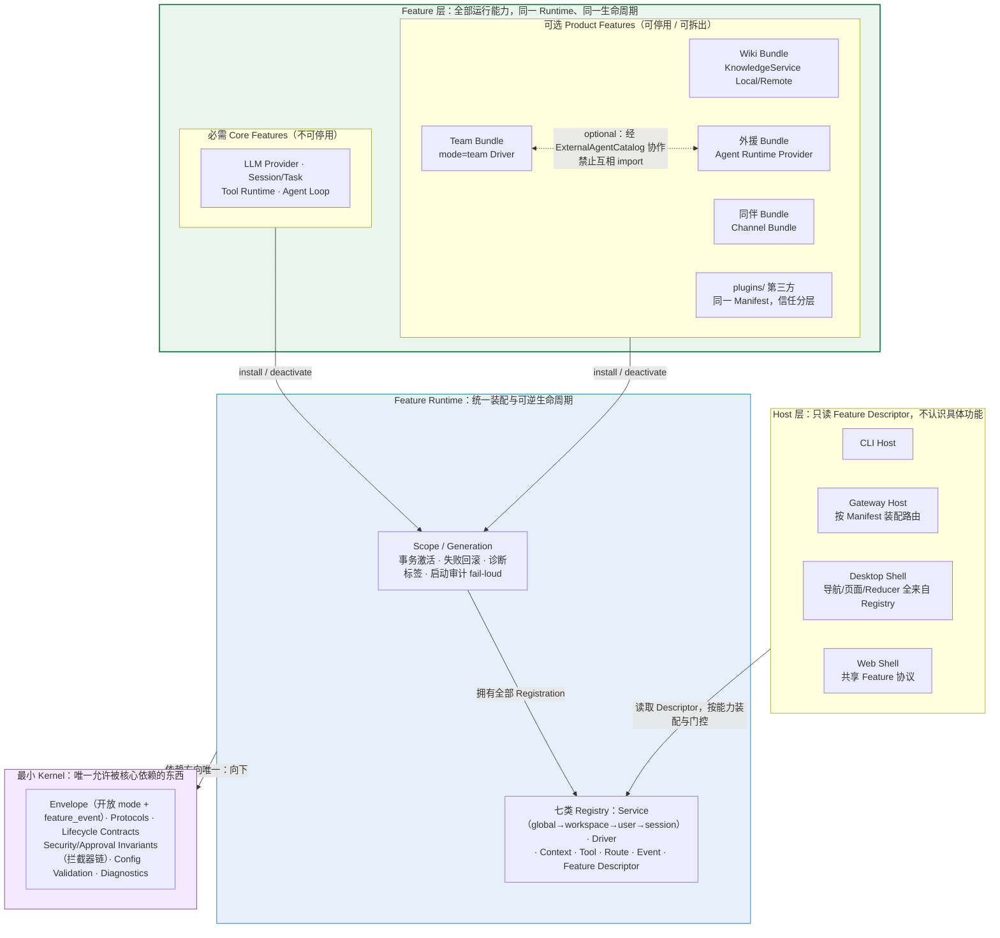
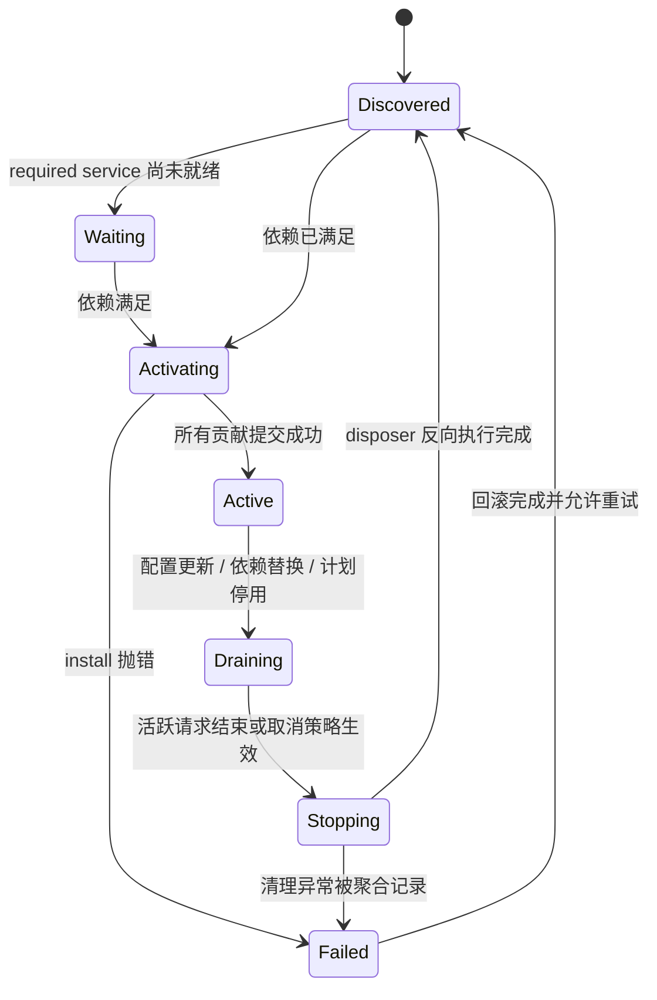
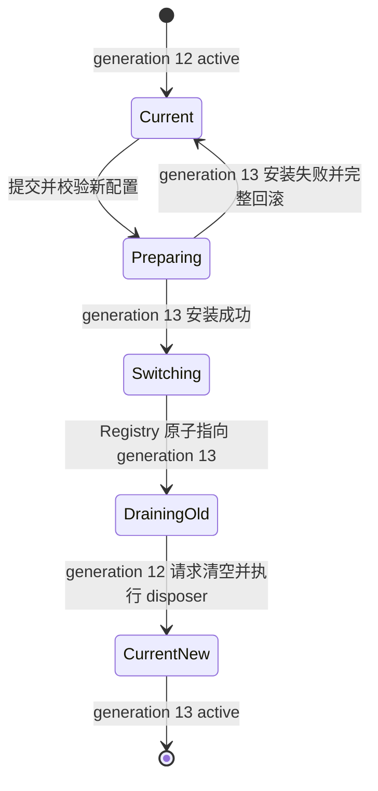
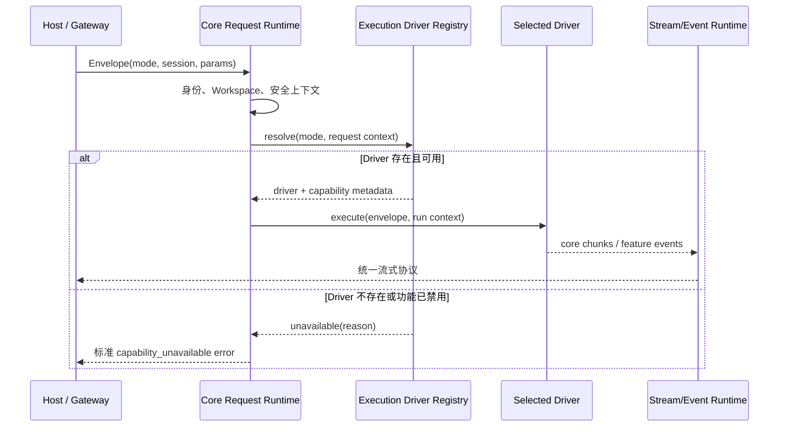
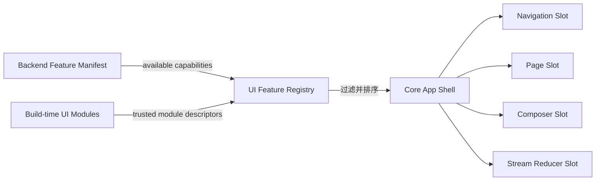
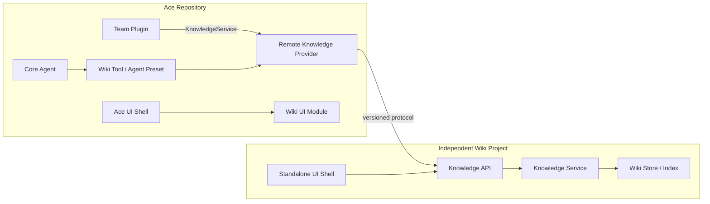

# Ace 可插拔架构演进方案

> 文档状态：设计提案  
> 适用分支：`dev` 及其后续演进分支  
> 基线核查日期：2026-08-31  
> 目标读者：Ace 后端、桌面端、Web 端及独立功能模块的维护者  
> 修订记录：2026-08-31 评审追加——workspace_guard 依赖核查（§2.3.3、§11、§17）、第一方/第三方插件契约收口（§2.3.8）、effect 诊断与启动审计（§6.3）、服务作用域维度（§6.4）、拦截器语义（§7.5）、螺旋式迁移节奏与依赖检查工具（§10、§13.3）、配置与数据命名空间约定（§12.5）、Adapter 保质期（§15.2）、ADR 机制（§16）、新增验收指标（§14）；同日补充——演进紧迫性论证与中心文件基线数据（§1.1.1）、接口层多租户地基（§2.2）；同日范围校正——明确 dsh 广义 Plugin 与 Ace 当前 `plugins/` 的区别，将目标提升为全部 Feature 的统一可逆生命周期，补充 Feature Generation、业务数据边界、全量迁移地图和工作量评估（§0、§3.3、§5、§6、§8、§10、§16、§18、§19）；同日——§2.1、§5.1 增加耦合视角与装配视角两张架构对比图（离线渲染版：docs/todo/ace-arch-compare.html）

## 0. 执行摘要

Ace 不需要推翻重写，也不应该把现有功能简单搬进一个名为 `plugins` 的目录就宣布完成插件化。

本文所说的 Plugin 采用与 dsh 相同的广义架构含义：**除最小 Kernel 外，运行中的每一项能力都是由生命周期单元装配出来的 Feature**。它不等同于 Ace 当前顶层 `plugins/` 中数量较少的外部扩展。现有 PluginManager 只是未来 Feature Runtime 的一个兼容入口，目标不是让七八个目录插件可卸载，而是让 Agent Loop、Tools、Task、Wiki、外援、Team、Dynamic Kanban、Work、Sites、Cron、Browser、Channels、同伴以及前端 UI Contribution 都进入同一套可逆生命周期。

当前 Ace 已经具备若干正确的基础：统一的请求与响应协议、可替换的 Agent Executor、工具注册表、插件管理器、外部 Agent 适配层，以及相对独立的 Wiki 领域代码。真正阻碍长期演进的，是这些能力尚未形成一套完整的“能力装配系统”：

- `CrewApp` 和 `build_app()` 同时承担组合根、服务定位器、功能开关和业务接线，新增功能往往要修改中心文件。
- 核心 Agent Runtime 仍直接导入 Wiki、Gateway 上下文等上层模块。
- `Envelope.mode`、`ResponseChunk.kind` 直接枚举 Team、Wiki、Dynamic Kanban 等业务概念。
- 现有目录插件能注册工具、Hook 和 API Router，但绝大多数第一方 Feature 仍由 `CrewApp` 手写构造、启动和关闭，尚未进入统一生命周期。
- 桌面端和 Web 端仍直接认识 Wiki、外援、技能、灵感等具体功能，后端拆开后 UI 仍会形成第二道耦合。

本方案建议保留 Ace 现有核心 Agent 与产品形态，逐步建立以下稳定结构：

```text
最小 Ace Kernel
  + Feature Lifecycle Runtime
  + 作用域化 Service / Contribution Registry
  + 必需 Core Feature Bundle
  + 可选 Product Feature Bundle
  + Host/UI Feature Registry
```

最终希望达到的效果不是“所有代码都放进插件目录”，而是：

1. Kernel 只保留生命周期引擎、稳定协议、配置解析、能力注册、安全不变量和诊断，不包含具体产品 Feature。
2. Agent Loop、Tool Runtime、Session/Task 等基础能力也是必需 Core Feature；它们可以被替换和重载，但产品策略可以禁止用户直接关闭。
3. Wiki、同伴、外援、Team 等产品能力以 Product Feature Bundle 交付，拥有自己的 Service、Agent、Tool、Route、Event、存储和 UI 贡献。
4. Feature 之间通过能力接口协作，不导入彼此的具体实现。
5. Feature 启用、禁用、配置更新和依赖变化具有完整可逆生命周期，失败不会污染全局状态。
6. 停用 Feature 只撤销运行时装配与资源，不隐式删除业务数据；数据删除必须是独立显式操作。
7. 将 Wiki、同伴或外援迁出 Ace 时，主要工作是替换 Provider、配置和宿主 UI，而不是重写业务逻辑。

---

## 1. 背景与设计目标

### 1.1 要解决的问题

Ace 的功能由不同人员并行开发。Wiki、同伴、外援、Team 等功能在产品上需要协作，但在工程上不能互相绑定，否则会出现以下问题：

- 开发 Wiki 时必须理解 Team 或 Gateway 的内部实现。
- 关闭一个功能只能隐藏入口，无法真正释放工具、路由、后台任务和资源。
- 新增一种 Agent 模式时必须修改 `CrewApp.handle()`、核心类型、Gateway 和 UI。
- 将某个功能拆成独立项目时，会发现其存储、Agent、API 和 UI 分散在多个中心模块中。
- 多人并行开发频繁修改同一个组合根和同一组前端入口，增加冲突与回归风险。

本次架构演进的核心问题可以表达为：

> 如何在保持现有 Ace 可持续运行的前提下，把“中心文件知道所有功能”逐步改成“功能向宿主声明自己贡献的能力”。

### 1.1.1 为什么是现在

中心耦合的恶化是加速度的。中心接线是当前“加功能”阻力最小的路径：中心文件越大，后来者越倾向于继续在中心里加代码，耦合以每次提交为单位自我强化。因此迁移成本随时间上涨而不是不变——现在 3140 行的组合根做渐进迁移是外科手术，膨胀一倍之后，渐进迁移本身会演变成事实上的重写。

以下基线数据（2026-08-31 核查）用于让协作者直观理解严重程度，并作为后续阶段的对比基准——按 §14 的原则，行数下降不是目标，但它是依赖方向矫正后的可观察结果：

| 中心文件 | 基线行数 | 角色 |
|---|---:|---|
| `crew/team/team_manager.py` | 7367 | 全仓库最大单文件，Team 编排核心 |
| `crew/app.py` | 3140 | 组合根 + 服务定位器 + 中心路由 |
| `desktop/src/ui/backend-client.ts` | 3119 | 前端功能 API 集中地 |
| `crew/agent/runtime.py` | 1578 | 核心 Agent Runtime（含反向导入） |
| `crew/plugins/manager.py` | 1268 | 插件管理器（生命周期待闭环） |
| `desktop/src/ui/app.ts` | 985 | 桌面前端组合根 |

### 1.2 目标

本方案有六个明确目标：

1. **核心稳定**：核心 Agent 的执行循环、会话、工具执行和安全边界不因新增业务功能而频繁修改。
2. **功能自治**：Wiki、同伴、外援、Team 分别拥有清晰的代码、存储、配置、API 和 UI 边界。
3. **按能力协作**：模块通过 Protocol、事件和注册表通信，不通过具体类和跨域数据库表通信。
4. **全量可逆生命周期**：每项 Core/Product Feature 的注册和后台资源都归属于独立 Feature Scope，能够可靠清理、重载和诊断。
5. **渐进迁移**：每个阶段都能独立测试、发布和回滚，不要求大爆炸式切换。
6. **可独立部署**：业务模块先在单仓库内形成可拆边界，再视需要迁出仓库或进程。

### 1.3 非目标

本方案不做以下事情：

- 不重写现有 Agent Loop。
- 不把 Ace 改造成另一种语言或引入一套重量级前端微应用框架。
- 不为了形式上的纯粹，把每个小函数拆成独立包。
- 不在第一阶段加载不受信任的远程前端 JavaScript。
- 不要求所有功能立刻进程外运行。
- 不改变现有安全审批、工作区隔离和用户隔离的不变量。

### 1.4 设计原则

后续架构决策应遵守以下原则：

| 原则 | 含义 | 判断标准 |
|---|---|---|
| 依赖倒置 | 业务功能依赖核心 Protocol，核心不依赖业务功能 | `crew/agent` 中不能出现 `crew.wiki`、`crew.team` 等导入 |
| 能力优先 | 先定义服务能力，再选择本地或远程实现 | Wiki 本地化和服务化使用同一 `KnowledgeService` |
| 生命周期归属 | 谁注册，谁负责释放 | Tool、Hook、Router、Task、连接都能追溯到 Feature Scope 与 Generation |
| 组合代替分支 | 新功能通过注册贡献，不在中心函数增加 `if feature` | 新增 mode 不修改 `CrewApp.handle()` |
| 兼容先行 | 新旧协议可以在迁移期共存 | 旧的 `wiki_cards` 能通过适配器继续工作 |
| 先逻辑拆分、后物理拆分 | 先清理依赖方向，再迁仓库或进程 | 拆 Wiki 前先确保只依赖核心契约 |
| 跨平台一致 | 平台差异封装在 Provider 内 | macOS、Linux、Windows 使用相同接口和生命周期 |

---

## 2. Ace 当前架构：十分钟总览

### 2.1 当前主路径

Ace 已经使用 `Envelope -> Agent -> ResponseChunk` 统一 CLI、Gateway 和 UI 的运行语义，这是应当保留的核心资产。当前请求大致经过以下路径：



图中最关键的问题不是节点数量，而是箭头方向：组合根和核心运行时正在向具体功能延伸。每增加一个功能，中心层就需要知道更多业务细节。
下图从依赖与耦合视角再看一次同一结构（2026-08-31 核查，红色为病灶；渲染版见 `docs/todo/ace-arch-compare.html`）：



红色箭头一一对应 §2.3 的耦合点：组合根认识全部业务（§2.3.1/§2.3.2）、核心反向导入上层（§2.3.3）、协议含业务枚举（§2.3.4）、UI 硬编码功能（§2.3.7）。

### 2.2 已有的良好基础

Ace 并非从零开始做模块化。以下能力可以直接作为演进基础：

| 已有能力 | 当前价值 | 后续处理 |
|---|---|---|
| `Envelope` / `ResponseChunk` | 统一请求与流式响应 | 保留基础协议，移出业务枚举 |
| `crew/core/interfaces.py` | 已定义 Provider、Tool、Agent、Store、Plugin 等接口 | 收紧为稳定内核契约，补齐能力注册接口 |
| 接口层的多租户设计 | `SessionStore`、`WorkspaceStore` 全部接口携带 `owner_account_id` 参数 | 多租户意识已在接口层就位，直接支撑 §6.4 的服务作用域维度 |
| `crew/agent/executor/` | Builtin、External、Client 执行可替换 | 上升为 Agent Runtime Provider seam |
| `crew/plugins/manager.py` | 已支持工具、Hook、Middleware、Command、Router、Skill Root 等贡献 | 演进为作用域化、事务式生命周期管理器 |
| `crew/agent/external/` | 外部 Agent 协议和适配器已相对集中 | 去除 Team 反向依赖，独立成为 Provider Bundle |
| `crew/wiki/` | 存储、编译、查询和工具已形成领域模块 | 作为第一个完整 Feature Bundle 试点 |
| Gateway Channel 抽象 | 同伴可自然成为一种 Channel | 把同伴直接设计成 Channel Bundle |

这意味着演进重点应放在“装配方式和依赖方向”，而不是重写已经工作的业务算法。

### 2.3 主要耦合点

#### 2.3.1 `CrewApp` 同时承担过多职责

`crew/app.py` 中的 `CrewApp` 保存 Wiki、Team、Dynamic Kanban、外援、Work、Cron、Site、Browser 等运行时对象。`build_app()` 则直接构造并连接这些对象。

当前 `build_app()` 的典型职责包括：

- 创建基础 Store、Provider、Registry 和 PluginManager。
- 发现插件并补充运行时 Service。
- 注册内置工具、Site 工具、外援工具、Task 工具和 Plan 工具。
- 直接创建 Wiki Store、Compiler、Querier、Summarizer 和 SessionManager。
- 直接创建 Work、Subagent、Cron、Team 和 Dynamic Kanban。

这使 `build_app()` 既是组合根，也是所有业务功能的安装脚本。它可以继续作为顶层启动入口，但不应再知道每个功能的内部构造过程。

#### 2.3.2 `CrewApp.handle()` 硬编码执行模式

`CrewApp.handle()` 当前直接判断：

- 外援功能是否关闭；
- `mode == "team"`；
- `mode == "dynamic_kanban"`；
- 否则租用默认 Agent。

这意味着 mode 不是开放扩展点。未来新增“同伴 Agent 模式”“研究模式”或独立 Wiki Agent，都会继续增长中心分支。

#### 2.3.3 核心 Agent Runtime 反向依赖上层功能

`crew/agent/runtime.py` 当前直接导入或使用：

- `crew.wiki.attachments`；
- `crew.gateway.context.REFERENCE_INJECTORS`；
- `crew.gateway.session_context`；
- `wiki_manager` 特殊逻辑。

此外，`crew/agent` 还有三处对 `crew/team` 的直接导入（2026-08-31 核查）：

- `crew/agent/loop/tool_runner.py` 导入 `crew.team.workspace_guard.check_workspace_guard`；
- `crew/agent/executor/external.py` 导入 `crew.team.workspace_guard` 的 `check_workspace_guard` 与 `classify_external_permission`；
- `crew/agent/file_changes.py` 导入 `crew.team.workspace_guard.normalize_acp_tool_name`。

`workspace_guard` 本质上是工作区安全工具，并非 Team 领域概念，只是当前被安放在 `team/` 目录中。它恰好挡在“`crew/agent` 不得导入 `crew/team`”红线的正中央，且迁移成本低、不涉及业务逻辑，应作为最早一批整改项移入核心安全层（见 §10 阶段 0、§11）。

从分层角度看，Gateway 和 Wiki 应依赖 Agent Core 提供的扩展点，而不是 Agent Core 导入 Gateway 和 Wiki。

#### 2.3.4 核心数据协议包含业务枚举

`crew/core/envelope.py` 当前将以下业务概念写入核心类型：

- `Mode = Literal["agent", "team", "dynamic_kanban"]`；
- `wiki_cards`；
- `wiki_ingest_progress`；
- `team_internal`。

这样做能提供静态类型提示，但代价是每增加一个功能或事件都必须修改核心协议。核心协议应稳定，业务事件应通过带命名空间和版本号的扩展事件表达。

#### 2.3.5 外援模块反向依赖 Team

`crew/agent/external/store.py` 直接导入 Team 的 Agent Profile、Capabilities 和 Roles。外援本应是可供多个场景使用的 Agent Runtime Provider，却依赖其中一个消费者 Team。

正确方向应是：

```text
Team Plugin -> Agent Catalog Protocol <- External Agent Plugin
```

而不是：

```text
External Agent Store -> Team concrete types
```

#### 2.3.6 插件生命周期尚未闭环

当前 PluginManager 已支持大量贡献类型，但仍有四个关键缺口：

1. 插件 `register()` 中途失败时，已注册的 Tool、Hook 或 Middleware 未形成统一事务回滚。
2. `discover_and_load()` 会清理内部映射，但重复发现前未必完整执行旧资源的 disposer。
3. `services` 是非类型化共享字典，缺少 required/optional 依赖和依赖驱动的启动顺序。
4. FastAPI Router 在应用创建时挂载；从 PluginManager 移除记录并不会自动从已经构造的 FastAPI Router 树中卸载路由。

因此，当前插件更接近“启动时扩展加载器”，还不是完整的“能力生命周期系统”。

#### 2.3.7 前端仍然硬编码功能

桌面端存在以下中心耦合：

- `desktop/src/ui/features/sidebar-nav.ts` 写死 Wiki、外援、Skills、Sites 等导航项。
- `desktop/src/ui/app.ts` 顶层导入各功能，并在 `activateTab()` 中按 tab 名称逐个判断。
- Stream Reducer 和渲染路径认识 `wiki_cards`、`team_internal` 等业务事件。
- `desktop/src/ui/backend-client.ts` 聚集了大量具体功能 API。

即使后端完成插件化，如果 UI 仍然需要修改中心文件，Wiki 也无法做到“只改宿主外壳即可独立”。

#### 2.3.8 顶层 `plugins/` 与 Feature Bundle 的关系尚未收口

仓库顶层 `plugins/` 已有 6 个带 `plugin.yaml` 的第一方插件（browser、feishu、wiki_learning、platforms、security_guidance、crew_disk_cleanup）。其中 browser 已具备 Tool、Skills、Workflow Store 等多种贡献，形态上接近完整 Feature Bundle；wiki_learning 则是天然的“依赖 Wiki 能力的插件”样本。

本方案明确：**第一方 Feature Bundle 与第三方插件必须收敛到同一份 Manifest、同一个 Feature Scope 和同一套生命周期**，区别仅在产品必需性、信任层级（随仓库构建发布 vs 外部安装）与权限声明。否则将形成“内置功能一套、外部插件一套”的双轨系统，违背 §15.2 的控制目标。`plugins/browser` 适合作为阶段 1 新生命周期的首个试点插件；`plugins/wiki_learning` 适合作为阶段 3 跨 Feature 服务依赖（requires: knowledge）的验证样本。

另外，`crew/companion/` 与 `crew/notifications/` 目前是不含实现代码的空目录。同伴作为尚未开发的功能，应直接按 §8.4 的目标形态实现，并作为第一个“不允许中心接线”的功能，验证核心扩展点是否真正开放（见 §14 验收指标）。

### 2.4 当前事件和扩展机制碎片化

Ace 已存在多种通信机制：

- PluginManager Hook / Middleware；
- Gateway 全局 Hook Registry；
- `ResponseChunk.kind`；
- 静态 `REFERENCE_INJECTORS`；
- 各功能自己的回调和后台通知。

这些机制本身不一定错误，但缺少统一的所有权、命名、生命周期和适用边界。演进时不应再增加第五、第六套全局回调表，而应明确：

- 直接调用稳定服务完成确定性能力调用；
- 使用 Context Contributor 组装模型可见上下文；
- 使用 Execution Driver 选择运行方式；
- 使用持久 Session Event 记录需要回放的事实；
- 使用瞬时 Domain Event 通知当前进程内观察者；
- 所有注册都归属 Feature Scope 和明确 Generation。

---

## 3. dsh 设计中值得吸收的部分

### 3.1 “一切都是插件”的真正含义

dsh 的关键并不是把代码放进插件目录，而是通过 Cordis 建立了五个一致概念：

1. 插件是服务或行为的安装单元。
2. Context 是服务容器，消费者通过稳定 key 获取能力。
3. 插件显式声明依赖，生命周期由依赖关系驱动。
4. 类型化事件承担观察、拦截、并行分发和串行决策。
5. 每项注册都是可逆副作用，卸载时按作用域释放。

这使模型适配器、工具、会话日志和 Agent Loop 都可以被组合与替换。它解决的是“依赖、所有权和装配”，而不是目录命名问题。

### 3.2 Capability Seam

dsh 将一项可替换能力分为三类角色：

| 角色 | 职责 | Ace 示例 |
|---|---|---|
| Service Definition | 定义稳定接口和数据协议 | `KnowledgeService` |
| Service Provider | 提供本地、远程或平台特定实现 | `LocalWikiProvider`、`RemoteWikiProvider` |
| Consumer | 使用能力，通常面向 Agent 或 UI | Wiki Tool、Wiki Agent、API Router |

这对 Ace 最重要的启示是：**功能不等于 Agent，Agent 也不等于插件。**

Wiki 有存储、编译、查询、Agent、工具、API 和 UI，因此它应是一个 Feature Bundle；其中 Wiki Agent 只是一个消费者和交互入口。外援适配器是 Agent Runtime Provider；某个具体外援实例才是 Agent。Team 是编排插件，团队成员才是 Agent。

### 3.3 可逆副作用

插件安装时经常产生副作用：注册工具、添加路由、启动后台任务、打开数据库、订阅事件、写入菜单。若这些副作用没有统一所有者，禁用插件就只能“隐藏”，不能真正卸载。

Ace 应吸收的机制是：

```text
Feature Scope
  owns Service registration
  owns Tool registration
  owns Driver registration
  owns Event subscription
  owns Route contribution
  owns Background Task
  owns Resource disposer
```

Feature 激活失败时，Scope 反向执行 disposer，恢复到激活前状态。Feature 停用时也走同一条清理路径。

dsh 中这套机制不是约定，而是由 Cordis Fiber 强制执行：每次插件挂载产生一个 Fiber；`ctx.effect()` 在插件代码开始制造副作用时就登记清理包装器；Service、Tool、Event Listener、System Prompt Section 等注册最终都返回精确 disposer 并归属当前 Fiber。Fiber 停用时按后进先出顺序取出 disposer；Service 的注册和移除会通知依赖它的 Fiber，依赖缺失时自动卸载，依赖恢复时重新激活；配置更新则通过 Fiber restart 清理旧 Effect 后重新执行安装函数。

Ace 的“可逆”必须分成四层验收，不能只检查菜单是否隐藏：

| 可逆层次 | 必须撤销的内容 | 明确边界 |
|---|---|---|
| 装配可逆 | Service、Tool、Driver、Prompt、Hook、Route Gate、Event、UI Contribution | 停用后新请求不可再解析到旧贡献 |
| 资源可逆 | asyncio Task、线程、子进程、连接、定时器、Provider、文件句柄、数据库连接 | `deactivate()` 返回前必须 await 清理完成或明确进入 draining |
| 依赖与配置可逆 | required service 变化、配置重载、失败回滚、旧 generation 恢复 | 不允许半激活状态和静默缺席 |
| 业务状态可控 | 会话、Wiki 内容、Team 历史、任务记录、Migration | 不自动回滚；disable、uninstall、delete data 是三个独立动作 |

因此“配置可逆”不是把所有外部行为恢复到过去，而是保证旧配置制造的运行时装配能够完整撤销，新配置失败时不会污染当前运行状态。已经发送的消息、写入的业务记录和完成的 Migration 必须另行设计幂等或补偿协议。

### 3.4 声明式组合

dsh 使用 Profile 和 Bundle 描述运行中的插件树。Ace 不需要复制其配置格式，但应建立自己的声明式 Feature 配置：

```yaml
features:
  wiki:
    enabled: true
    provider: local
  external_agents:
    enabled: true
  team:
    enabled: true
    optional_dependencies:
      - external_agent_catalog
  companion:
    enabled: false
```

配置只表达“需要什么”，依赖图决定启动顺序。`build_app()` 不再逐项手写功能构造过程。

### 3.5 Ace 不应照搬的部分

Ace 应吸收原则，而不是复制实现：

- 不必移植 Cordis。
- 不必将 Python 项目拆成数百个极小包。
- 不要求第一阶段就支持默认 Agent Loop 的运行时热卸载，但目标架构中它仍是由 Feature Runtime 管理的必需 Core Feature。
- 不必为了动态卸载而牺牲 FastAPI 的清晰路由和类型检查。
- 不必第一阶段开放第三方远程 UI 代码。

Ace 更适合“小而稳定的 Kernel + Python Protocol + Feature Runtime + 明确注册表 + 作用域生命周期 + Feature Bundle”。

---

## 4. 统一概念模型

### 4.1 核心概念定义

| 概念 | 定义 | 不应承担的职责 |
|---|---|---|
| Agent | 使用模型、提示词、工具和状态完成任务的运行参与者 | 不负责安装 API、数据库和 UI |
| Plugin | 安装、激活、停用和释放一组贡献的生命周期单元 | 不必等同于一个 Agent |
| Service | 供其他模块直接调用的稳定能力接口 | 不向模型暴露 schema |
| Provider | Service 的具体实现，可本地、远程或平台特定 | 不让消费者依赖实现细节 |
| Tool | 面向模型的能力入口，通常是 Service 的消费者 | 不独占业务状态和连接生命周期 |
| Execution Driver | 根据 mode 或运行策略执行一次请求 | 不在核心 `if/else` 中硬编码 |
| Context Contributor | 向提示词、附件、引用或会话上下文贡献内容 | 不直接修改 Agent Runtime 内部字段 |
| Feature Bundle | 一项产品功能的完整交付单元 | 不要求所有内容都在一个文件中 |
| Host | CLI、Gateway、Desktop、Web 等产品外壳 | 不应知道功能内部构造方式 |

### 4.2 推荐关系



这个关系能避免“把 Wiki 包装成一个 Agent 就算拆分完成”的误区。即使没有 Wiki Agent，Wiki Service 仍可被 Team、默认 Agent、API 或外部项目调用。

---

## 5. 目标架构

### 5.1 分层模型

目标架构分为五层，依赖只能向下。必需 Core Feature 与可选 Product Feature 使用同一个 Feature Runtime，区别只是产品策略、信任级别和是否允许停用：



核心约束是：Kernel 和 Feature Runtime 不导入任何具体 Feature Bundle。Core Feature 与 Product Feature 都只能通过稳定 Service Definition 和作用域注册表协作。Agent Loop 虽然是 Ace 产品运行必需能力，但在架构上仍是 Feature，不再成为 Wiki、Team、外援等功能反向导入的中心容器。
再用装配视角看同一目标结构——Feature 如何接入、请求如何被解析、Feature 间如何协作（渲染版见 `docs/todo/ace-arch-compare.html`）：



**验收标志**：新增运行模式、上下文来源或同伴 Channel 时，不改 Agent Loop、请求路由、核心协议和核心导航任何一行——只新增 Feature 并向 Registry 注册贡献。

### 5.2 最小内核边界

Ace Kernel 应只保留以下能力：

- `Envelope`、核心响应、错误和身份标识。
- Agent、Tool、Session、Task、Workspace、Memory、Provider 的基础 Protocol，不保留其具体运行实现。
- Feature Scope、Generation、依赖图、配置验证和贡献注册表。
- Effect/disposer 的异步清理语义与生命周期状态机。
- 安全审批、授权和审计的不变量及能力注入边界。
- Host 与 Feature 之间的能力清单协议。
- 依赖、Effect、配置版本和失败原因的诊断模型。

Kernel 不应包含：

- 默认 Agent Loop、具体 Tool Runtime 和具体 Session/Task Store。
- Wiki Store、Wiki Attachment 特判。
- Team Mode、Dynamic Kanban Mode 的枚举。
- 外援角色、团队 Profile。
- Companion 的通道策略。
- 具体业务导航和页面。
- 具体业务 Stream Event 名称。

必需 Core Feature 包括默认 Agent Loop、Tool Runtime、Session/Task、LLM Provider、Prompt Assembly 等。它们使用与 Product Feature 相同的 Scope 和 Generation；产品可以通过 Manifest 标记 `required_by_product: true`，禁止普通用户关闭，但测试、部署组合和未来 Provider 替换仍能独立装配。

### 5.3 Feature Bundle 的标准组成

一个完整 Feature Bundle 可以包含以下组成，但不要求每项都存在：

```text
feature/<name>/
  manifest / descriptor
  contracts
  provider
  service
  agent preset
  tools
  api routes
  event schemas
  persistence + migrations
  ui contribution
  lifecycle install/dispose
  contract tests
```

目录结构不是硬性目标。关键是每项贡献都由同一个 Feature Scope 管理，并且模块只通过公开契约暴露能力。

---

## 6. Feature Runtime 设计

### 6.1 从现有 PluginManager 演进为统一 Feature Runtime

当前 `crew/plugins/manager.py` 已经掌握目录插件发现、Manifest、工具和 Hook 注册，可以复用其 Manifest 解析、贡献 API 和已有插件兼容能力。但它不能继续作为“只服务于顶层 `plugins/`”的旁路系统：目标是形成唯一的 Feature Runtime，让第一方 Core/Product Feature 与第三方目录插件共享同一个 Scope、依赖图、Generation 和状态机。

实现上可以保留 `PluginManager` 名称作为迁移期 Facade，但内部核心应逐步收敛到中立的 `FeatureRuntime`。`build_app()` 不再直接构造 Wiki、Work、Cron、Sites、Team 等对象，而是声明需要加载的 Feature Definition；现有目录插件则通过 Adapter 转换为同一种 Feature Definition。迁移完成后，Ace 不应存在“内置 Feature 手写启停、外部插件走 Scope”的双轨生命周期。

建议新增或收敛以下概念：

| 组件 | 职责 |
|---|---|
| `FeatureManifest` | Feature ID、版本、required/optional services、平台约束、配置 schema、产品必需性和更新策略 |
| `FeatureDefinition` | Feature 的安装入口；Core Feature、Product Feature、目录插件最终统一为这一形态 |
| `FeatureScope` | 持有某一 Feature Generation 的所有注册 token、任务和资源 disposer |
| `ServiceRegistry` | 通过稳定 key 和 Protocol 提供服务，检测冲突和缺失 |
| `ContributionRegistry[T]` | 为 Tool、Driver、Context、Route、Feature 等提供统一所有权模型 |
| `FeatureTransaction` | 激活期间暂存贡献，成功后提交，失败则反向释放 |
| `FeatureGeneration` | 一次配置对应的一代运行实例，支持准备、切换、drain 和恢复 |
| `FeatureState` | discovered、waiting、activating、active、draining、stopping、failed |
| `LegacyPluginAdapter` | 把现有 `register(ctx)` 目录插件接入 FeatureDefinition，带明确删除期限 |

不建议给每种贡献写一套完全不同的生命周期逻辑。底层应统一返回一个 Registration Token 或 disposer。

### 6.2 显式依赖

Feature Manifest 应区分：

- `requires`：缺失时插件不能激活。
- `optional`：存在时增强能力，不存在时仍可运行。
- `provides`：插件激活后提供的稳定 Service Key。
- `conflicts`：不能同时激活的实现或独占 Provider。

示例关系：

| 插件 | requires | optional | provides |
|---|---|---|---|
| Wiki Local Provider | storage、security | owner model provider | knowledge |
| Wiki Agent | agent presets、tools、knowledge | attachment parser | wiki agent preset |
| External Agent | security、workspace | interaction bridge | external agent catalog、agent runtime provider |
| Team | execution drivers、agent factory | external agent catalog | `mode:team` driver |
| Companion | channels、sessions、agent factory | notifications | companion channel |

依赖图取代 `build_app()` 和 `CrewApp.startup()/shutdown()` 中脆弱的手工创建、启动和关闭顺序。必需 Core Feature 同样声明依赖；`required_by_product` 只影响控制面是否允许用户停用，不改变生命周期模型。

### 6.3 事务式激活

Feature 激活应遵循以下生命周期：



激活过程必须满足一个不变量：

> Feature 激活失败后，所有注册表、后台任务和资源状态与激活前一致；停用返回完成后，不再存在属于该 Generation 的活跃资源。

建议执行顺序：

1. 创建隔离的 `FeatureScope`、新 Generation 和暂存事务。
2. 验证必需 Service、配置、产品策略和平台条件。
3. 调用 Feature `install(ctx)`。
4. 每次注册立即记录对应 disposer，但对外可见性暂存。
5. `install()` 成功后原子提交注册项。
6. 任意步骤失败，按后进先出顺序执行 disposer。
7. 记录结构化失败原因，不继续留下半激活 Feature。

同时补充两条运营级要求：

- **带标签的注册诊断**：每次贡献注册都记录可读标签（如 `tool:wiki_query`、`hook:session.start`）和所属 Feature/Generation。FeatureScope 因此能输出“谁在什么时候注册了什么”的诊断树，并提供 `ace --dump-features` 调试命令，列出所有 Feature 状态、贡献清单和注册来源。多人并行开发时，“我的功能为什么没起来”类问题应主要靠它自查，而不是阅读中心装配代码。
- **启动审计 fail-loud**：启动收敛后输出一次审计报告。凡是停在 Waiting（required service 未满足）或 Failed 的 Feature 必须被显式点名，包含缺失的 Service Key 列表；配置错误不允许“树看起来起来了但功能悄悄缺席”。审计结果同时作为 §6.6 Feature Manifest 的数据来源。

### 6.4 统一贡献注册表

首批建议建立六类注册表：

1. **Service Registry**：稳定服务能力。
2. **Execution Driver Registry**：开放请求执行模式。
3. **Context Contributor Registry**：提示词、附件、引用和提醒。
4. **Route Registry**：Gateway API 贡献。
5. **Feature Descriptor Registry**：后端功能状态与 UI 元数据。
6. **Event/Stream Registry**：扩展事件 schema、版本和客户端 reducer。

Tool Registry 已存在，应改为同一作用域所有权模型，而不是另起一套。

**Service Registry 必须带作用域维度。** Ace Gateway 是多用户、多工作区的：未来 `KnowledgeService` 很可能需要按用户或工作区解析到不同的 Provider 实例。如果 Service Registry 只是全局 key 到单实例的字典，Wiki 服务化时会把单租户假设烤进契约，阶段 6 物理拆分时必然返工。因此注册与解析都应支持作用域层级：

```text
global -> workspace -> user -> session
```

解析时沿层级向上查找；上层注册的实现遮蔽下层。第一阶段可以只实现 global 和 workspace 两级，但接口必须预留完整层级，避免契约定型后再开孔。

### 6.5 Router 的现实边界

FastAPI 的路由通常在应用构造时固化。第一阶段不要承诺真正的运行时热卸载 Router，可以采用两个层次：

- **启动期装配**：插件启用状态确定后再构造 Gateway Router 树。
- **运行期禁用**：稳定代理路由检查 Feature State，未启用时返回统一 unavailable 响应。

未来若确有热卸载需求，再评估重新构造子应用或挂载独立 ASGI App。不要直接修改 FastAPI 内部 route list 来伪造可逆生命周期。

### 6.6 配置与 Feature Descriptor

后端应提供可信的 Feature Manifest，至少包含：

```json
{
  "id": "wiki",
  "version": "1",
  "state": "available",
  "capabilities": ["knowledge.query", "knowledge.ingest", "agent.preset.wiki"],
  "ui": {
    "navigation": "wiki",
    "stream_protocol": "ace.feature-event.v1"
  }
}
```

该 Manifest 是后端和 UI 的能力事实来源。前端不应根据某个 API 是否报错来猜测功能是否存在。

### 6.7 Feature Generation 与配置更新

Feature 配置更新不能简单修改共享对象字段。每次已验证配置对应一个不可变 Generation，例如 `wiki@g12`。Runtime 根据 Feature 的资源特性选择两种策略：

| 策略 | 执行过程 | 适用场景 |
|---|---|---|
| `replace` | 准备新 Generation → 激活成功后原子切换注册项 → drain 并清理旧 Generation | Tool、Prompt、纯内存 Service、可并行 Provider |
| `restart` | 将旧 Generation 置为 draining → 停止并清理 → 启动新 Generation；失败时尝试用旧配置恢复 | 独占端口、Channel 长连接、Cron 调度器、独占数据库写者 |

推荐的 replace 路径如下：



配置记录只有在新 Generation 达到可接受状态后才标记为 effective。Runtime 应同时保存 `desired_config_revision` 与 `effective_config_revision`，使控制面能够明确显示“用户想要的配置”和“当前实际运行配置”，避免更新失败后 UI 仍误报成功。

### 6.8 活跃请求的 drain、取消与停用语义

Feature 停用时不能直接关闭仍被请求使用的资源。每个 Feature 必须声明停用策略：

- `drain`：拒绝新请求，等待当前 lease 结束后清理；默认用于 Agent、Provider、Wiki 查询和 Team。
- `cancel`：通知活跃任务取消，在超时后终止；用于用户明确停止的后台运行。
- `immediate`：没有活跃请求或资源无状态时立即清理；用于纯注册贡献。
- `restart_required`：Router 树或进程级资源无法安全热切换时，记录待重启状态，由 Host 在重启边界完成。

FeatureScope 必须提供 lease 计数、取消信号、drain timeout 和强制清理后的结构化诊断。`deactivate()` 只有在贡献不可再见且资源完成清理后才能返回成功；若超时，应返回 `draining/failed`，不能提前标记为 disabled。

---

## 7. 核心请求与事件协议演进

### 7.1 Execution Driver 替代中心 mode 分支

`Envelope.mode` 可以继续存在，但类型应从封闭业务枚举改成开放字符串或稳定标识，例如：

```text
agent.default
team
dynamic-kanban
wiki.agent
```

核心流程只做一次 Driver 解析：



默认 Agent、Team 和 Dynamic Kanban 都只是 Driver。新增 mode 时不修改核心路由。

### 7.2 Context Contributor 替代核心反向导入

Agent Runtime 只定义上下文组装阶段：

```text
request metadata
  -> attachment contributors
  -> reference contributors
  -> session contributors
  -> feature contributors
  -> policy filtering
  -> prompt assembly
```

Wiki 注册 Wiki Attachment Contributor，Gateway 注册 Session Source Contributor，Cron 注册 Reminder Contributor。核心 Agent Runtime 只遍历贡献者，不导入其模块。

Contributor 需要声明：

- 唯一 ID 和所属插件；
- 执行阶段和优先级；
- 输入 Context 类型；
- 输出片段类型；
- 是否允许失败降级；
- 超时和取消行为；
- 是否产生模型可见持久事件。

### 7.3 业务事件命名空间

核心 `ResponseChunk` 只保留稳定类型，例如：

- `delta`；
- `tool`；
- `thinking`；
- `final`；
- `error`；
- `status`；
- `feature_event`。

业务事件统一封装：

```json
{
  "kind": "feature_event",
  "body": {
    "feature": "wiki",
    "event": "cards",
    "version": 1,
    "payload": {}
  }
}
```

迁移期保留旧事件适配器：

| 旧事件 | 新事件 |
|---|---|
| `wiki_cards` | `feature=wiki, event=cards, version=1` |
| `wiki_ingest_progress` | `feature=wiki, event=ingest_progress, version=1` |
| `team_internal` | `feature=team, event=internal_message, version=1` |

后端可双发或在 Gateway 层转换，前端逐步迁移 reducer。所有客户端升级后再删除旧协议。

### 7.4 持久事件与瞬时事件分开

不是所有 `feature_event` 都需要存储。建议区分：

| 类型 | 用途 | 示例 |
|---|---|---|
| Session Event | 必须回放、恢复或审计的事实 | Team 内部消息、Wiki 查询结果引用 |
| Stream Event | 当前请求的实时渲染 | Wiki 导入进度、临时状态 |
| Domain Event | 进程内解耦通知 | Knowledge updated、Agent catalog changed |

若一个事件会影响刷新后的 UI 或模型上下文，它必须具有持久投影；不能只依赖 WebSocket 瞬时帧。

### 7.5 拦截语义：区分拦截器与观察者

现有 PluginManager Hook 与 Gateway 全局 Hook 并存（§2.4），收敛时应按语义分成两类，而不是合并成一张回调表：

| 语义 | 行为 | 适用场景 |
|---|---|---|
| 拦截器（Interceptor） | 环绕执行链，拿到 `next` 回调；调用 `next()` 委托给内建行为，不调用即否决或接管 | 安全审批、工具前后置、请求改写、权限裁决 |
| 观察者（Observer） | 接收通知，不影响执行结果 | 遥测、审计、UI 通知、领域事件 |

确定性决策（审批、否决）只能走拦截器；观察者不得通过副作用影响流程。拦截器按注册顺序串联，内建行为永远是链尾——这保证核心行为始终存在，插件只能包裹、不能替换核心安全不变量（§15.5）。§7.2 的 Context Contributor 属于观察者变体（贡献内容，由核心决定组装）；审批链则是典型的拦截器。

---

## 8. 各功能的目标形态

### 8.1 Wiki：首个 Feature Bundle 试点

Wiki 是最适合先迁移的功能，因为其存储、编译、查询和工具已经相对集中。

建议拆成以下逻辑角色：

| 角色 | 职责 |
|---|---|
| `KnowledgeService` | 定义查询、摄取、文档读取、索引状态等稳定能力 |
| `LocalWikiProvider` | 复用现有 FileSystem Store、Compiler、Querier、Summarizer |
| `RemoteWikiProvider` | 未来通过 HTTP/gRPC 调用独立 Wiki 服务 |
| Wiki Agent Preset | 选择 Wiki Prompt、Tool Policy 和 Context Contributor |
| Wiki Tools | 面向模型调用 `KnowledgeService` |
| Wiki API | 面向 UI 调用 `KnowledgeService` |
| Wiki Event Schema | cards、ingest progress、knowledge updated |
| Wiki UI Module | 导航、页面、Composer 入口、Stream Reducer、设置 |

依赖方向：

```text
Wiki Agent / Tools / API / UI
              |
              v
      KnowledgeService Protocol
              ^
              |
    Local Provider or Remote Provider
```

未来拆项目时，Ace 内部只把 Provider 从 Local 换为 Remote；Tool、Agent Preset 和 UI 可以继续使用同一协议。

### 8.2 外援：Agent Runtime Provider Bundle

外援的本质不是 Team 子模块，而是一种可发现、可配置、可调用的 Agent Runtime Provider。

建议暴露：

- `ExternalAgentCatalog`：列出、解析和更新外部 Agent 描述。
- `AgentRuntimeProvider`：根据 Agent ID 创建或连接执行器。
- `DelegationService`：提交任务、流式接收结果、取消和收集。
- Adapter：ACP、CLI、Codex 等具体协议实现。
- Tools/API/UI：面向默认 Agent、Team 和用户的消费者。

需要优先处理的耦合是 `crew/agent/external/store.py` 对 `crew.team.*` 类型的依赖。公共 Agent Profile 应上移到稳定契约层，或者由外援契约定义中立描述，Team 自己做映射。

### 8.3 Team：Execution Driver 与协调服务

Team 不是核心 Agent 的内建模式，而是一个编排插件：

- 注册 `mode=team` 的 Execution Driver。
- 依赖核心 `AgentFactory`、Session/Task 和安全服务。
- 可选依赖 `ExternalAgentCatalog`。
- 管理 roster、任务图、mailbox、协作历史和结果呈现。
- 通过 Feature Event 输出内部协作状态。

Team 当前影响面最大，且 `team_manager.py` 体量很大，因此应最后迁移。先稳定外援和 Agent Factory 契约，再把 Team 的中心接线迁入 Bundle，风险更低。

Team 内部可以继续渐进拆分为规划、编排、执行和投影子模块，但这与 Feature Bundle 边界是两个问题，不应在同一阶段做大规模重构。

### 8.4 同伴：Channel Bundle

当前工作树中未发现可核查的同伴业务源码，因此这里只定义目标契约，不对现有实现作事实判断。

从产品定位看，同伴更适合作为 Channel Bundle：

- Channel Provider 负责外部输入输出和连接生命周期。
- Session Mapping 将联系人或对话映射到 Ace Session。
- Policy 决定身份、权限、工作区和可用能力。
- Notification Provider 负责主动通知。
- 同伴可以调用默认 Agent、Wiki Agent 或 Team Driver，但核心 Agent 不知道“同伴”概念。

目标调用方向：

```text
Companion Channel
  -> Session / Identity / Policy
  -> Agent Factory or Execution Driver Registry
  -> Response Stream
  -> Companion Transport
```

若未来同伴独立为服务，它只需把本地 Channel Provider 换成远程 Transport，核心 Agent 协议不变。

### 8.5 功能分类总结

完整目标不是只迁 Wiki、外援、Team 和同伴，而是让当前由 `CrewApp`、Gateway Lifespan 和前端 Shell 手写管理的全部能力进入 Feature Runtime：

| Feature | 类型 | 主要稳定服务或贡献 | 生命周期难点 | 建议批次 |
|---|---|---|---|---:|
| LLM Provider | 必需 Core Feature | `LLMProvider` | 活跃请求 drain、旧 Provider 延迟退休 | 2 |
| Session / Task | 必需 Core Feature | `SessionService`、`TaskRuntime` | 持久状态与运行资源分离、崩溃恢复 | 2 |
| Tool Runtime | 必需 Core Feature | `ToolRegistry`、安全执行流水线 | Tool Scope、审批不变量不可被替换 | 2 |
| Agent Loop | 必需 Core Feature | `AgentFactory`、默认 Execution Driver | Agent lease、上下文贡献、运行取消 | 2 |
| Memory / Prompt | Core Feature | `MemoryService`、Prompt Assembly | Session Scope、动态 Contributor | 2 |
| Cron | Product Feature | `CronService`、Cron Tools/API | 调度任务、Owner 挂载、restart 策略 | 1 |
| Sites | Product Feature | `SiteService`、Blueprint Scheduler | 调度器和 Store 的统一关闭 | 1 |
| Browser | Product/目录插件 | Browser Service、Tools/API | 浏览器 Owner、页面和进程清理 | 1 |
| Wiki | Knowledge Feature Bundle | `KnowledgeService` | Compiler 后台任务、Store、API、Agent、UI | 3 |
| Work | Product Feature | `WorkService` | 多个 Store、Wiki 可选依赖、后台处理 | 3 |
| 外援 | Agent Runtime Provider Bundle | `ExternalAgentCatalog`、`AgentRuntimeProvider` | ACP/CLI/Codex 子进程和流任务 | 4 |
| Dynamic Kanban | Execution Driver Feature | `mode:dynamic-kanban` | 运行任务、Store、Provider 状态 | 4 |
| Team | Orchestration Feature | `TeamCoordinator`、`mode:team` | 任务图、Provider 所有权、活跃协作 drain | 5 |
| Channels | Channel Feature Family | Channel/Delivery Services | 长连接、轮询、线程、Owner 生命周期 | 5 |
| 同伴 | Channel Bundle | `CompanionChannel`、Session Mapping | 当前源码证据不足；新代码直接采用 Feature Scope | 新增时 |
| Desktop / Web UI | Host Feature Module | Navigation/Page/Composer/Reducer | activate/dispose、协议版本、前后端状态一致 | 6 |

批次 1 的 Cron、Sites、Browser 是生命周期机制验证者；Wiki 是第一个完整业务纵向切片；外援、Dynamic Kanban、Team 和 Channels 因资源与并发状态复杂而后迁。必需 Core Feature 进入 Runtime 不等于允许普通用户关闭：Manifest 可以禁止控制面停用，但其测试、替换、配置重载和应用关闭仍走同一生命周期。

### 8.6 当前 Feature 生命周期分散的代码证据

当前 `CrewApp.startup()` 逐项启动 Task、Work、Browser、MCP、Cron 和 Sites，`CrewApp.shutdown()` 再逐项停止并关闭；Gateway Lifespan 又负责 Channels、Logout、全局 Hook 和 CrewApp 的关闭。这已经是一套隐式 Feature Runtime，只是生命周期协议、资源所有权和依赖关系都由中心代码手工维护。

此外，各 Feature 的接口并不统一：

- Work、Sites、Cron 使用 `start()/stop()`；
- Browser 使用 `startup()/aclose()`；
- Store 多使用同步 `close()`；
- 外援 Adapter 同时管理子进程、reader/writer/stderr Task；
- Team、Dynamic Kanban 和 Wiki 在业务方法内部直接创建后台 Task；
- Channels 同时包含 asyncio Task 和平台线程；
- UI 通过中心 `activateTab()` 和全局 reducer 隐式管理激活状态。

Feature Runtime 的迁移价值，就是把这些资源从 `CrewApp` 和 Gateway 的人工清单中收回所属 FeatureScope；不是把现有 `start/stop` 再包装一层后继续保留中心依赖。

---

## 9. 前端 Feature Registry

### 9.1 前端也必须有组合根

后端插件化不能自动解决 UI 耦合。桌面端和 Web 端需要统一的 Feature Registry，让核心 Shell 只认识插槽，不认识具体功能。

首期建议使用**构建期可信模块**，而不是运行时下载任意 JavaScript。每个 UI Feature 可以贡献：

| 贡献 | 说明 |
|---|---|
| Navigation Item | 图标、标题、排序、可见条件 |
| Page | 页面组件与 activate/dispose 生命周期 |
| Settings Section | 功能设置入口 |
| Composer Extension | 模式、Mention、附件或快捷操作 |
| Stream Reducer | 消费带版本的 Feature Event |
| Message Renderer | 渲染持久会话节点 |
| Badge / Inspector | 会话标识和侧栏检查器 |
| API Client | 该功能自己的类型化客户端 |

### 9.2 UI 装配流程



后端 Manifest 决定功能是否可用；构建期 UI Module 决定客户端是否具备相应渲染能力。二者都满足时才显示入口。

### 9.3 桌面端迁移重点

- 将 `sidebar-nav.ts` 的具体功能数组改为 Registry 贡献。
- 将 `app.ts` 中 `activateTab()` 的业务分支改成 `registry.activate(tab)`。
- 将 Wiki、外援等 API 从 `backend-client.ts` 移入各 Feature Client。
- 将业务 Stream Event 的 reducer 注册到 Feature Registry。
- 核心 Shell 仅保留 Chat、Settings、错误页等真正基础页面。

### 9.4 Web 端一致性

Desktop 和 Web 不应分别发明一套 Feature 协议。建议共享：

- Feature Descriptor Type；
- Stream Event Envelope；
- Capability 状态；
- UI Module 生命周期命名；
- API DTO 或生成的 Client Type。

组件实现可以不同，但协议和行为边界必须一致。

### 9.5 UI 安全边界

第一阶段只允许仓库内、随版本构建并经过审查的 UI 模块。若未来需要第三方动态 UI，必须额外设计：

- 插件签名和来源信任；
- 资源完整性校验；
- CSP 与隔离执行环境；
- API 权限声明；
- 插件升级和回滚策略。

在这些能力完成前，不应加载后端插件目录中的任意前端脚本。

---

## 10. 渐进迁移路线

整个迁移按“先建立契约和生命周期，再迁业务，再拆 UI，最后物理拆分”的顺序进行。每个阶段都必须保持旧路径可用。

执行节奏采用螺旋式：**每个基础设施组件交付时必须带着一个真实消费者**，不允许先把全部注册表建完再迁业务。具体地：FeatureScope 以 `plugins/browser` 和 Cron 为试点验证；Driver、Context Contributor、Feature Event 三个扩展点与 Wiki 切片（阶段 3B）一起设计，由 `KnowledgeService` 这个真实消费者校验接口是否够用；Team Driver 适配、外援契约等泛化工作放到第二轮。这样可以从机制上防止 §15.1 的抽象过度——接口不在空转期被提前泛化。

### 阶段 0：建立架构基线与保护线

**目标**：先把允许和禁止的依赖变成可执行规则，避免迁移期间继续增加反向依赖。

**工作内容**：

- 记录核心层、Feature 层和 Host 层的模块边界。
- 增加依赖检查测试。优先使用声明式依赖契约工具（如 import-linter 或 tach），把 §13.3 的红线表达为仓库内的 contracts 配置，而不是自写 AST 遍历脚本；输出对多开发者更友好，维护成本更低。
- 将 `crew/team/workspace_guard.py` 移入核心安全层（如 `crew/security/`），同步修正 `crew/agent/loop/tool_runner.py`、`crew/agent/executor/external.py`、`crew/agent/file_changes.py` 的导入。该迁移不触碰业务逻辑，一次提交即可消除三处核心对 Team 的反向依赖，是成本最低的先行整改项。
- 为当前 `Envelope`、Tool Registry、插件加载、Wiki、外援和 Team 建立行为基线。
- 明确旧 Stream Event 的兼容期和淘汰条件。

**关键测试**：

- `crew/agent` 不得新增到 Wiki、Team、External、Gateway 的导入。
- `crew/agent/external` 不得新增到 Team 的导入。
- 当前默认 Agent、Wiki、外援和 Team 主流程回归通过。

**完成标准**：边界违规会在 CI 中失败，且现有行为有可重复的测试基线。

### 阶段 1：建立统一 Feature Runtime

**目标**：建立供全部 Core/Product Feature 使用的通用作用域、显式依赖、Generation 和事务式激活；现有 PluginManager 作为兼容 Facade 接入，不新建第二套平行生命周期。

**工作内容**：

- 建立中立的 `FeatureRuntime`、`FeatureScope`、`FeatureGeneration` 和统一 Registration Token。
- 将现有 PluginManager 的 Manifest 发现和 `register(ctx)` 入口适配为 `FeatureDefinition`。
- 为 Service、Tool、Hook、Middleware、Command、Skill Root、Task、Process、Connection 等注册建立统一所有权。
- 增加 required/optional service 声明。
- 激活失败时自动反向回滚。
- 实现 `replace/restart` 配置更新策略、desired/effective config revision 和旧 Generation 恢复。
- 实现 drain/cancel/immediate/restart_required 停用策略。
- 正确处理重复 discovery、应用关闭、异步 disposer await 和清理异常聚合。
- 保留现有 `register_*` API，通过内部适配到新 Scope。
- 为每次注册记录诊断标签，并提供 `--dump-features` 调试命令输出插件状态与贡献清单。
- 将 `plugins/browser` 切换为新 Scope 的首个试点插件，用真实多贡献插件验证回滚、重复加载和 disposer 聚合。
- 实现启动审计：启动收敛后点名 Waiting/Failed 插件及其缺失的 Service Key。

**兼容策略**：现有目录插件入口不需要立即重写；旧 PluginManager API 是 Feature Runtime 的薄适配层。`CrewApp.startup()/shutdown()` 暂时保留，后续 Feature 每迁移一个就从中心清单移除一个。

**关键测试**：

- 插件第 N 项注册后抛错，前 N-1 项全部移除。
- disposer 以后进先出顺序执行。
- required service 缺失时插件进入 waiting/failed，不产生贡献。
- optional service 缺失不阻止激活。
- 重复 discovery 不重复工具、Hook 或后台任务。
- async disposer 未完成前 Feature 不得报告 inactive。
- replace 更新失败时旧 Generation 继续服务；restart 更新失败时能恢复旧配置或明确进入 failed。
- drain 期间拒绝新 lease，已有请求完成或按策略取消。

**完成标准**：Feature 启停、配置更新和失败回滚是确定性的，注册表没有孤儿贡献；启动审计能点名所有未激活 Feature 及原因；`plugins/browser` 在新旧生命周期下行为一致；Runtime API 不含目录插件专用假设。

### 阶段 2：开放核心扩展点

**目标**：移除核心 Agent 和 `CrewApp.handle()` 对具体功能的认识，并把默认 Agent、Tool、Session/Task 等基础运行能力包装为必需 Core Feature。

**工作内容**：

- 建立 Execution Driver Registry。
- 建立 Context Contributor Registry。
- 将 `Mode` 改为开放标识，同时保留旧值兼容。
- 引入 `feature_event` Envelope 与旧事件适配器。
- 让 Gateway 从 Route Registry 和 Feature Descriptor Registry 完成启动期装配。
- 将 `REFERENCE_INJECTORS` 等静态表迁入作用域注册。
- 移除 Agent Runtime 中 Wiki 和 Gateway 的直接导入。
- 将默认 Agent Loop、Tool Runtime、Session/Task、Prompt/Memory 和 LLM Provider 注册为 `required_by_product` 的 Core Feature。
- 复用现有 Agent lease 与 Provider retirement 机制，将其归属到对应 Feature Generation，而不是 `CrewApp` 全局字段。

**兼容策略**：

- 默认 Agent Driver 内置注册，行为不变。
- Team 和 Dynamic Kanban 先用适配插件包装原有 Manager。
- 旧 `wiki_cards`、`team_internal` 继续由兼容层输出。
- Core Feature 在产品控制面不可被普通用户关闭，但测试和部署装配可以替换 Provider 或禁用整组 Feature。

**关键测试**：

- 未注册 mode 返回标准 unavailable 错误。
- Driver 注册/停用不需要修改 `CrewApp.handle()`。
- Contributor 按优先级执行，失败策略和超时可控。
- Wiki 关闭后 Agent Runtime 不触发 Wiki 导入或初始化。
- Core Feature 配置更新遵守 lease/drain，活跃请求不会被提前关闭 Provider。

**完成标准**：新增一种执行模式和一种上下文来源，无需修改 Agent Core 和 `CrewApp.handle()`。

### 阶段 3：生命周期验证与完整业务纵向切片

#### 3A. Cron、Sites、Browser 生命周期验证

- Cron 使用 `restart` 策略接入 Runtime，验证调度任务、Owner 挂载和配置更新。
- Sites 把 Manager、Store、Blueprint Scheduler 和 Tools 收入同一 FeatureScope。
- Browser 复用现有目录插件入口，验证 Tool、Service、API Gate、Owner 资源和 `aclose()` 的统一所有权。
- 每迁移一个 Feature，就从 `CrewApp.startup()/shutdown()` 删除对应的手写启停分支。

#### 3B. Wiki

- 定义 `KnowledgeService`。
- 现有 Wiki 实现包装为 Local Provider。
- 将 Wiki Tool、API、Agent Preset、Context Contributor 和 Event 注册集中到 Wiki Bundle。
- `build_app()` 只加载 Bundle，不构造 Wiki 内部对象。
- 建立 Remote Provider 契约测试，但可以暂不提供生产远程服务。
- 将 Wiki Compiler 内部创建的后台 Task 收入 Scope Task Factory，停用时能够 drain/cancel。
- disable 只撤销运行时能力，Wiki 数据目录和索引不被删除。

#### 3C. Work

- 将 WorkService、多个 Store、后台处理和 API/Tools 统一收入 Work Feature。
- 对 Wiki 的使用改成 optional `KnowledgeService`，Wiki 不存在时明确降级，不直接持有 Wiki Store。
- 统一同步 Store `close()` 与异步 Service `stop()` 的 disposer 语义。

**完成标准**：Cron、Sites、Browser、Wiki、Work 均可在独立测试容器中 activate/update/deactivate；中心启动和关闭代码不再认识它们的具体 Manager。

### 阶段 4：迁移复杂并发与进程型 Feature

#### 4A. 外援

- 将公共 Agent 描述移出 Team 具体类型。
- 定义 `ExternalAgentCatalog` 和 `AgentRuntimeProvider`。
- ACP、CLI、Codex Adapter 作为 Provider 内部实现。
- 默认 Agent 和 Team 通过服务接口调用外援。
- 外援关闭时，其工具、API、后台资源和 UI 状态一致消失。
- ACP、CLI、Codex 的子进程、reader/writer/stderr Task 全部由 External Agent Generation 持有。

#### 4B. Dynamic Kanban

- 注册 `mode=dynamic-kanban` Execution Driver。
- 将 Store、运行 Task、Provider 状态和 Stream Event 纳入 FeatureScope。
- 停用时先拒绝新 run，再 drain 或取消现有工作；历史任务数据保留。

#### 4C. Team

- 用 `mode=team` Driver 包装 Team Coordinator。
- Team 只依赖 Agent Factory 和可选 External Agent Catalog。
- 将 Team Stream Event 迁到命名空间协议。
- 最后移除 `CrewApp.team` 的业务特判和中心接线。
- 把 Team 后台任务、Provider 和活动协作状态从 `CrewApp` 所有权迁到 Team Generation；业务内部重构与生命周期迁移分开提交。

#### 4D. Channels 与同伴

- 将 ChannelManager、Delivery、平台 Adapter、Owner 映射和连接资源按 Channel Feature 管理。
- asyncio 轮询 Task、WebSocket 和平台线程必须有一致的 stop/join 超时语义。
- 同伴新增时直接实现 Channel Bundle，不进入 `CrewApp` 特判。

**完成标准**：外援、Dynamic Kanban、Team 和 Channels 能独立 activate/update/deactivate；停用不会遗留子进程、线程、Task 或 Provider；核心无需导入其具体模块。

### 阶段 5：前端 Feature Registry

**目标**：让 Desktop 和 Web Shell 不再硬编码具体功能。

**工作内容**：

- 建立共享 Feature Descriptor 和 Feature Event 类型。
- 建立构建期 UI Module Registry。
- 先迁 Wiki，再迁外援和 Team。
- 将页面生命周期、导航、Composer 和 Stream Reducer 收回各 Feature。
- 按 Backend Manifest 决定功能可见性。

**关键测试**：

- 禁用 Wiki 后，不显示导航、不调用 Wiki API、不注册 Wiki reducer。
- 启用功能后页面可以 activate/dispose，多次切换无重复订阅。
- 收到未知 Feature Event 时核心 UI 安全忽略并记录可诊断信息。
- Desktop 和 Web 对同一事件版本有一致行为。

**完成标准**：新增一个可信 UI Feature 无需修改核心导航、`activateTab()` 或全局 Stream Reducer。

### 阶段 6：物理拆分准备与按需迁出

**目标**：验证逻辑边界足以支持独立仓库或独立服务。

**工作内容**：

- 每个 Feature 拥有独立配置命名空间、数据目录和迁移入口。
- Feature 间不使用跨领域数据库外键，使用不透明 ID 和 Service API。
- 建立 Local Provider 与 Remote Provider 的契约一致性测试。
- 评估将仓库升级为 uv workspace 多包结构（如 `crew-core`、`crew-wiki`、`crew-external-agents`、`crew-team` 等粗粒度包，不追求小包数量），让依赖方向由包管理器物理强制——这是逻辑拆分完成的最强证明，也是迁出仓库的直接前提。
- 前端对应地将 UI Feature Module 组织为 pnpm workspace 包，Desktop 与 Web 消费同一份 Feature 协议包。
- 将可共享 UI 模块提取为版本化包。
- 建立独立服务的认证、版本协商、健康检查和失败降级协议。

**完成标准**：以 Wiki 为例，只替换 Provider 和部署配置即可切换本地/远程，默认 Agent、Team 和 UI 业务逻辑无需重写。

---

## 11. 建议的文件级改造地图

下表描述未来改造方向，不代表本次文档提交会修改这些文件。

| 当前入口 | 问题 | 演进方向 |
|---|---|---|
| `crew/app.py::build_app` | 直接构造所有功能 | 只构造内核并加载 Feature Bundle |
| `crew/app.py::startup/shutdown` | 手写启动和关闭 Task、Work、Browser、MCP、Cron、Sites 等能力 | 由 Feature Runtime 根据依赖图 activate/drain/deactivate |
| `crew/app.py::CrewApp.handle` | 硬编码 Team、Kanban、外援判断 | 统一解析 Execution Driver 和 Capability Policy |
| `crew/agent/runtime.py` | 导入 Wiki/Gateway，持有 Wiki 特判 | 使用 Context Contributor、Service 和 Agent Preset |
| `crew/team/workspace_guard.py` | 工作区安全工具错放在 Team 内，被核心 Agent 三处导入 | 阶段 0 移入核心安全层 |
| `plugins/`（browser、wiki_learning 等） | 第一方插件与 Feature Bundle 存在两套形态的风险 | 通过 Adapter 收敛到统一 FeatureManifest 与 FeatureScope，仅产品必需性和信任层级不同 |
| `crew/core/envelope.py` | Mode 与 ChunkKind 包含业务枚举 | 开放 mode + namespaced feature event |
| `crew/core/interfaces.py` | 接口较多但缺少装配协议 | 明确稳定 Protocol 与 Feature Lifecycle Contract |
| `crew/plugins/manager.py` | 只覆盖目录插件，缺少事务激活和统一作用域 | 作为兼容 Facade 并入统一 Feature Runtime |
| `crew/gateway/app.py` | 启动时直接挂载插件 Router | 从启动期 Route Registry 装配，运行期能力门控 |
| `crew/gateway/hooks.py` | 全局 Hook 与插件 Hook 并存 | 收敛到作用域 Event/Contribution Registry |
| `crew/agent/external/store.py` | 依赖 Team 具体类型 | 依赖中立 Agent Profile Contract |
| `crew/team/team_manager.py` | 体量大且依赖具体运行时 | 先作为 Driver 包装，再渐进拆内部职责 |
| `crew/wiki/*` | 领域代码较集中但由中心装配 | 形成 Knowledge Service + Wiki Bundle |
| `desktop/src/ui/app.ts` | 功能导入和 tab 激活中心化 | Core Shell + UI Feature Registry |
| `desktop/src/ui/features/sidebar-nav.ts` | 导航写死 | Navigation Slot Contribution |
| `desktop/src/ui/backend-client.ts` | 业务 API 集中 | 按 Feature 划分类型化 Client |
| `web/src/*` | 重复业务事件和组件耦合 | 共享 Feature 协议，各自实现 UI Module |

---

## 12. 独立拆分策略

### 12.1 为什么先逻辑拆分

把目录移动到另一个仓库并不会消除耦合，只会把 Python 导入耦合变成网络耦合和版本耦合。正确顺序是：

1. 在当前仓库定义稳定服务契约。
2. 让所有消费者只依赖契约。
3. 用本地 Provider 包装现有实现。
4. 建立契约测试和失败语义。
5. 新增远程 Provider。
6. 最后迁出实现代码和数据。

### 12.2 Wiki 独立后的形态



Wiki UI Module 可以同时挂载在 Ace Shell 和独立 Wiki Shell。需要变化的是宿主接线、认证和路由前缀，而不是重新实现整个页面业务。

### 12.3 数据边界

为支持迁出，每个 Feature 应遵守：

- 使用自己的数据目录或表前缀和 Migration 入口。
- 不直接查询其他 Feature 的表。
- 跨功能只保存不透明 ID，不建立跨领域外键。
- 数据导入导出格式带 schema version。
- Provider API 明确幂等、分页、取消、超时和错误语义。
- Feature 停用不影响核心数据库启动。

### 12.4 版本协商

本地调用也应使用带版本的 DTO，避免迁出时才发现协议不存在。远程 Provider 至少需要：

- 服务版本；
- 能力列表；
- 最低兼容版本；
- 健康状态；
- 可重试和不可重试错误；
- 客户端超时与取消传播。

### 12.5 配置与数据命名空间约定

多人并行开发时，配置 key、数据目录和表命名是最容易互相踩踏的公共资源。阶段 3 开始前应以一页纸约定并写入开发文档：

| 资源 | 约定 | 示例 |
|---|---|---|
| 配置 key | `features.<name>.*`，核心保留 `core.*` | `features.wiki.provider` |
| 数据目录 | `crew_data/<name>/`，Feature 不得读写其他 Feature 的目录 | `crew_data/wiki/` |
| 数据库表 | 统一表前缀，跨 Feature 不建外键 | `wiki_documents`、`team_tasks` |
| Migration 入口 | 每个 Feature 独立入口与版本表 | `ace wiki migrate` |
| Service Key | 稳定命名空间，带主版本 | `knowledge.v1` |
| Feature Event | `<feature>.<event>` + version 字段 | `wiki.cards v1` |

命名空间一经发布视为公共契约，变更走与 API 相同的兼容流程。

---

## 13. 测试与验收体系

### 13.1 测试金字塔

| 层级 | 覆盖内容 |
|---|---|
| Contract Test | Service Definition 的本地/远程 Provider 行为一致 |
| Feature Lifecycle Unit Test | 激活、Generation 切换、回滚、drain、依赖变化、重复加载 |
| Architecture Test | 禁止依赖和核心业务枚举 |
| Feature Integration Test | Bundle 独立安装后 Tool、API、Event、Store 可用 |
| Host Integration Test | Gateway、Desktop、Web 正确消费 Manifest 和事件 |
| End-to-End Test | 用户从 UI/Channel 发起请求到 Agent/Feature 返回结果 |
| Platform Matrix | macOS、Linux、Windows 的路径、进程、信号和清理一致 |

### 13.2 必须具备的生命周期测试

1. 注册 Tool 后抛错，Tool 不可见。
2. 注册 Service、订阅 Event、启动 Task 后抛错，三者全部释放。
3. Required Service 后加载时，等待 Feature 能正确激活。
4. Required Service 被停用时，依赖 Feature 按依赖逆序停止。
5. Optional Service 出现或消失时，Feature 按声明策略刷新或保持稳定。
6. 多次启停不会增加重复 Hook、Router Gate、线程或协程。
7. 应用关闭时所有后台任务收到取消并在超时内结束。
8. disposer 自身失败时，其余 disposer 仍会继续执行，错误被聚合报告。
9. replace 更新的新 Generation 安装失败时，旧 Generation 的服务、Tool 和请求处理保持可用。
10. restart 更新失败时，旧配置能够恢复；恢复也失败时 desired/effective revision 和错误状态准确可见。
11. drain 开始后拒绝新 lease，已有请求完成前不关闭它正在使用的 Provider、Store 或连接。
12. disable、uninstall 和 delete data 三个操作互不混淆；停用 Feature 不删除持久业务数据。

### 13.3 架构红线测试

建议使用声明式依赖契约工具（import-linter 或 tach）实现以下规则，contracts 配置纳入仓库管理；不建议自写 AST 遍历脚本。规则如下：

- `crew/agent/**` 不得导入 `crew/wiki/**`、`crew/team/**`、`crew/agent/external/**`、`crew/gateway/**`。
- `crew/core/**` 不得包含 Wiki、Team、Companion、External Agent 等 Feature 名称，兼容适配器除外且必须有删除期限。
- `crew/agent/external/**` 不得导入 `crew/team/**`。
- Feature Bundle 只能依赖公开核心 Protocol 或声明的 Service Definition。
- Host 层不得构造 Feature 内部具体 Store/Manager。
- UI Shell 不得直接处理具体 Feature Event。

### 13.4 功能启停一致性测试

禁用一个功能后，以下状态必须一致：

- 后端 Service 不可解析；
- Tool 不出现在模型 schema；
- Execution Driver 不可用；
- API 返回标准 unavailable 或不挂载；
- 后台任务和连接已释放；
- Feature Manifest 标记为 disabled/hidden；
- UI 不显示入口；
- Stream Reducer 不再注册；
- 已有历史数据仍可安全读取或显示兼容占位。

### 13.5 跨平台测试

Feature Runtime 本身应完全使用跨平台 Python 生命周期语义。平台差异只能出现在具体 Provider 中：

| 风险点 | 要求 |
|---|---|
| 路径 | 使用 `pathlib`，不拼接平台分隔符 |
| 进程创建 | 复用统一 Process/Security Provider，不在 Feature 内写平台分支 |
| 信号与取消 | Windows 无 POSIX Signal 时走 Provider 的标准取消协议 |
| 文件锁 | 使用项目统一抽象，不假设 `fcntl` 可用 |
| 临时目录 | 使用系统临时目录 API，不硬编码 `/tmp` |
| Socket/端口 | 独立服务支持动态端口和明确健康检查 |
| 文件大小写 | 不依赖大小写敏感文件系统 |

---

## 14. 阶段性验收指标

不要只用“移动了多少文件”衡量插件化，应使用可验证行为：

| 指标 | 目标 |
|---|---|
| 新增执行 mode | 不修改 `CrewApp.handle()` 和核心 Mode 枚举 |
| 新增上下文来源 | 不修改 `SingleAgent` 主循环 |
| Feature 激活失败 | 注册表、后台资源和 Service 状态与激活前完全一致 |
| Feature 配置更新失败 | 旧 Generation 继续服务或明确恢复失败，不出现半切换 |
| Feature 停用完成 | 旧贡献不可见，Task/进程/连接已清理，持久业务数据仍保留 |
| 禁用 Feature | Tool、Driver、API Gate、任务和 UI 同步不可用 |
| Wiki 本地/远程切换 | 消费者代码不变，只替换 Provider 配置 |
| 外援被 Team 使用 | Team 只依赖 Catalog/Runtime Protocol |
| UI 新增 Feature | 不修改核心导航和中心 Stream Reducer |
| 新增同伴 Channel | 不修改 `CrewApp.handle()`、`build_app()` 和核心导航 |
| 多用户服务解析 | 同一 Service Key 可按 workspace/user 作用域解析到不同 Provider |
| Core/Product/第三方 Feature | 共用同一份 Manifest 与生命周期，仅产品必需性、信任层级和权限不同 |
| 跨平台 | 同一 Contract Test Suite 在三平台通过 |

`CrewApp` 或 `team_manager.py` 的行数下降可以作为结果观察，但不应成为主要目标。真正目标是依赖方向、生命周期和替换能力。

---

## 15. 风险与控制措施

### 15.1 抽象过度

**风险**：为了插件化创建大量只有一个实现的接口和空壳文件。

**控制**：只有满足以下至少一项时才定义 Service Seam：

- 已有两个实现；
- 明确需要本地/远程替换；
- 被两个以上 Feature 消费；
- 生命周期需要独立管理；
- 安全或平台边界需要隔离。

### 15.2 新旧系统长期并存

**风险**：兼容适配器变成永久双轨，维护成本更高。

**控制**：每个 Legacy Adapter 创建时必须声明 `deprecated_after`（目标删除版本）、消费者清单和跟踪 Issue；CI 在超过约定版本窗口（建议两个 minor 版本）后对仍存活的 Adapter 报警。没有机械强制的兼容层一定会变成永久双轨。

### 15.3 动态卸载带来的状态复杂度

**风险**：FastAPI Router、数据库 Migration 和活跃 Session 并不天然支持运行时热卸载。

**控制**：区分“启动期装配”和“运行期能力门控”。第一阶段只要求资源可释放和功能可禁用，不强行承诺所有结构都能无重启热替换。

### 15.4 事件泛化成新的全局总线

**风险**：所有模块都用字符串事件通信，依赖关系变得隐蔽。

**控制**：确定性能力调用优先使用类型化 Service；只有观察、拦截、广播和流式渲染才使用 Event。事件必须有 schema、版本、所有者和持久性分类。

### 15.5 安全边界被插件绕过

**风险**：Feature 自己执行文件、进程或网络操作，绕开 Security Service。

**控制**：文件、进程、网络、Workspace、Approval 等敏感能力只能通过核心 Provider 获取；Manifest 声明权限，Feature Context 只注入获准能力。

### 15.6 多人并行迁移冲突

**风险**：所有团队同时修改 `app.py`、`runtime.py` 和前端 `app.ts`。

**控制**：先合并注册表和兼容层，再让各 Feature 在自己的 Bundle 内迁移；Team 最后切换。每次迁移以一条纵向功能链为单位，不同时重构所有业务内部代码。

---

## 16. 推荐实施顺序与提交边界

建议把实际开发拆成以下可独立审核的提交，不将大规模业务整理混在插件基础设施中：

1. 架构依赖测试与当前行为基线。
2. Feature Scope、Generation、Registration Token、异步清理和回滚测试。
3. Service Registry、作用域解析、依赖图和 desired/effective config revision。
4. 现有 PluginManager Adapter 与 Browser 生命周期试点。
5. Execution Driver、Context Contributor、Feature Event 和 Route Gate Registry。
6. 默认 Agent、Tool、Session/Task、Prompt/Memory、LLM Provider 的 Core Feature 包装。
7. Cron restart 策略、Sites Scope 和中心启停分支移除。
8. Wiki Knowledge Service、Local Provider 和完整 Bundle 迁移。
9. Work Feature 与可选 KnowledgeService 解耦。
10. External Agent 中立契约、子进程所有权和 Provider Bundle。
11. Dynamic Kanban Driver 与运行资源迁移。
12. Team Driver、可选外援能力、Provider 和后台任务所有权迁移。
13. Channels 生命周期统一；同伴按 Channel Bundle 接入。
14. Desktop/Web Feature Registry 和各 Feature UI Module 迁移。
15. Wiki Remote Provider 原型与拆分演练。
16. 删除过期 Legacy Adapter、`CrewApp` Feature 字段和中心启停清单。

每个阶段开工前，在 `docs/backend/adr/` 下先写一页架构决策记录（ADR）：背景、候选方案、决定、回退方式。本文档定位为长期纲领，阶段级的权衡和变更沉淀到 ADR，避免纲领文档频繁过期。

每一个提交都应具备：

- 单一架构目的；
- 兼容路径；
- 对应测试；
- 对应模块文档更新；
- macOS、Linux、Windows 行为说明；
- 明确的回退方式。

---

## 17. 关键实现入口

以下入口用于后续开发时快速定位，行号以 2026-08-31 当前工作树为基线，后续可能变化。

| 机制 | Ace 入口 | 当前观察 |
|---|---|---|
| 应用容器 | `crew/app.py::CrewApp`（约 369 行） | 保存大量功能运行时对象 |
| 中心生命周期 | `crew/app.py::startup/shutdown`（约 1490/1693 行） | 手写启动和关闭多个 Feature，是待迁移的隐式 Runtime |
| 请求路由 | `crew/app.py::CrewApp.handle`（约 2554 行） | 直接判断 Team 和 Dynamic Kanban |
| 应用装配 | `crew/app.py::build_app`（约 2706 行） | 集中构造 Wiki、Work、Team 等功能 |
| 核心协议 | `crew/core/envelope.py`（18-27 行） | ChunkKind 与 Mode 包含业务枚举 |
| Agent Runtime | `crew/agent/runtime.py` | 导入 Wiki 与 Gateway Context |
| 插件上下文 | `crew/plugins/manager.py::PluginContext` | 已提供多种 `register_*` 入口 |
| 插件发现 | `crew/plugins/manager.py::discover_and_load`（约 428 行） | 清理映射后重新发现和加载 |
| 插件卸载 | `crew/plugins/manager.py::unload_plugin`（约 505 行） | 多种贡献分别清理 |
| 插件激活 | `crew/plugins/manager.py::_load_plugin`（约 649 行） | 需增强事务式回滚 |
| 插件 API | `crew/gateway/app.py`（约 402 行） | FastAPI 启动期挂载 Router |
| 外援存储 | `crew/agent/external/store.py`（19-27 行） | 导入 Team Profile/Capabilities/Roles |
| 工作区守卫 | `crew/team/workspace_guard.py` | 被 `tool_runner.py`、`executor/external.py`、`file_changes.py` 导入，非 Team 概念 |
| Team 编排 | `crew/team/team_manager.py` | 影响面大，建议最后迁移 |
| 桌面导航 | `desktop/src/ui/features/sidebar-nav.ts` | 具体功能列表硬编码 |
| 桌面组合根 | `desktop/src/ui/app.ts::activateTab`（约 187 行） | 按功能名称分支激活 |

dsh 中与本方案相关的设计证据位于：

- `/Users/ahuamao/Documents/Codes/deepseek-harness/docs/architecture.zh.md`：插件树、事件域、Capability Seam 和行为归属。
- `/Users/ahuamao/Documents/Codes/deepseek-harness/docs/cordis-primer.zh.md`：Service Container、依赖注入、类型化事件和可逆副作用。
- `/Users/ahuamao/Documents/Codes/deepseek-harness/docs/capability-seams.md`：Definition、Provider、Consumer 的能力边界。
- `/Users/ahuamao/Documents/Codes/deepseek-harness/packages/bundle/base/cordis.patch.yml`：声明式 Bundle 装配实例。
- `/Users/ahuamao/Documents/Codes/deepseek-harness/vendor/cordis/src/fiber.ts`：Fiber 状态机、Effect 收集、失败清理、epoch 依赖重载和配置 restart。
- `/Users/ahuamao/Documents/Codes/deepseek-harness/vendor/cordis/src/reflect.ts`：`ctx.provide()` 将 Service 注册包装为 Effect，并在移除时通知依赖 Fiber。
- `/Users/ahuamao/Documents/Codes/deepseek-harness/vendor/cordis/src/events.ts`：Event Listener 注册自动归属当前 Fiber。
- `/Users/ahuamao/Documents/Codes/deepseek-harness/vendor/cordis/src/utils.ts`：DisposableList 的所有权与反向清理顺序。
- `/Users/ahuamao/Documents/Codes/deepseek-harness/packages/core/tools/src/index.ts`：Tool 注册返回精确 disposer。

这些材料用于提炼设计原则；Ace 的实现仍应遵循自身 Python 技术栈、现有安全模型和渐进迁移约束。

---

## 18. 工作量评估与团队组织

### 18.1 评估口径

本节估算的是“除最小 Kernel 外，Ace 全部 Core/Product Feature 进入统一可逆生命周期”，不是只增强当前目录插件。估算包含架构设计、兼容 Adapter、单元/契约/集成测试、模块文档和 macOS/Linux/Windows 验证；不包含同伴现有业务迁移，因为当前工作树缺少足够源码证据，也不包含 Team 内部业务算法的大规模重写。

以下数字用于制定量级和依赖顺序，不应直接作为固定排期。当前工作树存在大量并行修改，Team、Agent Runtime 和前端中心文件仍在快速变化，实际排期应在每阶段 ADR 中按最新基线重新估算。

### 18.2 基础设施工作量

| 工作包 | 单人估算 | 主要交付物 |
|---|---:|---|
| Feature Runtime 核心 | 2～3 周 | Scope、Generation、状态机、Effect、异步 disposer、诊断 |
| Service 与依赖系统 | 2～3 周 | 作用域 Service Registry、requires/optional、依赖变化重载 |
| 配置与更新语义 | 1.5～2.5 周 | desired/effective revision、replace/restart、失败恢复、drain |
| Contribution Registries | 2～3 周 | Driver、Context、Route Gate、Event、Feature Descriptor |
| Core Feature 包装 | 2～3 周 | Agent、Tool、Session/Task、Prompt/Memory、Provider 进入生命周期 |

基础设施存在交叉，不能简单把每行相加；由一名熟悉 Ace 的工程师连续推进，预计约 **7～11 周**形成可承载业务迁移的稳定底座。若只实现 Scope 而不做 Generation、依赖变化和活跃请求 drain，时间会更短，但不能满足本文定义的“全部 Feature 可逆”。

### 18.3 Feature 迁移工作量

| 迁移包 | 单人估算 | 难点 |
|---|---:|---|
| Cron、Sites、Browser 验证批次 | 2～3 周 | restart、调度 Task、浏览器 Owner 和多种贡献 |
| Wiki 完整纵向迁移 | 2～3 周 | Store、Compiler Task、Tool、API、Agent、Event、UI 边界 |
| Work | 1.5～2.5 周 | 多 Store 生命周期和 Wiki 可选依赖 |
| External Agents | 2～4 周 | ACP/CLI/Codex 子进程、流任务和 Team 反向依赖 |
| Dynamic Kanban | 2～3 周 | 运行状态、Store、Provider、Driver 与事件 |
| Team | 4～6 周 | 大体量编排、后台任务、Provider 所有权和活跃协作 drain |
| Channels | 3～5 周 | Owner 生命周期、长连接、轮询、线程和 Gateway 边界 |
| Desktop/Web Feature Registry | 4～6 周 | 导航、页面、API Client、Composer、Reducer 和双端协议 |

### 18.4 总体量级

| 投入方式 | 合理量级 | 说明 |
|---|---:|---|
| 1 名熟悉 Ace 的高级工程师 | 约 4～6 个月 | 顺序风险最低，但中心代码持续变化会拉长周期 |
| 2～3 名工程师 | 约 2～3 个月 | 先由一人稳定 Runtime/契约，再按 Feature 并行；Team 和 Core 切换仍需串行协调 |
| 一次性全仓切换 | 不建议估期 | 回归面和并行冲突过大，容易演变成事实重写 |

建议把“全部完成”拆成三个可独立产生收益的里程碑：

1. **M1：生命周期底座可用**——Runtime、Service、Generation 和 Browser/Cron 验证完成，新增 Feature 不再进入 `CrewApp` 手写清单。
2. **M2：核心产品边界成立**——Core Feature、Wiki、Work、外援完成迁移，默认 Agent 不再反向导入业务模块。
3. **M3：全产品组合化**——Team、Kanban、Channels 和 UI Registry 完成，中心 Feature 字段与兼容 Adapter 删除。

多人并行的关键不是同时改更多中心文件，而是先冻结 `FeatureDefinition`、`FeatureContext`、Service Key、Generation 和 Feature Event 五组契约。契约未稳定前，业务团队只补齐本 Feature 的资源清单与测试基线，不应各自实现生命周期框架。

---

## 19. 最终判断

Ace 当前最值得保留的是核心 Agent 能力、统一请求协议、工具体系和已经形成领域边界的功能代码；最需要改变的是中心装配方式和依赖方向。

因此，下一步不应是继续把更多代码塞进 `crew/plugins`，也不只是增强当前数量较少的目录插件。应把现有 PluginManager 的可复用部分并入统一 Feature Runtime，让 Ace 的全部运行能力都由该系统装配：

- 用 Service 定义稳定能力；
- 用 Provider 提供本地、远程和平台实现；
- 用 Feature Scope 和 Generation 管理全量可逆生命周期；
- 用 Execution Driver 扩展运行模式；
- 用 Context Contributor 扩展模型上下文；
- 用 Feature Event 扩展流式协议；
- 用 Feature Bundle 交付完整业务；
- 用 UI Feature Registry 消除前端中心耦合。

这条路线不会让 Ace 变成另一个 dsh。Ace 保留 Python 技术栈、安全模型和产品体验，但把 dsh 中最有价值的所有权原则落实到自己的全部 Feature：谁安装能力，谁拥有运行资源；依赖变化能够触发停用和恢复；配置更新以 Generation 切换；停用撤销装配但不隐式删除业务数据。

Wiki、同伴、外援和 Team 可以继续协作，但它们的关系从“互相导入和中心接线”变成“通过稳定能力契约被 Agent/Driver 调度”。Agent Loop、Tool Runtime 和 Session/Task 同样不再是特殊的中心单例，而是受产品保护的必需 Core Feature。完成这一演进后，`CrewApp` 才能真正退化为轻量 Host/Composition Entry，Ace 也才具备支持多人并行开发、按部署组合能力和未来独立拆分的可持续结构。
