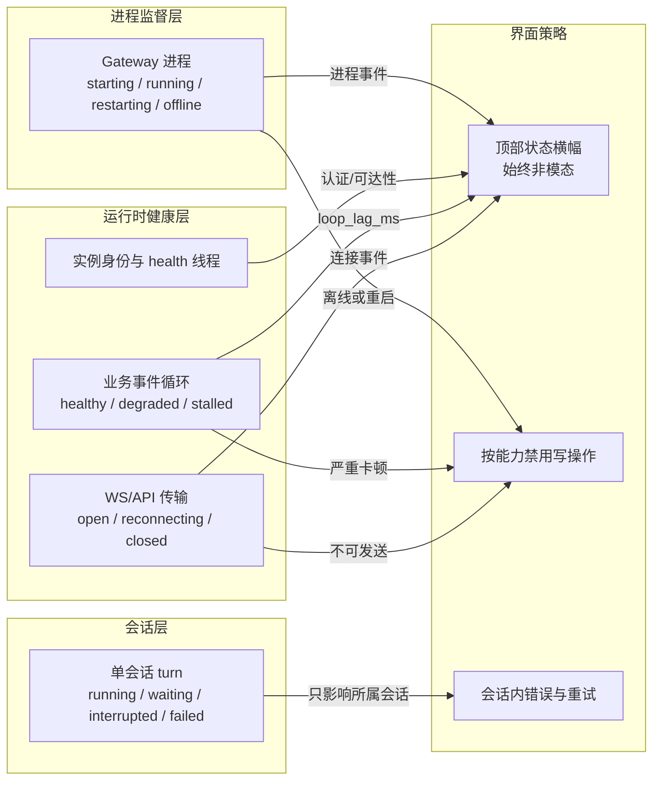

# Ace Agent 核心缺陷复核与桌面端阻断优化方案

> 原始调研日期：2026-09-16<br>
> 复核日期：2026-09-18<br>
> 原始代码基线：`61d1c8b`<br>
> 当前复核基线：`460155a`<br>
> 范围：agent 主循环、工具执行、取消、超时、上下文、持久化、错误处理，以及这些机制向 Desktop 健康状态和交互可用性的传导。<br>
> 对照项目：codex、deepseek-harness。Codex Desktop 本体闭源，因此本文只引用其开源 core/app-server 能证明的机制，不推断闭源 UI 的具体呈现。

---

## 0. 文档结论

原始清单发现了一批真实问题，但混淆了三种性质不同的故障：单回合停滞、业务事件循环阻塞、桌面端全局阻断。复核后的核心判断如下。

| 层级 | 真实问题 | 用户影响 | 正确治理方向 |
|---|---|---|---|
| 单回合 | 工具、插件或模型请求长期不返回 | 当前会话一直运行，停止可能不及时 | 分阶段超时、统一取消、合法中断结果 |
| 业务事件循环 | 同步 hook、同步文件 I/O、CPU 密集逻辑占住 asyncio 线程 | 所有业务请求和主 health 端点延迟 | 线程化、缓存、后台写、loop-lag 监测 |
| 进程生命周期 | Gateway 未启动、崩溃、端口或身份异常 | 所有依赖后端的写操作不可用 | 独立探活、进程监督、退避重启 |
| Desktop 呈现 | 把任意后端异常映射成全屏遮罩 | 历史、设置等无关页面也被阻断 | 启动/运行分态、非阻断横幅、能力级禁用 |

必须修正的旧结论：

1. 异步工具或异步压缩长期等待只会停滞所属回合，不会因为“单事件循环”自动冻结所有会话；只有同步阻塞或 CPU 独占才会冻结事件循环。
2. Ace 在原始基线已经具备 per-session FIFO、TaskRuntime 整回合超时、增量事件表、fork/rewind、开放回合检测、原生沙箱、一次/会话授权和持久规则，不能把这些能力描述为不存在。
3. “无流水线”不是成立的缺陷。Ace 已在模型流中对参数完整的安全工具进行 prewarm，剩余串行大多是数据依赖或副作用边界。
4. Desktop 不应删除进程级健康状态。正确做法是把进程状态、事件循环健康和会话状态拆开，避免一个 `backendConnected` 布尔承担所有语义。

---

## 1. 修复状态复核

| 项目 | 当前结论 | 状态 |
|---|---|---|
| 同步插件 hook/middleware 内联执行 | 原缺陷成立；同步回调已移出事件循环，并补齐 ContextVar 回写 | 已修复，仍需插件线程安全约束 |
| 单工具无框架级超时/中断竞争 | 原缺陷成立，但影响是“当前回合停滞”，不是必然全局冻结 | 已修复；总预算覆盖完整工具管线，取消回收有界，结果带结构化状态 |
| 整回合无 deadline | executor 内部原本没有 deadline，但标准 Gateway 路径已有 TaskRuntime 3600s 执行上限 | 已修复；TaskRuntime 注入唯一根 deadline，executor 仅兼容直接调用回退 |
| `interrupt_message` 未消费 | 原缺陷成立 | 已修复 |
| prompt/env/trace/媒体热路径同步 I/O | 原缺陷基本成立；`llm_trace` 和媒体读取并非每轮必走 | 已修复主要路径 |
| 追问/普通工具权限确认无限等待 | 原缺陷成立；安全服务自己的审批原本已有 300s TTL | 已修复，默认交互上限 3600s |
| 无串行事件入口 | 表述不准确；已有 per-session FIFO 和 queue/interrupt/steer，只是没有统一 session actor | 架构候选，不是已证实缺陷 |
| 无事件持久化/resume/fork | 错误；原始基线已有事件表、投影、fork/rewind 和开放回合检测 | 应改为“缺少回合内 write-ahead 与活动回合恢复” |
| 错误没有类型化 | 原始 provider/core 路径问题成立 | core/provider/gateway 基本完成，工具结果协议未完全统一 |
| 无沙箱/审批/策略沉淀 | 错误；原始基线已经具备完整安全子系统 | 从缺陷清单删除 |
| `asyncio_bridge` 自循环死锁 | 原缺陷成立 | 已修复 |
| 子 agent 收尾顺序 | 原缺陷成立 | 已修复 |
| `bg_events` 永久增长 | 原缺陷成立；现在仅在新任务启动时顺带清理超 TTL 项 | 已缓解，不是严格定时回收 |
| `evolution_visible` 扣留 final | 行为存在，但默认关闭且明确属于 Demo 模式 | 产品取舍，不列通用缺陷 |
| 批量子 agent 等待期间 steer 不即时生效 | 原判断成立 | 未修复 |
| Desktop 全屏后端遮罩 | 原 UX 缺陷成立 | 已修复；拆分 process/health/transport，并按发送能力禁用 |

相关提交：

- `71513d9`：同步 hook/middleware 线程化、取消等待有界化；
- `f8d33e1`：补齐同步回调 ContextVar 写回；
- `4ce7c1b`：工具执行段超时和 interrupt 竞争；
- `679ace7`：executor deadline 能力、interrupt message、compact 中断；
- `e99e58e`：交互等待超时与 interrupt 联动；
- `94b37b5`：热路径同步 I/O 治理；
- `5080c47`、`81583a2`：错误类型化、Retry-After 和结构化 error 帧；
- `cccc05e`、`2ffe5a6`、`08f746f`：Desktop 探针、非阻断横幅和独立 health 线程；
- `a8aa51b`：子 agent 收尾、后台事件清理和 sqlite retry sleep；
- `7be86ac`：TaskRuntime 异步门面。

---

## 2. Agent 核心仍需处理的问题

### 2.1 工具看门狗只覆盖了执行段（已修复）

当前看门狗把真实 handler 和 execution middleware 放入独立 task，与超时和 interrupt 竞争。超时或中断后生成合法 tool output，保持 tool-call/output 历史配对，这个方向正确。

本批次已闭合的边界：

- request middleware、pre hook、普通权限检查、结果转换、post hook 现在由 `_execute_total_guarded` 统一纳入总预算；
- 被取消的工具子任务使用有限取消宽限，第三方协程吞掉 `CancelledError` 时不再阻塞当前回合，并登记待回收 task；
- 同步回调进入线程后无法强杀，超时只能放弃等待，线程仍可能占用默认线程池；
- 外部进程、浏览器或 MCP 需要各自的资源终止动作，不能只依赖取消 Python task。

工具结果会在超时/中断路径写入 `code`、`retryable`、`side_effect_state` 和 durable result commit；同步线程与外部资源的强制终止仍由对应执行器负责。

优化方案：

1. 为一次工具调用建立总预算，再为审批、执行、结果处理划分阶段预算；
2. 超时后先发协作式取消，等待短暂 grace，再停止等待并登记泄漏任务；
3. 为进程型工具调用进程树终止，为远程工具关闭连接或请求；
4. 工具只有显式声明幂等且 retry-safe 时才能自动重试，写操作默认不重试；
5. 把 timeout、aborted、sandbox_denied、approval_rejected 变成结构化工具结果，而不是依赖字符串匹配。

### 2.2 整回合超时存在两套控制面（已收口）

标准 Gateway 路径已经通过 TaskRuntime 给 agent turn 配置 3600s 执行上限和 600s 不活跃上限，并能取消关联 worker。后来增加的 `turn_deadline_seconds` 默认关闭，而且只在 executor 安全点比较墙钟；模型在首个事件前不返回、插件异步 hook 卡住时，它不会自行到点。

优化方案：

- TaskRuntime 作为 Gateway agent turn 的整回合 deadline 唯一事实来源，并把快照注入 `ExecutionContext.deadline_seconds`；
- deadline 到达时向 turn 根 cancellation 发信号，工具、模型流、压缩和子 agent 使用子 cancellation；
- executor 只负责把 deadline 解释成历史标记和终态帧；`turn_deadline_seconds` 仅保留给直接调用 executor 的兼容路径；
- 脱离 Gateway 的直接 executor 调用，由装配层创建同一类根 cancellation 和 timer task；
- 保留工具自身的短超时，整回合 deadline 只做最后保险。

### 2.3 持久化缺口是“回合内未提交”，不是“没有事件溯源”（已补关键边界）

Ace 已有增量 `session_events`、父指针事件链、投影、flush barrier、fork/rewind、compaction checkpoint 和开放回合扫描。当前缺口在于 assistant/tool 等主要消息仍在回合结束时批量提交：进程在工具执行中崩溃时，可以识别开放回合，但不能完整恢复已产生的中间状态。

本批次增加以下明确的 durable boundary，而不是持久化每个文本 delta：

1. 用户输入完成校验后先落 `user_message`；
2. 模型完整产生 tool calls 后落 assistant/tool-call 声明；
3. 工具真正开始前落 execution intent；
4. 每个工具结果完成后独立落库；
5. final 或 error 后落 turn terminal；
6. 启动恢复时把有 intent、无 result 的调用标记为 interrupted，默认不自动重放有副作用工具。

这样可以获得可审计的中断恢复，又不会把高频流式 delta 变成写放大。

### 2.4 session actor/mailbox 是可选重构，不是前置条件

当前 Dispatcher 已实现同会话 FIFO，并在加锁前处理 queue、interrupt 和 steer。它已经解决“两个普通回合同时修改同一会话”的主要竞争。

只有在以下目标明确成立时，才值得引入统一 session actor：

- 审批答复、interrupt、steer、子 agent 消息和用户新输入必须统一排序；
- 需要在父回合等待子 agent 时即时转发 steer；
- 会话状态只能由一个所有者修改；
- 所有输入都需要持久 inbox 和崩溃后重放。

重构前应先列出状态所有权和实际竞态用例，避免仅为了对齐其他项目替换一套已经工作的 FIFO。

### 2.5 错误类型化已完成主体，工具协议已收口基础字段

`CrewErrorKind`、provider 分类、`is_retryable()`、HTTP status、Retry-After 和结构化 gateway error 帧已经落地。剩余工作主要在工具层：不少工具仍把错误编码成自然语言或各自格式的 JSON，调用方通过字符串识别取消、审批或沙箱错误。

`ToolResult` 与 `tool` 响应帧现在统一至少包含：

- `code`：稳定错误码；
- `message`：给模型和用户的描述；
- `retryable`：是否允许自动重试；
- `retry_delay`：可选退避；
- `side_effect_state`：`none / unknown / committed`，防止错误重试重复写；
- `details`：工具自有诊断字段。

### 2.6 沙箱与审批不是缺失项

Ace 已有跨平台原生安全运行时、精确 action digest、once/session grant、`ALWAYS` 持久规则、审计、附加文件/网络权限和 `require_escalated`。后续工作应该审计执行面是否全部经过授权票据，而不是重新设计一套审批系统。

安全边界必须保持：

- 用户明确拒绝后不得换工具或自动升级权限重试；
- 只有技术性 sandbox denial 才可能进入重试判断；
- 任何权限扩大都必须被既有 grant 覆盖或重新审批；
- 重试必须绑定同一规范化动作和 digest，不能在授权后悄悄改变命令。

### 2.7 不再作为缺陷跟踪的项目

- “单回合严格串行、无流水线”：Ace 已有安全工具 prewarm；下一次模型请求依赖工具结果，本来就不能无条件并行。
- “异步 compact 阻塞事件循环”：异步等待只占用当前回合，不占住事件循环；应优化取消和用户反馈，而非为了异步而异步。
- `evolution_visible` 延迟 final：默认关闭、用途明确的 Demo 行为；若产品不再需要可单独删除，不应影响主路径优先级。
- “工具层应统一自动重试”：副作用工具不能默认重试，必须以幂等声明和 side-effect 状态为前提。

---

## 3. Desktop 全局阻断问题与优化方案

### 3.1 问题本质

原全屏“智能体运行环境准备中”组件把后端可用性变成了整个应用的门锁。一次探针误判、Gateway 重启或业务事件循环抖动，都会让历史、设置等不依赖实时写入的页面一起失效。

需要分开的不是文案，而是三种状态的所有权：



核心原则：进程和运行时故障可以影响全局写能力，但不得锁死整个界面；单会话故障只能影响对应会话。

### 3.2 原链路为什么容易误伤

旧链路是：主进程每秒发起 health 请求，3 秒超时，连续失败后把 `connected=false` 推给 renderer；renderer 用全屏遮罩和 `setTab` 门禁阻断所有页面。

其中有两个独立问题：

1. `setInterval` 不等待上一轮探针，慢探针会叠加，多次超时可能在同一时刻结算；
2. renderer 只认识一个布尔值，无法区分启动、崩溃、业务循环卡顿、身份验证失败和单会话超时。

同步 hook 和同步文件 I/O 确实会拖慢主 health 端点；但异步工具等待、异步 compact 和 final 延迟不会阻塞事件循环，它们最多占用当前回合或并发槽。

### 3.3 当前已经完成的止血

当前实现已经落地：

- 探针改为链式 `setTimeout`，任意时刻最多一个在途 probe；
- 稳定期连续 3 次失败才判断开，启动 30 秒宽限期使用 10 次失败阈值；
- 失败分类为 `unreachable / timeout / auth_failed / unknown`；
- 全屏遮罩和 `setTab` 门禁已删除，改成顶部非阻断横幅；
- 断连时只读页面仍可浏览，聊天输入依据后端连接状态禁用；
- Gateway health 服务运行在独立线程，即使业务 asyncio loop 卡住仍可响应；
- health 返回 `loop_lag_ms`，用于识别“进程活着但业务循环没有调度”；
- 托管 Gateway 崩溃后由 supervisor 以 500ms 到 30s 的退避自动重启；
- 恢复成功后立即隐藏横幅、重连 WS 并补拉配置。

这组改动已经解决“后端一抖动就全屏锁死”的主要体验问题。

### 3.4 当前仍然存在的状态建模缺口

独立 health 线程返回的 `loop_lag_ms` 现在进入 `backend:status` 负载和 renderer 状态机，并使用连续样本迟滞。状态协议已拆为：

- `processState`：进程监督的 starting/ready/restarting/offline/error；
- `healthState`：健康探针判定的 healthy/degraded/stalled；
- `transportState`：WS 的 connected/reconnecting/disconnected；
- `backendCanSend`：由上述状态合成的发送能力，`backendConnected` 仅保留兼容语义。

因此下一阶段不应删除探活，而应把状态拆开。

### 3.5 目标状态协议

`backend:status` 已从布尔扩展为兼容的结构化状态。过渡期保留 `connected`，新消费方以细分字段为准：

```json
{
  "connected": true,
  "processState": "ready",
  "healthState": "degraded",
  "transportState": "connected",
  "loopLagMs": 6200,
  "failureKind": null,
  "since": 1789670400000,
  "retryable": true,
  "components": {
    "startup": { "status": "ready" },
    "cron": { "status": "ready" }
  }
}
```

字段职责：

| 字段 | 事实来源 | 用途 |
|---|---|---|
| `processState` | 子进程 exit/error、supervisor 重启流程 | 显示启动、重启或离线，不从 HTTP 错误猜进程状态 |
| `healthState` | 独立 health 响应和 `loop_lag_ms` | 区分 healthy、degraded、stalled |
| `transportState` | WS open/close/reconnect 与请求失败 | 决定当前能否发送，不替代进程探活 |
| `failureKind` | 实例探针 | 区分不可达、超时、实例身份不匹配和未知错误 |
| `components` | Gateway 启动组件快照 | 组件失败只提示相关能力，不把整个后端判死 |
| `since` | 状态首次进入时间 | 稳定展示持续时长并做迟滞判断 |

### 3.6 Desktop 状态与交互决策表

| 场景 | 全局展示 | 聊天发送 | 历史/设置/日志 | 会话展示 | 恢复动作 |
|---|---|---|---|---|---|
| 冷启动，进程尚未 ready | 顶部“正在启动后端”，可展示进度 | 禁用 | 可用 | 不制造会话错误 | supervisor 等待 ready |
| 业务 loop 短暂抖动 | 不提示或轻量黄条，使用迟滞避免闪烁 | 保持 | 可用 | 当前 turn 保持运行 | 自动观察 |
| 业务 loop 持续 degraded | 黄色横幅，显示持续时间和 loop lag | 可短暂保持；达到 stalled 阈值后禁用新发送 | 可用 | 已在途 turn 不立即判失败 | 等待、停止当前 turn、查看日志 |
| Gateway 进程崩溃/不可达 | 黄色横幅“正在自动重启” | 禁用 | 可用 | 运行中的 turn 标记连接中断 | 500ms~30s 退避重启 |
| 实例身份校验失败 | 红色横幅，说明端口可能被其他服务占用 | 禁用 | 可用 | 不自动归因到某个 turn | 停止盲目重试，提供日志/重试 |
| 单个工具或单个 turn 超时 | 不改变全局后端状态 | 其他会话可发送 | 可用 | 仅该会话内显示 timeout/aborted | 会话内重试或继续 |
| 单个组件失败 | 非阻断 toast 或组件页告警 | 与该组件无关的聊天保持可用 | 可用 | 仅相关功能提示 | 组件级重试 |
| 恢复成功 | 横幅立即消失 | 启用 | 可用 | 重连/恢复所属会话 | WS 重连、hydrate 配置 |

启动阶段可以隐藏尚未可用的写入口，但不再使用覆盖整个窗口的全屏遮罩。登录墙属于身份边界，继续与后端状态横幅正交。

### 3.7 分阶段实施方案

#### 阶段 A：保持现有止血方案

现有串行探针、失败分类、双阈值、非阻断横幅、独立 health 线程和自动重启全部保留。不要退回全屏遮罩，也不要用 WS 连接完全替代进程监督。

需要修正文案和注释中仍把“摘要/异步工具执行”描述成事件循环阻塞源的内容，只保留同步阻塞、CPU 独占和主端点排队等真实原因。

#### 阶段 B：拆分全局健康状态

1. 让 `BackendHealthProbeResult` 携带 `loopLagMs`，由 monitor 维护 `healthy / degraded / stalled`；
2. 对 loop lag 使用迟滞，建议以连续样本而不是单点切换状态：例如连续两个样本超过 3s 才进入 degraded，恢复也要求连续成功；具体阈值以埋点分布校准；
3. supervisor 在 spawn、ready、exit、restart scheduled、restart running、restart failed 时直接发布 `processState`；
4. WS 只发布 `transportState`，连接断开不直接等价为进程死亡；
5. renderer 从“全局 backendConnected”改成能力判断：发送消息要求进程 ready、业务未 stalled、传输可用；浏览本地/缓存数据不要求这些条件；
6. 横幅以优先级合成状态：身份异常 > 进程离线/重启 > loop stalled > loop degraded > 组件告警 > healthy；
7. 每次状态跃迁记录原因、持续时间、loop lag、进程代际和重启次数，避免只能靠用户描述“闪了一下”。

#### 阶段 C：会话级错误与恢复

1. 给每个 session/turn 发布 running、waiting、interrupted、failed、completed；
2. provider 的 `will_retry` 错误在对话流内显示“正在重连”，成功后自动消失；
3. 终态错误只标记对应 turn，不改变全局 Gateway 状态；
4. 配合回合内 durable boundary，在重连后恢复已持久化历史，并把未完成工具明确标记为 interrupted；
5. 不自动重放可能产生副作用的工具；用户选择继续后再启动新调用。

阶段 C 能改善断线恢复，但不是删除全屏遮罩的前置条件——全屏遮罩已经在阶段 A 删除。

### 3.8 验收标准

Desktop 优化必须通过以下行为测试，而不只验证组件能渲染：

1. 冷启动超过 60s：窗口可操作，可查看日志和设置；聊天发送禁用；Gateway ready 后自动恢复，无需刷新。
2. 同步代码人为阻塞业务 loop 10s：独立 health 线程持续响应；UI 进入 degraded/stalled，而不是误报进程死亡或触发重复重启。
3. 一个异步工具永久等待：仅该 turn 停滞，其他会话、health、历史和设置正常；点击停止能结束该 turn。
4. Gateway 进程退出：只触发一个串行重启流程；退避为 500ms~30s；只读页面始终可用。
5. health 端口被占用或旧版本不存在：安全回退主端点，不跳过实例证明。
6. 身份证明失败：显示明确红色错误，不把陌生端口服务当成 Gateway，也不无限重启。
7. 单个组件启动失败：`connected` 主能力不被整体判死，相关组件告警只出现一次。
8. health 恢复一次成功：清空失败计数和 outage 时间，横幅消失，WS 与配置补拉幂等执行。
9. 高频抖动：探针最大并发始终为 1，状态有迟滞，不出现横幅每秒闪烁。
10. macOS、Linux、Windows 都使用同一状态协议；平台差异仅封装在进程启动、日志入口和系统服务控制层。

### 3.9 Codex 对照的证据边界

Codex 开源部分可以证明以下原则值得吸收：

- 会话/线程有独立状态；
- 可重试流错误和终态错误分开；
- 事件先持久化再投递；
- resume 从持久历史重建；
- 工具 task 与 cancellation 竞争，中断后仍生成配对结果。

但 Codex Desktop 本体闭源，不能据此断言其 UI 永不使用全屏状态、没有后台探活或只在下一次操作时拉起进程。Ace 应根据自身 Electron 托管 Gateway 的事实保留启动和进程监督，只吸收“错误归属到具体会话”和“恢复基于持久状态”这些可验证原则。

---

## 4. 修复优先级

### P0：取消与桌面可用性

1. 补全工具全管线超时和取消抗性；
2. 合并整回合 deadline 到 TaskRuntime 根 cancellation；
3. 把 `loop_lag_ms` 纳入 Desktop 状态协议，拆分 process/health/transport；
4. 保证任何运行期异常都不恢复全屏遮罩或页面切换门禁。

### P1：恢复和错误协议

5. 增加回合内 durable boundary；
6. 统一结构化工具错误及 side-effect 状态；
7. 建立 per-session/turn 状态通知和会话内重试展示。

### P2：经证据驱动的架构改造

8. 先用竞态用例验证是否需要统一 session actor/mailbox；
9. 若需要父回合等待子 agent 时即时 steer，再设计消息转发与中断传播；
10. 审计所有执行面是否强制经过既有安全授权票据，不重复建设沙箱系统。

---

## 5. 关键实现入口

| 责任 | 实现入口 |
|---|---|
| Agent 主循环、deadline、LLM 流 | `crew/agent/executor/builtin.py` |
| 工具调度、权限等待、执行看门狗 | `crew/agent/loop/tool_runner.py` |
| turn steer/interrupt 控制 | `crew/agent/loop/control.py` |
| 回合持久化边界 | `crew/agent/runtime.py` |
| 会话事件表、投影、fork/rewind | `crew/state/session_store.py` |
| per-session FIFO 与忙时策略 | `crew/gateway/dispatcher.py` |
| 长任务 deadline 与 worker 取消 | `crew/tasks/runtime.py` |
| 插件同步回调线程化 | `crew/plugins/manager.py` |
| 沙箱、审批、grant 和持久规则 | `crew/security/`、`crew/tools/builtin.py` |
| Desktop 健康探针调度 | `desktop/src/main/backend-health-monitor.ts` |
| 独立 health 端口探测 | `desktop/src/main/backend-health-probe.ts` |
| Gateway 独立 health 线程 | `crew/gateway/health_server.py` |
| Desktop 进程监督和状态 IPC | `desktop/src/main/index.ts`、`desktop/src/main/gateway-restart-controller.ts` |
| Renderer 非阻断状态横幅 | `desktop/src/ui/features/backend-status-guard.ts` |
| Composer 能力禁用 | `desktop/src/ui/features/composer-view.ts` |

---

## 6. 验证记录

原修复批次记录：`docs/testing/agent-core-defects-batch-2026-09-17.html`。

2026-09-18 复核执行以下关键测试，共 12 项通过：

- 同步 hook/middleware 线程隔离、取消有界窗口、ContextVar 回写；
- 工具执行超时和 interrupt；
- executor deadline 历史标记；
- followup 默认超时；
- asyncio bridge 自循环拒绝；
- `bg_events` TTL 清扫；
- 独立 health 线程的 loop-lag 上报。

文档所列 Desktop 下一阶段状态拆分尚未实现，实施时至少需要补充：monitor loop-lag 迟滞测试、process/health/transport 合成测试、跨会话隔离测试，以及 macOS/Linux/Windows 的进程重启集成验证。

---

## 7. 小结

Ace 当前最重要的问题已经不是“整个 agent 是同步的”或“没有沙箱、事件存储”，而是取消边界和状态语义尚未完全统一。Agent 侧应围绕根 cancellation、工具阶段预算和回合内 durable boundary 收口；Desktop 侧应把进程、业务 loop、传输和单会话状态分别建模。

桌面端的最终目标不是隐藏故障，而是准确降级：后端不能写时禁用对应写能力，某个会话失败时只标记该会话，任何运行期故障都不再剥夺用户浏览历史、设置、日志和执行恢复操作的能力。
